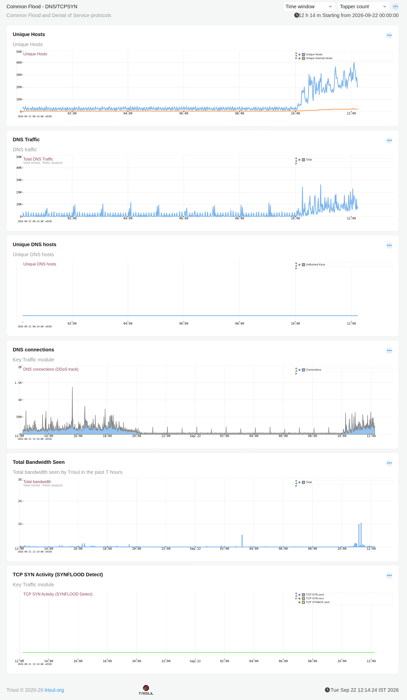

import Primer from '@site/docs/guide/ug/_primer.mdx';

<Primer />

# DNS Flood Activity

:::info
**DNS Flood Activity** (shown in the product as **Common Flood - DNS/TCPSYN**) tracks the traffic patterns behind two of the most common denial-of-service techniques, DNS floods and TCP SYN floods so you can catch a flood attempt early instead of discovering it after the fact.
:::

## What Can You Do With This Dashboard?

- Watch unique host counts for a sudden jump that signals a flood in progress.
- Track total DNS traffic and DNS connection volume against their normal baseline.
- Watch for TCP SYN flood indicators (SYN sent/received/SYNACK sent) that would flag a SYN flood attempt.
- Correlate a spike in bandwidth with the specific flood signal that caused it, a real flood usually shows up across more than one panel at once.

## Viewing the Dashboard

Go to **NBAD → DNS Flood Activity**.

Use the **Time window** and **Topper count** controls at the top right to change how far back the dashboard looks and how many top entries each panel shows. The active window is shown just below them. For example, `12h 14m Starting from 2026-09-22 00:00:00`.

*Figure: Common Flood - DNS/TCPSYN*

## Panels

| Panel | What it shows |
|---|---|
| **Unique Hosts** | Total unique hosts vs. unique internal hosts seen over the window. A flood typically shows as a sharp, sustained jump from a flat baseline. |
| **DNS Traffic** | Total DNS traffic volume. Normal DNS traffic is fairly steady with small periodic spikes; a flood shows as a sustained elevated plateau rather than a brief spike. |
| **Unique DNS hosts** | Unique hosts generating DNS traffic, tracked via unflushed keys. Stays flat at zero when there's no DNS-specific host churn to report. |
| **DNS connections** | DNS connection count, tracked specifically as a DDoS indicator. Short, isolated spikes are normal; a sustained rise is the signal worth acting on. |
| **Total Bandwidth Seen** | Overall bandwidth Trisul has seen in the window. Useful for confirming whether a flood is also consuming meaningful bandwidth, or is high in connection/request count but low in actual data volume. |
| **TCP SYN Activity (SYNFLOOD Detect)** | TCP SYN sent, SYN received, and SYNACK sent counts, specifically to catch a SYN flood. Stays flat at zero when no SYN flood is present. |

:::tip
Don't read these panels one at a time, a genuine flood event usually shows up across several of them together, not just one. A correlated rise across Unique Hosts, DNS Traffic, and DNS connections at the same time is a stronger signal than any single panel spiking on its own.
:::

:::note
A spike in one panel without a matching rise in the others is more often normal variation than an actual flood, read the panels together before treating a single spike as an incident.
:::
