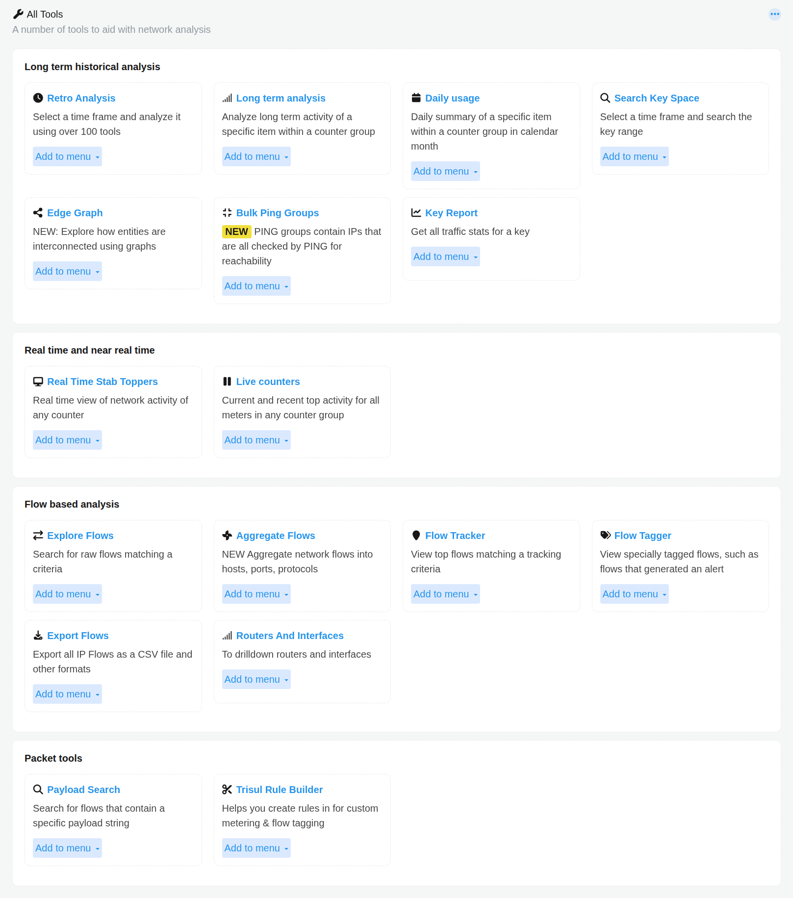

# Show All

:::info Navigation
:point_right: Go to **Netflow &rarr; Show all**
:::

  

*Figure: Netflow Show all*

This page is the central All Tools launcher, where you can find every analysis tool available in the platform, grouped by workflow type. You can also use Add to menu to pin any tool to your custom navigation.

## Long Term Historical Analysis

Tools for investigating traffic that already happened — retrospective ("retro") analysis, long-term trends, and calendar-style usage reporting. Trisul stores data unsummarized, so these tools can drill into raw traffic, flows, and alerts from any point in the past.

1. **Retro Analysis**- [Performing Retro Analysis](/docs/guide/ug/cg/retro), [Retro Analysis Tools](/docs/guide/ug/cg/retrotools), and [Retro Q&A](/docs/guide/ug/cg/retrofaq)
2. **Long Term Analysis**- [Using the Analyze Item Page](/docs/guide/ug/tools/analyze_item)
3. **Daily Usage** - [Using Monthly Charts](/docs/guide/ug/tools/daily_usage)
4. **Search Key Space** - [Using Search Key Space](/docs/guide/ug/tools/keyspace)
5. **Edge Graph** - [Using Edge Analysis](/docs/guide/ug/edges/using)
6. **Bulk Ping Groups** - [Using Bulk Ping Groups](/docs/prodguide/isp/pingmonitor)
7. **Key Report** - [Using Key Dashboard](/docs/guide/ug/ui/key_dashboard)

## Realtime and Near Realtime

Live views of what is happening on the network right now, with roughly a 5-second delay.

1. [Realtime Stab Toppers](/docs/guide/ug/cg/stabber)
2. [Live Counters](/docs/prodguide/nsm/Netflow/show-all#live-counters)

## Flows Based Analysis  

Tools that work directly with individual network flows (as opposed to aggregated counter metrics).

1. [Explore Flows](/docs/guide/ug/tools/explore_flows)
2. [Aggregate Flows](/docs/guide/ug/tools/aggregate_flows)
3. [Flow Tracker](/docs/guide/ug/flow/tracker)
4. [Flow Tagger](/docs/guide/ug/flow/tagger)
5. [Export Flows](/docs/prodguide/nsm/Tools/export-flows)
6. [Routers and Interfaces](/docs/guide/ug/netflow/routers_and_interfaces)

## Packet Tools

Tools that operate on raw packet content (require full packet capture / PCAP mode).

1. [Payload Search](/docs/guide/ug/tools/payload_search)
2. [Trisul Rule Builder](/docs/guide/ug/tools/rule_builder)

### Live Counters

Live Counters shows you live and recent activity for any counter group, all on one screen without setting any time range or search criteria.

#### How to Use

To access Live Counters,

:::info Navigation
:point_right: Go to **Tools → Select Live Counters**
:::

The following Select a counter group form opens up.

| Field |	Description |
|-------|---------------|
| Counter Group | Select any counter group you want to monitor (Apps, Hosts, ASNumber, City, Blacklist, and so on; any counter group available in your deployment) |

Once you select a counter group, the result screen updates immediately without using any Submit button.

The result screen shows live toppers of the counter group you selected. The items, meters, and values shown depend entirely on the counter group chosen. For example, selecting Apps shows top applications, selecting ASNumber shows top autonomous systems, and so on.