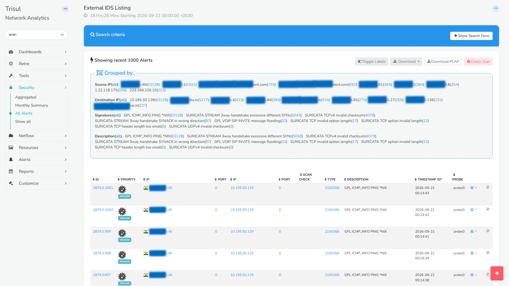

# All Alerts

:::info
**Summary of All Alerts** is the single consolidated listing of every alert Trisul has raised across threshold crossing, flow tracker, IDS/Suricata, malware and blacklist, DDoS, and every other alert class in one place. Use it when you need the complete picture instead of checking each alert type separately.
:::

## What Can You Do With All Alerts?

- See every alert Trisul has raised in one place, regardless of which detection engine or alert class generated it.
- Group results by Source IP, Destination IP, Signature, or Description to spot patterns — a handful of IPs responsible for most of the noise, or one signature firing far more than the rest.
- Drill into an individual alert for more context, or download the underlying packet capture for offline analysis.
- Export the current result set for reporting or further investigation outside Trisul.

## Viewing the Alert Listing

:::info Navigation
:point_right: Go to **Security &rarr; All Alerts**
:::

:::note
The page itself is titled **External IDS Listing** once you're on it. That's expected, it's the same view, just labeled from the detection-engine side rather than the menu side.
:::

The top of the page shows the active time window, for example, `18 Hrs:26 Mins Starting 2026-09-21 00:00:00 +0530` so you always know exactly how far back the listing reaches before reading the results.

  
*Figure: All Alerts / External IDS Listing*

### Show Search Form

Click **+ Show Search Form** to open the search criteria panel and narrow the listing down — by IP, signature, time range, or other available fields — before Trisul returns results.

### Grouped By Options

Directly below the search bar, Trisul automatically groups the current result set:

| Group | Shows |
|---|---|
| **Source IP** | The IPs generating the most alerts, with a count next to each |
| **Destination IP** | The IPs being targeted most often, with a count next to each |
| **Signatures** | The Suricata/IDS signature names that fired, with a count next to each |
| **Description** | The human-readable description tied to each signature, with a count next to each |

:::tip
Grouped By is usually the fastest way to triage a busy alert window — a handful of source IPs or signatures dominating the counts is often the real story, not the individual alerts underneath them.
:::

## Showing Recent 1000 Alerts

Below the Grouped By panel, individual alerts are listed in a table:

| Column | Description |
|---|---|
| **ID** | Trisul's internal alert identifier |
| **Priority** | The alert's priority, shown with an action tag (for example, **allowed**) |
| **IP / Port** | Source IP and port |
| **IP / Port** | Destination IP and port |
| **Scan Check** | Result of an associated scan check, where applicable |
| **Type** | The numeric signature ID that fired |
| **Description** | The human-readable signature description |
| **Timestamp IST** | When the alert fired |
| **Probe** | Which probe captured the traffic that triggered the alert |

### Working With Results

Across the top of the table:

- **Toggle Labels** — switch between raw values and resolved/labeled names where available.
- **Download** — export the current result set.
- **Download PCAP** — pull the packet capture behind the listed alerts for offline analysis.
- **Check Scan** — re-runs the scan check against the currently listed alerts.

### Drilldown Options

Each row has its own action menu (**⋮ ▾**) for drilling into that specific alert, plus a quick-action icon for suppressing it from future listings.

:::warning
Downloading PCAP for a large result set can produce a very large file — narrow the search criteria first if you only need packets for a specific IP, signature, or time range.
:::