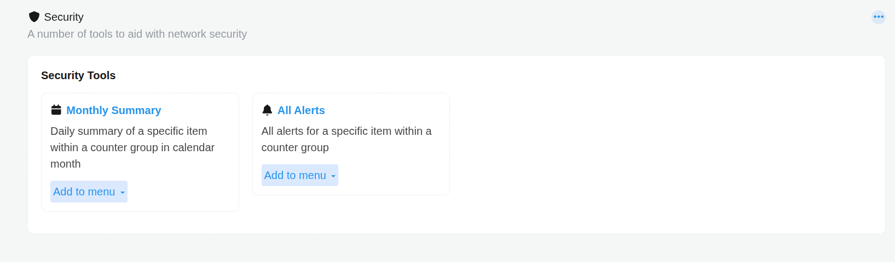

# Security Tools

The Show all menu opens the Security Tools catalog. It gathers every tool available under the Security menu in one place, with a short description of what each one does and an option to pin it directly to your own menu.

## Viewing Security Tools

Go to **Security → Show all**.

*Figure: Security Tools*

## Available Tools

| Tool | Description |
| --- | --- |
| **Monthly Summary** | Daily summary of a specific item within a counter group, shown across a calendar month. |
| **All Alerts** | All alerts for a specific item within a counter group. |

:::tip
Add to menu turns a general purpose tool into a shortcut for something you check often. For example, pinning Monthly Summary scoped to a specific alert signature saves you from selecting that signature again every time you want the same view.
:::

