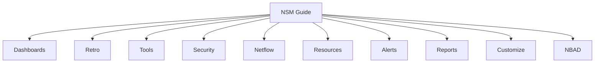

# Trisul Network Security Monitoring (NSM) Guide

Welcome to the **Trisul Network Security Monitoring (NSM) Guide**.

**Trisul NSM** is designed for comprehensive network security monitoring, traffic analysis, threat detection, and packet-level visibility. It combines [flow monitoring](https://docs.trisul.org/docs/guide/learntrisul/terminology#flow), [full packet capture (PCAP)](https://docs.trisul.org/docs/guide/learntrisul/terminology#pcap-packet-capture), [IDS alert correlation (Suricata/Snort)](https://docs.trisul.org/docs/guide/learntrisul/terminology#ids-alert), [network behavioral analysis (NBAD)](https://docs.trisul.org/glossary/nbad), and protocol extraction in a unified platform.

With Trisul NSM, you can:

* Monitor and analyze network traffic in real time and retrospectively
* Detect security incidents, intrusions, and anomalous network behavior
* Correlate IDS alerts with raw packet captures and flow history
* Track top talkers, applications, conversation flows, and host endpoints
* Perform deep protocol inspection (DNS, HTTP, SSL/TLS, and more)
* Investigate historical traffic without data loss
* Automate alerts and generate compliance and security reports

## Before you begin

If you have not installed Trisul yet, start with the installation guide.

During installation, select **Network Security Monitoring (NSM)** as the **Product Mode**. This configures Trisul for comprehensive security telemetry and packet analysis.

**[Install Trisul and select NSM mode](/docs/guide/starthere/quickstart)**

Once Trisul is installed and you have logged in to the Web UI, return to this guide to learn how to use the NSM interface.

The screens and menus described in this guide are available when Trisul is configured in NSM mode. If you selected a different Product Mode during installation, your Web UI may have a different menu structure.

## What you will find in this guide

The NSM Web UI is organized into ten main menu categories. Each category helps you perform a different type of network monitoring or security analysis:

:::tip New here?
Start with **Dashboards** for a live view of your network, then check **Security** to see IDS alerts, then **NBAD** for behavior-based detections. These are the two menus that set NSM apart from NetFlow Analyzer. The rest of the menus below are for deeper investigation once you know what you are looking for.
:::

import DocCardList from '@theme/DocCardList';

<DocCardList />
