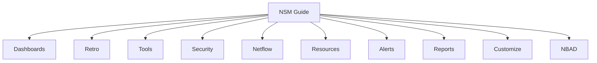

# Trisul NSM Guide

Welcome to the **Trisul NSM Guide**.

**Trisul NSM** analyzes raw packets for network security monitoring, traffic analysis, threat detection and packet-level visibility. It combines [flow monitoring](/docs/guide/learntrisul/terminology#flow), [full packet capture (PCAP)](/docs/guide/learntrisul/terminology#pcap-packet-capture), [IDS alert correlation (Suricata/Snort)](/docs/guide/learntrisul/terminology#ids-alert), [Network Behavior Anomaly Detection (NBAD)](/glossary/nbad) and protocol extraction.

With Trisul NSM, you can:

* Monitor and analyze network traffic in real time and retrospectively
* Detect security incidents, intrusions, and anomalous network behavior
* Correlate IDS alerts with raw packet captures and flow history
* Track top talkers, applications, conversation flows, and host endpoints
* Inspect protocols such as DNS, HTTP and SSL/TLS
* Investigate historical traffic without data loss
* Automate alerts and generate compliance and security reports

## Before you begin

1. Install Trisul. Follow the [Quickstart](/docs/guide/starthere/quickstart).
2. Send raw packets to the Trisul Probe from a SPAN or TAP port. See [Configure Packet Capture](/docs/guide/starthere/setuptrisul/network/input_packets).
3. Log in to the Web UI and select **Trisul NSM** as the product mode. You choose the mode on first login, not during installation. See [Selecting the Product Mode](/docs/guide/starthere/setuptrisul/install/selectmode).
4. Confirm that packets are arriving. Go to **Dashboards &rarr; Real Time Traffic** and check that the live traffic rate is above zero.

Some NSM features need extra setup:

- **IDS alerts** need an IDS such as Suricata or Snort sending alerts to Trisul. The [MITRE ATT&CK prerequisites](/docs/guide/ug/alerts/mitre#prerequisites) show how to install the Suricata app.
- **NBAD dashboards** need the NBAD apps. See [Enabling NBAD](/docs/prodguide/nsm/NBAD/enable-nbad).

When packets are arriving, use the rest of this guide to learn the NSM menus.

The screens and menus described in this guide are available when Trisul is configured in NSM mode. If you selected a different product mode, your Web UI may have a different menu structure.

## What you will find in this guide

The NSM Web UI is organized into ten main menu categories. Each category helps you perform a different type of network monitoring or security analysis:

```mermaid
graph TD
    A[NSM Guide] --> B[Dashboards]
    A --> C[Retro]
    A --> D[Tools]
    A --> E[Security]
    A --> F[Netflow]
    A --> G[Resources]
    A --> H[Alerts]
    A --> I[Reports]
    A --> J[Customize]
    A --> K[NBAD]
```

:::tip New here?
Start with **Dashboards** for a live view of your network, then check **Security** to see IDS alerts, then **NBAD** for behavior-based detections. These are the two menus that set NSM apart from NetFlow Analyzer. The rest of the menus below are for deeper investigation once you know what you are looking for.
:::

import DocCardList from '@theme/DocCardList';

<DocCardList />
