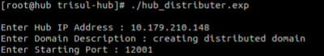
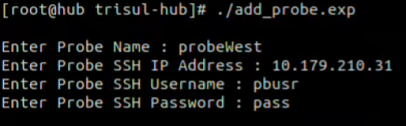

import Tabs from '@theme/Tabs';
import TabItem from '@theme/TabItem';


# Distributed-Domain
## Prerequisites

**Step 1: Download Trisul**  
Download the Trisul network monitoring platform from the [official website](https://www.trisul.org/get-started/).  

**Step 2: Install Trisul Components**  
- Install Hub and Webtrisul on the Trisul-hub server.  
- Install Probe on the Trisul-Probe server.   

**Step 3: Verify Expect Script**  
Ensure that the `Expect` script is present on your system. If not, install the `Expect` package.   

>**Important Licensing Note**  
Please note that 7-day trial licenses are not supported for Distributed-Domain setup. Ensure you have a valid license before proceeding with the setup. 

## Installing and Configuring Trisul Probe

**Step 1: Install `Expect`**  
Run the following command to install `Expect`: 

  <Tabs className="unique-tabs">
    <TabItem value="UBUNTU"  default>
      ```bash
      sudo apt install expect
      ```
    </TabItem>
    <TabItem value="RHEL" >
      ```bash
      sudo yum install expect
      ```
    </TabItem>
  </Tabs>

**Step 2: Install Trisul Probe**  
- Install the Trisul Probe on the Trisul-probe server.
- For multiple probes, install the probe on each server.

**Step 3: Configure SSH**  
Configure SSH on all Trisul servers.  

## Enabling Distributed Domain on Trisul-Hub Server

To enable Distributed Domain on the Trisul-Hub server, follow these steps:     

**Step 1: Run the Distribution Script**  

On the Trisul-Hub server, run the following script:  
`/usr/local/share/trisul-hub/hub_distributer.exp`

**Step 2: Provide Required Inputs**
The script will prompt for the following inputs:
- Hub-Server IP
- Description
- Starting port

Enter the required details to complete the Distributed Domain setup.


  
  | Parameters         | Sample Inputs      |
  | ------------------ | ------------------ |
  | Hub IP Address     | 192.168.1.6        |
  | Domain Description | Distributed domain |
  | Starting Port      | 12001              |

The installation process will now commence, and the server will be converted into a Distributed Domain configuration.

## Adding Trisul Probe to Trisul Hub

**Step 1: Run the Probe Addition Script**  
Run the following script on the Trisul Hub server:

`/usr/local/share/trisul-hub/add_probe.exp`
  

  
  | Parameters         | Sample Inputs |
  | ------------------ | ------------- |
  | Probe-Name         | probeWEST     |
  | Probe-ssh-IP addr  | 192.168.1.7   |
  | Probe-ssh-username | demo-user     |
  | Probe-ssh-Password | demo-passwd   |

This script connects a Trisul-Probe to a Trisul-Hub. To connect multiple Trisul-Probe instances, simply run the script again after installing each probe and provide the respective probe details. Repeat this process for each additional Trisul-Probe to establish connections with the Trisul-Hub.

**Step 2: Provide Required Inputs**  
The script will prompt for the following inputs:
- Probe Name (must start with "probe" followed by the name, e.g., "probeWEST")
- Probe SSH IP Address
- Probe SSH Username
- Probe SSH Password

**Step 3: Verify Probe Connection**    
To verify that the probe is connected, run the following command:  
`/usr/local/bin/trisulctl_hub hello`  
This will display a list of connected probes.  

## Troubleshooting

If the probe is not listed, restart the Hub and Probe:    

On the Trisul Hub server:  
`/usr/local/bin/trisulctl_hub restart domain`  

On the Trisul Probe server:  
`/usr/local/bin/trisulctl_probe restart domain`  

Then, re-run the command to verify the probe connection.  