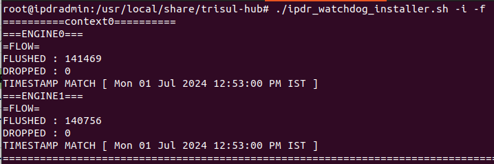
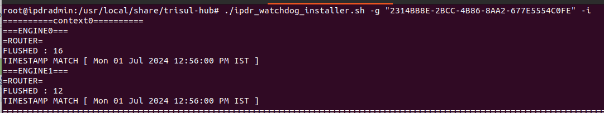
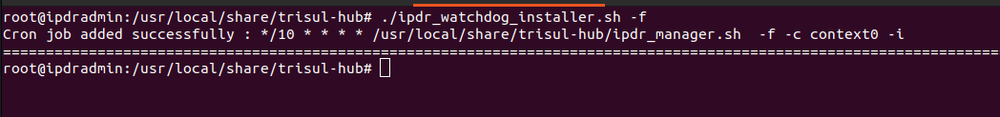

# IPDR-Watchdog

Real time monitoring of trisul-IPDR system which send email alerts when IPDR is down.

## How it works ?

1. First , it will check for the follwing error conditions before proceding into watchdog
   
   - Checks the Hub config file is present in given location.
   
   - Checks the Log file is accessible or not
     
     If above conditions fails it exit from the script

2. Location of log file is fetched from trisulHubconfig.

3. To check whether the trisul is flushing  or not it fetched the latest log entry from log file is compared with current time.The difference between them should be not greater than 10 min.If so , it triggers the syslog to send mail . 
   
   :::note[Tip]
   
   Trisul will flush every one minute 
   
   :::

4. The IPDR system is sends email alert along with the log entry.  And the log file which triggers alerts is stored in tmp/IPDR_WATCHDOG_CONTEXT_STATUS/ for each context seprately until the system is up.

5. You can make the script to start the hub & probe context automatically.If doesn't flush then it sends the email .

## Requirement

1. Install cronjob on the IPDR system . 
   
   :::note
   
   For every user in system the crontab will be different . 

2. Assign default editor 
   
   :::caution[check before running]
   
   Running crontab -e command in terminal should not ask for editor. If so , the script stops automatically
   
   :::

3. Configure the email email along with receiptients you want to send mail.

4. Go to profile0 → All groups alert → and click edit option → change Send to Syslog/Email to Alert

:::note

Run this script as root user

:::

| Option | Default value    | Info                                                                                                                                              | Example                                                                 |
| ------ | ---------------- | ------------------------------------------------------------------------------------------------------------------------------------------------- | ----------------------------------------------------------------------- |
| -c     | context0         |                                                                                                                                                   | ./ipdr_watchdog_installer.sh -c context0                               |
| -n     | 2                | No of engine present each trisul can have multiple engines based on the usage                                                                     | ./ipdr_watchdog_installer.sh -n 4                                      |
| -s     | Your system name | Name for your system                                                                                                                              | ./ipdr_watchdog_installer.sh -s trisul-system                          |
| -k     | 0                | If the system runs successfully it send mail for every run                                                                                        | ./ipdr_watchdog_installer.sh -k                                        |
| -t     | 70               | The differnence between the log entry and current time should be less than or equal to t                                                          | ./ipdr_watchdog_installer.sh -t 90                                     |
| -g     | No default value | Search for the particular guuid log entry                                                                                                         | ./ipdr_watchdog_installer.sh -g"2314BB8E-2BCC-4B86-8AA2-677E5554C0FE" |
| -f     | 0                | Runs in flow mode                                                                                                                                 | ./ipdr_watchdog_installer.sh -f                                        |
| -j     | /10* * * * *     | Assign cronjob in crontab                                                                                                                         | ./ipdr_watchdog_installer.sh -j /20* * * * *                           |
| -i     | -                | Print the output of the command in terminal                                                                                                       | ./ipdr_watchdog_installer.sh -i                                        |
| -e     | -                | Ignores the particular context                                                                                                                    | ./ipdr_watchdog_installer.sh -c context0 -c context_demo               |
| -r     | 0                | If the system is down then the script try to restart the hub and probe for first cycle and for next cycle if the system is down then it send mail | ./ipdr_watchdog_installer.sh -r                                        |
| -h     | -                | Prints the help command for smoth run                                                                                                             | ./ipdr_watchdog_installer.sh -h                                        |

:::note

The script should with either -f or -g option as argument 

:::

## Examples

- To check the script is providing the exact output run the script with -i option it provide the output in console

- To assign cronjob for continuous monitoring run this script without -i option

Example1 Explanation

- ENGINE0 & ENGINE1 mention the number of engine present in the trisul . Each system will have different engine based on the config files.

- DROPPED parameter should not be 0 . If so , then it send mail
