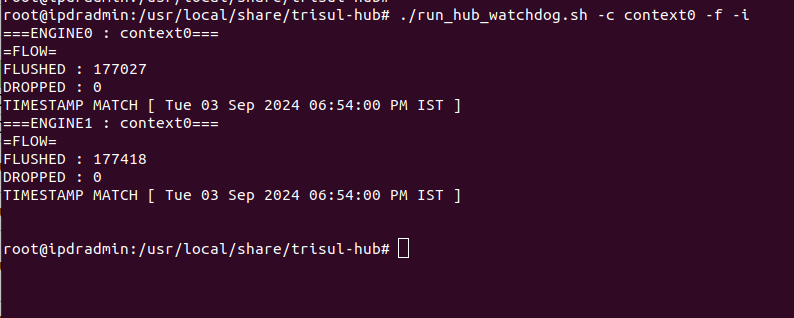
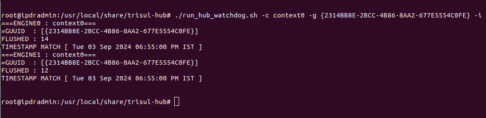
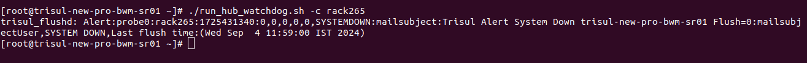

# Watch-dog


## Overview  

This solution consists of **three scripts** designed to monitor the status of Trisul-Hub and Trisul-Probe in real-time. The scripts detect when the systems are down and send alerts to the syslog. Additionally, they can be configured to send email alerts.

## Scripts

import Tabs from '@theme/Tabs';
import TabItem from '@theme/TabItem';

<Tabs>
<TabItem value="HUB-FLUSHER-WATCHDOG" default >
   1. Monitors the status of Trisul-System by analyzing logs using the script `hub_flusher_watchdog.sh`.
   2. Sends alerts to syslog when the system is down.
   3. Sends alerts when the system is up after a certain interval.
   4. Accepts a maximum of one context at a time.
   :::tip
   Configure mail in trisul to receive alert
   :bell:
   :::
</TabItem>
<TabItem value="RUN-HUB-FLUSHER" >
   1. Detects multiple context statuses of Trisul-System.
   2. Sends alerts for all non-running contexts to syslog.
   3. Depends on the `run_hub_watchdog.sh` script.
</TabItem>
</Tabs>

### Modes
   1) FLOW MODE ( IPDR Customer )
   2) COUNTER GROUP MODE ( Analytics Customer )
     > Requires the GUUID key to be provided.

## How it works ?
- ### Preliminary Check
   - Checks if the config file is available for the given context.
   - Extracts log file location from the given context config file.
   - Checks if the log file is accessible by the script owner.
   - #### If the above conditions are not met, the script stops.
- ### Gather Information from Log
  - Accesses the latest log file and gets the timestamp of the last log.
  - For Flow Mode, fetches the latest log with END-IPFLOW-FLUSH.
  - For GUUID Mode, fetches the latest log with the user-given GUUID-KEY and END-CG-FLUSH.
  - Extracts flushed value, timestamp, and number of dropped packets from the logs.
- ### Process Gathered Information
  - Checks if the fetched log file is empty.
  - Checks if the flushed value is not zero.
  - Checks if the difference between the timestamp of the log and the system is not more than the fixed seconds.
  - #### If the above conditions are not met, an alert is generated.

## Requirements
- Run this script as root
- Ensure cronjob is installed.
- Configure email in Trisul (if email alerts are required).

## Options

| Option             | Default value   | Description                           | Usage            |
| -------------------| ----------------| ------------------------------------- | -----------------|
| -c CONTEXT-NAME    | context0        | Context name                          | -c all [prints the flusher for all context]  or -c rack245' |
| -e CONTEXT-NAME    |     -           | Ignore context for checking           | -e netflow -e headoffice                                    |
| -s HOST-NAME       | hostname        | Host name                             | -s Trisul-Server                                            |
| -i INTERVAL        |     -           | Check flushed item count for last n minutes | -i 2                                                  |
| -g COUNTER_GROUP   |     -           | Check this counter group in log       | -g `{2314BB8E-2BCC-4B86-8AA2-677E5554C0FE}`                 |
| -f CHECK_FLOW_COUNT|     -           | Check flushed flow count              | -f                                                          |
| -v VERBOSE         |     -           | Print information like flushed flows  | -v                                                          |
| -m MATCH_ANY_ENGINE|    -           | Check if any 1 engine is flushed      | -m                                                          |
| -r RESTART         |     -           | Restart context if down               | -r                                                          |
| -a filepath        |     -          | Eg -a/home/trisul/filepath.text        | AAA file process interval |
| -j interval        |      3600        | Eg - j 3600             | AAA file process interval |


## How to Run this Script
<Tabs>
   <TabItem value="FLOW-MODE" default >
   ```bash
   /usr/local/share/trisul-hub/run_hub_watchdog.sh -c context0 -f -i
   ```
   ### Example
   
   </TabItem>
   <TabItem value="COUNTER_GROUP-MODE">
   ```bash
   /usr/local/share/trisul-hub/run_hub_watchdog.sh -c context0 -g {2314BB8E-2BCC-4B86-8AA2-677E5554C0FE} -v
   ```
   
   </TabItem>
</Tabs>

#### Execution Options
The script can be executed with or without the -i argument, which controls the verbosity of the output.  

**Verbose Mode (-i)**  
When executed with the -i argument, the script operates in verbose mode. In this mode, the script prints all values to the terminal, providing detailed information about the context status.  

**Non-Verbose Mode (No -i)**  
When executed without the -i argument, the script only prints values to the terminal if the context is not running. This mode provides a more concise output, only alerting the user to contexts that are not running.

### Example - How alert generated when the conditions not met
```bash
   /usr/local/share/trisul-hub/run_hub_watchdog.sh -c rack265
```


#### Alert Generation
The script generates alerts to the syslog based on the flush value. If the flush value is 0, it indicates that the context is not running, and an alert is generated.
#### Alert Format
The alert format is the same for both Flow Mode and GUUID Mode. The script sends a standardized alert message to the syslog, indicating that the context is not running.
>**Note: The alert message does not distinguish between Flow Mode and GUUID Mode. The same alert format is used for both modes.**
