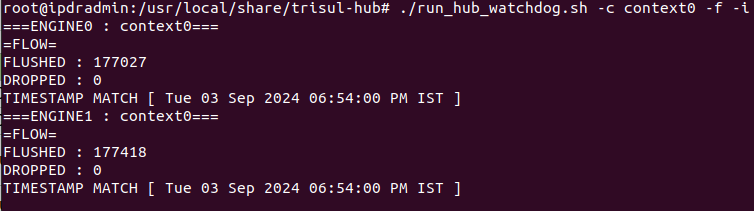

# Watch-dog


Real time monitoring of trisul-hub and trisul-probe and alert if they down.

## Consists of 3-scripts

import Tabs from '@theme/Tabs';
import TabItem from '@theme/TabItem';

<Tabs>
<TabItem value="HUB-FLUSHER-WATCHDOG" default >
   1. Detect the status of the trisul-system by analyzing the logs
   2. Send alert to syslog of the status of the trisul-system is down
   3. When the system is up after the certain interval then it send alert 
   4. Accept max of 1 context at a time
   :::tip
   Configure mail in trisul to receive alert
   :bell:
   :::
</TabItem>
<TabItem value="RUN-HUB-FLUSHER" >
   1. Detect multiple context status of the trisul-system
   2. Send alert for all the non-running context to syslog
   3. Depends on hub_flusher_watchdog.sh script
</TabItem>
<TabItem value="INSTALL-CRON-HUB-WATCHDOG" >
   1. Assign cronjob for a run-hub-flusher script with the help of given arguments
   2. It runs for a regular interval of time and generate alert if necessary
   3. Depends on run_hub_flusher.sh script
   :::note
   - Install cronjob 
   - Configure cronjob with detfault editor
   :::
</TabItem>
</Tabs>

### Two Modes
   - Flow Mode ( IPDR Customer )
   - GUUID Mode ( Analytics Customer )
     - In this mode , the GUUID key need to be provied 

## How it works ?
- ### Preliminary check
   - Check the config file is availabe for the given context
   - Extract log file location from given context config file
   - Checks the log file is accessbile by the script owner
   - #### If above condition is not met then it stops
- ### Gather information from log
  - Access the latest log file & get the timestamp of last log
  - For Flow Mode  - latest log with END-IPFLOW-FLUSH is fetched
  - For GUUID Mode - latest log with user given GUUID-KEY and END-CG-FLUSH
  - From the above logs you can get flushed value,timestamp,no.of.dropped packets. 
- ### Processing the gathering information
  - Check the fetched log file is empty or not.
  - Check the flushed value not zero.
  - Check the difference between the timestamp of log and system should not be more than fixed-sec
  - #### If the above condition is not met the alert is generated

## Requirements
- Run this script as root
- Check cronjob is installed
- Configure email in trisul ( If you need email alert )

## Options

| Option | Default value   | Info                                  | Example                                            |
| ------ | ----------------| ------------------------------------- | -------------------------------------------------- |
| -c     | context0        |    Defaule context                    | ./run_hub_watchdog.sh -c context0           |
| -n     | 2               | No of engine present each trisul can have multiple engines based on the usage    | ./run_hub_watchdog.sh -n 4                                      |
| -s     | Your system name | Name for your system                 | ./run_hub_watchdog.sh -s trisul-system               |
| -k     | 0                | If the system runs successfully it send mail for every run | ./run_hub_watchdog.sh -k       |
| -t     | 70               | The differnence between the log entry and current time should be less than or equal to t    | ./run_hub_watchdog.sh -t 90    |
| -g     | No default value | Search for the particular guuid log entry   | ./run_hub_watchdog.sh -g"2314BB8E-2BCC-4B86-8AA2-677E5554C0FE" |
| -f     | 0                | Runs in flow mode                    | ./run_hub_watchdog.sh -f     |
| -j     | /10* * * * *     | Assign cronjob in crontab            | ./install_cron_hub_watchdog.sh -j /20* * * * *                 |
| -i     | -                | Print verbose of the output terminal   | ./run_hub_watchdog.sh -i                                        |
| -e     | -                | Ignores the particular context         | ./run_hub_watchdog.sh -c context0 -c context_demo               |
| -r     | 0                | If the system is down then the script try to restart the hub and probe for first cycle and for next cycle if the system is down then it send mail | ./run_hub_watchdog.sh -r                                        |
| -h     | -                | Prints the help command for smoth run   | ./run_hub_watchdog.sh -h                     |


:::caution
  -j option is only available for the install_cron_hub_watchdog.sh script
:::


## How to run this script
<Tabs>
   <TabItem value="FLOW-MODE" default >
   ```bash
   /usr/local/share/trisul-hub/run_hub_watchdog.sh -c context0 -f -i
   ```
   :::note
   By default the script run in flow mode unless by run this script as -g option
   :::
   ### Example
   
   </TabItem>
   <TabItem value="GUUID-MODE">
   ```bash
   /usr/local/share/trisul-hub/run_hub_watchdog.sh -c context0 -g {2314BB8E-2BCC-4B86-8AA2-677E5554C0FE} -i
   ```
   
   </TabItem>
</Tabs>

When you see the example the above script is executed with argument -i
- This is the verbose option where it prints the values in terminal
- When you run without -i then it only print the values if the context is not running

### Example - How alert generated when the conditions not met
```bash
   /usr/local/share/trisul-hub/run_hub_watchdog.sh -c rack265
```


- In above example you can see that the flush value is 0. So that it generated the alert to syslog.
- For both flow mode & GUUID mode the alert will be same


  

