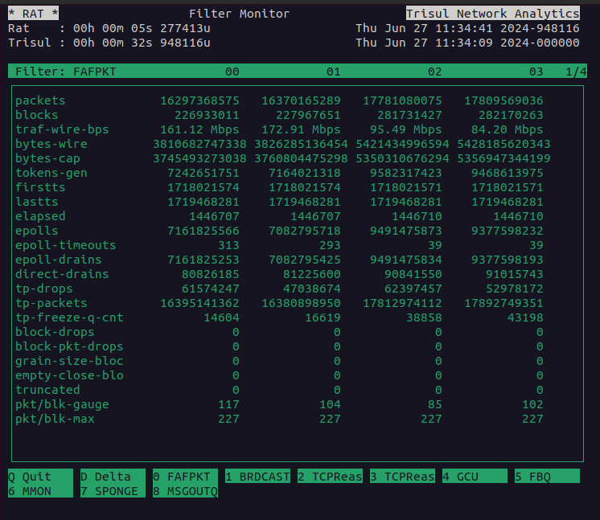
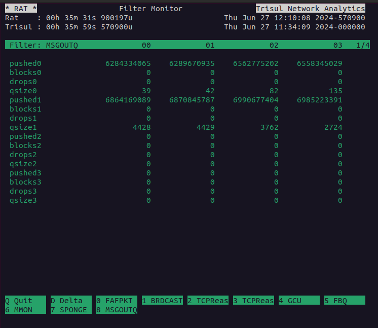

# RAT - The Trisul real time system monitor

The *rat* executable is located in `/usr/local/bin/`.

RAT is a tool that monitoring the internal performance characteristics
of Trisul pipelines. This can be an invaluable tool when you are trying
to tune the performance of the packet capture and analytics pipelines.

## Full Command line

```bash
[root@li76-90 ~]# rat probe-config-file packet-capture-method
```

The packet capture method parameter is one of `rxring` , `afp` -
AF_PACKET, `libpcap`, `ffpcap` - packet capture from file.

An example run

```bash
[root@li76-90 ~]# rat /usr/local/etc/trisul-probe/domain0/probe0/context0/trisulProbeConfig.xml rxring 
```

You can also use the “helper aliases defined in trisbashrc”: to make it
easier to start RAT. See the screencast below.

## Demo

The following screencast shows RAT in action

<figure><figcaption>rat tool screenshot showing live Trisul performance</figcaption></figure>




