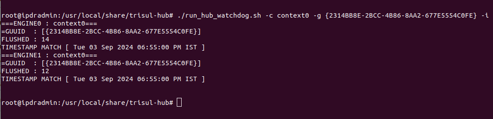

import Tabs from '@theme/Tabs';
import TabItem from '@theme/TabItem';

# Run_Hub_Flusher


The Trisul System context monitoring component is designed to detect the status of multiple contexts within the system. Unlike the `hub_flusher_watchdog.sh` script, which focuses on monitoring the overall system status and sending alerts for system downtime, this feature provides a more granular view by tracking the status of individual contexts. If any context is found to be non-running, the system automatically sends alerts to the syslog, ensuring prompt notification of potential issues. Notably, this monitoring functionality relies on the `run_hub_watchdog.sh` script, highlighting the interconnected nature of the system's monitoring and alerting capabilities.

## Modes
   1) FLOW MODE ( IPDR Customer )
   2) COUNTER GROUP MODE ( Analytics Customer )
     > Requires the GUUID key to be provided.

:::tip
Configure mail in trisul to receive alert
:bell:
:::


## Requirements
- Run this script as root
- Ensure cronjob is installed.
- Configure email in Trisul (if email alerts are required).

## Options

| Option             | Default value   | Description                           | Usage            |
| -------------------| ----------------| ------------------------------------- | -----------------|
| -c CONTEXT-NAME    | context0        | Context name                          | -c all [prints the flusher for all contexts]   |
| -e CONTEXT-NAME    |     -           | Ignores a particular context for checking           | -e netflow -e headoffice                                    |
| -s HOST-NAME       | hostname        | Host name                             | -s Trisul-Server                                            |
| -i INTERVAL        |     -           | Check flushed item count for last n minutes | -i 2                                                  |
| -g COUNTER_GROUP   |     -           | Check this counter group in log       | -g `{2314BB8E-2BCC-4B86-8AA2-677E5554C0FE}`                 |
| -f CHECK_FLOW_COUNT|     -           | Check flushed flow count              | -f                                                          |
| -v VERBOSE         |     -           | Print information like flushed flows  | -v                                                          |
| -m MATCH_ANY_ENGINE|    -           | Check if any 1 engine is flushed      | -m                                                          |
| -r RESTART         |     -           | Restart context if down               | -r                                                          |
| -a filepath        |     -          | Eg -a/home/trisul/filepath.text        | AAA file process interval |
| -j interval        |      3600        | Eg - j 3600             | AAA file process interval |


## How to Run this Script
<Tabs>
   <TabItem value="FLOW-MODE" default >
   ```bash
   /usr/local/share/trisul-hub/run_hub_watchdog.sh -c context0 -f -i
   ```
   ### Example
   
   </TabItem>
   <TabItem value="COUNTER_GROUP-MODE">
   ```bash
   /usr/local/share/trisul-hub/run_hub_watchdog.sh -c context0 -g {2314BB8E-2BCC-4B86-8AA2-677E5554C0FE} -v
   ```
   
   </TabItem>
</Tabs>

#### Execution Options
The script can be executed with or without the -i argument, which controls the verbosity of the output.  

**Verbose Mode (-i)**  
When executed with the -i argument, the script operates in verbose mode. In this mode, the script prints all values to the terminal, providing detailed information about the context status.  

**Non-Verbose Mode (No -i)**  
When executed without the -i argument, the script only prints values to the terminal if the context is not running. This mode provides a more concise output, only alerting the user to contexts that are not running.

### Example - How alert generated when the conditions not met
```bash
   /usr/local/share/trisul-hub/run_hub_watchdog.sh -c rack265
```


#### Alert Generation
The script generates alerts to the syslog based on the flush value. If the flush value is 0, it indicates that the context is not running, and an alert is generated.
#### Alert Format
The alert format is the same for both Flow Mode and GUUID Mode. The script sends a standardized alert message to the syslog, indicating that the context is not running.
>**Note: The alert message does not distinguish between Flow Mode and GUUID Mode. The same alert format is used for both modes.**

## Cron Tab

To schedule a script to run every half hour, add the following cron job to your crontab. This will allow the script to continuously run in the background, periodically checking for flows.

**COUNTER GROUP**  
`*/30 * * * *  /usr/local/share/trisul-hub/run_hub_watchdog.sh -c context0 -g {2314BB8E-2BCC-4B86-8AA2-677E5554C0FE}`

**IPDR**   
`*/30 * * * *  /usr/local/share/trisul-hub/run_hub_watchdog.sh -c context0`                     