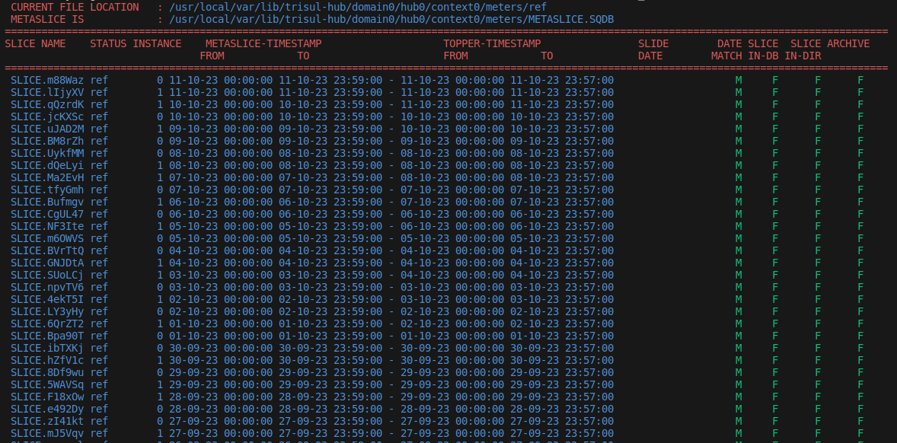
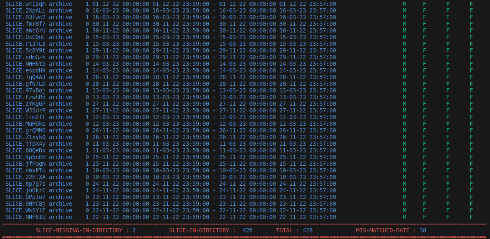

# Scan Slices

## Overview

The Scan Slices feature performs a comprehensive analysis of the METASLICE.DB and SLICE directory (each slices in storage pool) to gather and process slice information. It conducts preliminary checks, extracts slice details, analyzes each slice, and presents the findings in a table format, ultimately providing a summary of the collected slices.

  
   
   ## Arguments
   
   | Syntax          | Info                             | Usage                            |                Example               |
   | --------------- | ---------------------------------| ---------------------------------------------------- | ------------------------------------------------------ |
   | -l              | list the storage pool available                             | Use this output to below argument          | archive ref xarchive_1 oper/0/ oper/1/      |
   | -m storage-pool | prints the slice in the storage pool given by user          | You can run this script anywhere                     | ./scanslices.sh -m ref      |
   | -d .          | prints the current directry slice details                     | You should be in the storage pool to run this script | ./scan_slices.sh -d .                              |
   | -d Slice-name   | Print specific slice details given by user                  | You should be in the storage pool to run this script | ./scan_slices.sh -d SLICE.eJkeR                    |
   | -a              | Prints the slice which is either missing in db or directory | this option should be run aling with -d or -m option | ./scan_slices.sh -m red -a                               |
   | -h              | Prints the usage details                                    | -                                                    | ./scan_slices.sh -h      |

## Description of each column

| Parameter           | Info                                                              |
| ------------------- | ----------------------------------------------------------------- |
| Slice-name          | Name of the directory in storage pool                             |
| Status              | storage pool  name                                                |
| Instance            | Directory present inside storage pool for oper like 0,1.          |
| Metaslice Timestamp | Timestamp of slice in database                                    |
| Topper Timestamp    | Timestamp in directory itself                                     |
| Slide-date          | A file that contains the date in the file name                    |
| Date-Match          | compare the date between topper and meta-slice timestamp & check the difference is below 10 min or not |
| Slice-in-DB         | slice present in metaslice db or not                              |
| Slice-in-DIR        | slice presnet in storage-pool or not                              |
| Archive             | Check if the file is archivable or not                            |
| AAA                 | Check the AAAlog.SQT is present or not                            |

## Examples :

- /usr/local/share/trisul-hub/scan_slices.sh -m ref 
  
  

- 
