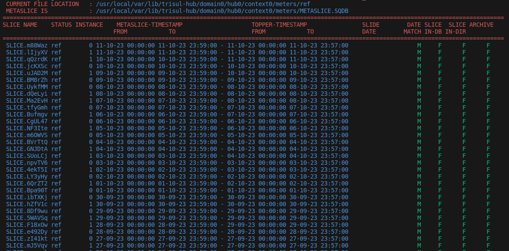
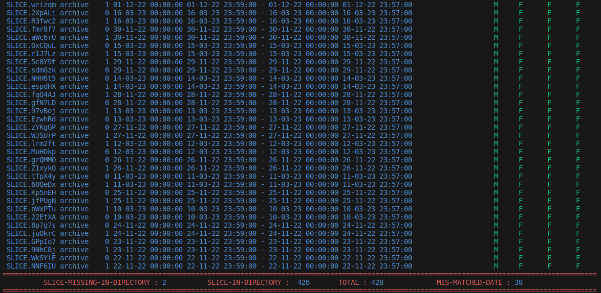

# Scan Slices

Scan each and every slice in the directory by comparing with metaslice db and provides supplementary information.

## How it works

1. Get the slice directory and checks it  contain the archivable and slide-data file or not.

2. By querying the the .SQT file with slice name , you will receive the time-frame.

3. By quering the metaslice db with slice-name and storage-pool name , you will receive the the instance and time-frame .

4. Compares the time-frame received by slice-directory and metaslice-db and it should be below 10min.

5. Before searching for the slices , it takes below precautions to run smoothly
   
   - Checks the direction given by user is accessable.
   
   - Based on the user arguments it creates a expression to search in a directory . The script checks the expression produce any error.
   
   - Checks if the given storage poo is empty or not Ex : xarchive_1.
   
   - Checks metaslice is accessible by user . Sometimes you receive an unable to open database error . For that you should run this script as root user.
   
   If any of the above condition is fails . The exit from the script and shows the reason for the error

6. At last by collecting all details and prints in output console.
   
   :::note
   
   Every minute the trisul will flush
   
   :::
   
   ## Arguments
   
   | Syntax          | Info                                                        | Usage                                                | Example                                                |
   | --------------- | ----------------------------------------------------------- | ---------------------------------------------------- | ------------------------------------------------------ |
   | -l              | list the storage pool available                             | Use this output to below argument                    | archive ref xarchive_1 oper/0/ oper/1/ |
   | -m storage-pool | prints the slice in the storage pool given by user          | You can run this script anywhere                     | ./scanslices.sh -m ref                                 |
   | -d   .          | prints the current directry slice details                   | You should be in the storage pool to run this script | ./scan_slices.sh -d .                                  |
   | -d Slice-name   | Print specific slice details given by user                  | You should be in the storage pool to run this script | ./scan_slices.sh -d SLICE.eJkeR                        |
   | -a              | Prints the slice which is either missing in db or directory | this option should be run aling with -d or -m option | ./scan_slices.sh -m red -a                             |
   | -h              | Prints the usage details                                    | -                                                    | ./scan_slices.sh -h                                    |

## Description of each column

| Parameter           | Info                                                                                                   |
| ------------------- | ------------------------------------------------------------------------------------------------------ |
| Slice-name          | Name of the directory in storage pool                                                                  |
| Status              | storage pool name                                                                                      |
| Instance            | Directory present inside storage pool for oper like 0,1.                                               |
| Metaslice Timestamp | Timestamp of slice in database                                                                         |
| Topper Timestamp    | Timestamp in directory itself                                                                          |
| Slide-date          | A file that contains the date in the file name                                                         |
| Date-Match          | compare the date between topper and meta-slice timestamp & check the difference is below 10 min or not |
| Slice-in-DB         | slice present in metaslice db or not                                                                   |
| Slice-in-DIR        | slice presnet in storage-pool or not                                                                   |
| Archive             | Checks if the file is archivable or not                                                                |

## Examples :

- /usr/local/share/trisul-hub/scan_slices.sh -m ref 
  
  
  
  At the end of the result , you will be shown  no.of slices present , no.of slices not-present , no of mismatched-date. 

- 

