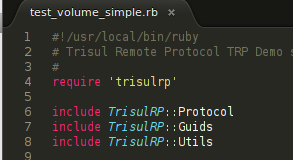

# Trisul Remote Protocol

Write reusable scripts to create your own reports in any format, automate hunting, and other security monitoring tasks

## Get started

This short step by step tutorial explains how you can get a ruby script running and exchange a simple HelloMessage with the Trisul server.

- [Step by step tutorial using Ruby](https://trisul.org/docs/trp/trpgemsteps.html)

## DOCUMENTATION

import { Icon } from '@iconify/react';

<Icon icon="mdi:github" height="25" /> [API message reference](https://github.com/trisulnsm/trisul-scripts/blob/master/trp/trp_proto.md ). 

<Icon icon="mdi:github" height="25" />  [TRP sample scripts](https://github.com/trisulnsm/trisul-scripts/tree/master/trp )

<Icon icon="logos:chrome" height="25" /> [Programming model](/docs/trp/trpprogramodel) 

<Icon icon="logos:chrome" height="25" /> [TrisulRP Ruby Gem RDOCs (External)](../ref/trpproto )

## Other links

<Icon icon="mdi:github" height="25" /> [Google protocol buffers on which TRP is built](https://github.com/protocolbuffers/protobuf).

<Icon icon="mdi:github" height="25" /> [The trisulrp ruby gem project on Github. Pulls welcome!](https://github.com/trisulnsm/trisulrp)

<Icon icon="logos:chrome" height="25" /> [ The trp.proto file - if you want to write clients in any language supported by protocol buffers](/docs/ref/trpproto)

## GITHUB CODE SAMPLES

Beginner ? Here are some ready to run scripts from our open [Github repo](https://github.com/trisulnsm/trisul-scripts) to get you started

##### [print_resources.rb](./samples/resources_step_by_step)

Print HTTP URLs seen by Trisul over a recent time interval. This is a step-by-step tutorial that also explains how to work with IPs and hostnames.

##### [flows_for_ip.rb](./samples/flows_for_ip)

View top 100 flows for an IP in a time window.

##### [pcap_simple.rb](./samples/pcap_simple)

Get all SMTP and DNS packets in last one hour as a PCAP
