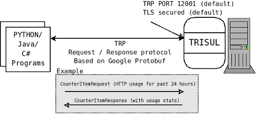

# The programming model

The main motivation of Trisul Remote Protocol is to allow remote
automation of forensics tasks. From a single workstation you can
[connect](/docs/trp/) to any number of Trisul probes and run
your custom analysis and forensics tools.

TRP is a message based request-response protocol. The protocol is built
using [Google Protocol Buffers](//code.google.com/p/protobuf) which
provides a language neutral, backward compatible, and compact format.
You can write scripts in any language such as Ruby, Python, or Java by
using the protocol definition file [trp.proto](/docs/ref/trpproto)
and binding them to a language of your choice.

div(success). All TRP messages are described in the [TRP Messages and
Fields](/docs/ref/trpproto) page.

## Request response

The Trisul Remote Protocol (known as TRP) provides an interface for
clients to access the data collected by Trisul.

### Key Features

\* TRP is based on [Protocol Buffers](//code.google.com/p/protobuf/) a
data interchange format introduced by Google.  
\* The entire protocol is specified in a single file called
[trp.proto](/docs/ref/trpproto)  
\* Allows clients to be written in **Ruby/Python/Java/C#/C** and any
language supported by Google Protocol Buffers  
\* Secure TLS with client authentication and Access Control Lists  
\* Access to traffic stats, flow details, flow investigation features

## Synchronous operation

A client sends a request message to Trisul and waits for a response to
that message. The protocol is synchronous. This means that you cannot
have multiple outstanding requests on a single connection. You may
however open any number of connections to Trisul.

The typical steps a developer needs to do :  
\# Construct a TRP message you want to send by filling in the
appropriate fields  
\# Serialize the message to a string  
\# Send across a 4 byte message length in **network byte** order  
\# Send across the serialized message itself  
\# Read a 4 byte response message length in **network byte** order  
\# Parse the response message  
\# Process the response as you see fit
