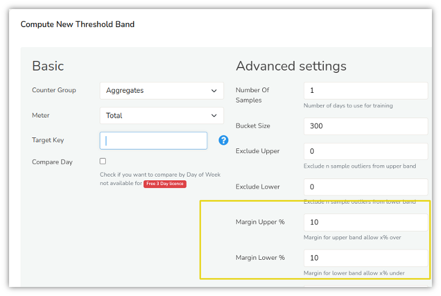
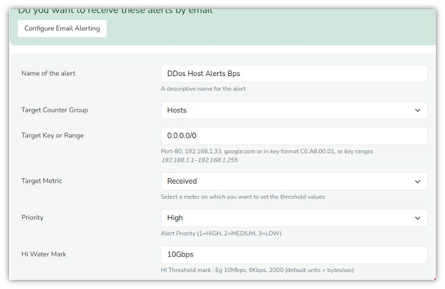
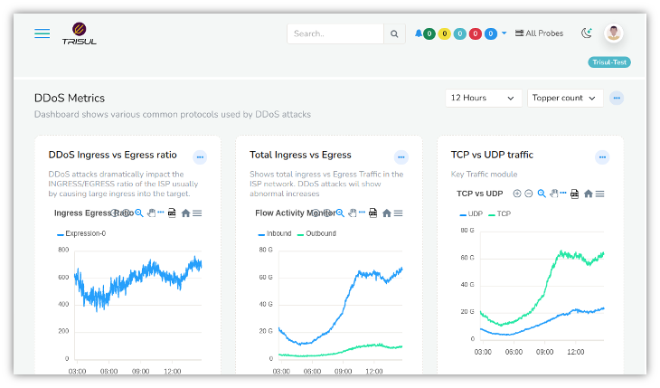
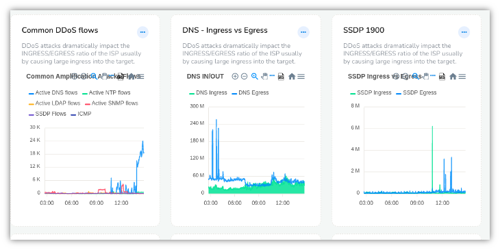
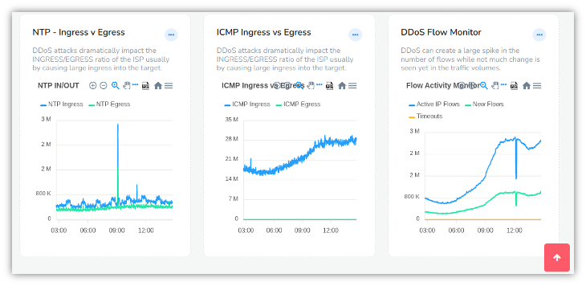

# 9.11. Detecting volumetric attacks

Using the TCA [Threshold Crossing Alerts](https://trisul.org/docs/ug/alerts/tca.html) and the TB [Threshold Band Alerts](https://trisul.org/docs/ug/alerts/tband.html) it is easy to configure Trisul Network Analytics to detect volumetric attacks such as DDoS Distributed Denial of Service.

Configuring DDoS detection in Trisul gives you the following features

1. With Packet Mode detection in as little as 10 seconds
2. With Netflow Mode detection in 1-2 minutes
3. Detect hosts sending or receiving exponential growth traffic
4. Ability to run a script in response to an alert
5. Sending Alert by Email immediately

## 9.11.1 DDoS attack types

DDoS attacks typically utilize a number of hosts to send large 
payloads to a target host. Trisul allows you to simply track all IP 
Addresses in real time and alert when any of them exceed threshold for 
the following criteria.

1. transmit or receive large volume of traffic
2. transmit or receive large number of packets
3. generate a large number of flows with TCP SYN or SYN/ACK
4. flood with ICMP or ARP

Furthermore you can configure Trisul to automatically track UDP protocols for amplification attacks like SNMP, DNS, CHARGEN, NTP and others by measuring IN vs OUT traffic and setting thresholds.

## 9.11.2 Configuration

There are two steps to configuring DDoS detection

1. Using Threshold Bands to detect anomalous traffic on key uplink traffic ports.
2. Using Threshold Crossing Alerts to track hosts sending huge volumes of traffic

### Threshold Band alerts for key uplink ports

Threshold Bands is a dynamic adaptive thresholding mechanism which 
monitors traffic for 5 weeks and builds a “Profile” for expected traffic
 volumes. Create threshold band alerts for all key uplink ports and set
 a large window.

Create a large Upper Margin of say 200%. This will generate an alert when anomalous traffic is generated.

### Create TCA with thresholds

This varies from network to network, the idea is to set high enough thresholds that would trigger a DDoS.

The following TCAs should be created

| Counter Group | Keys          | Meter            | Hi Water Mark | Sustained Intervals |
| ------------- | ------------- | ---------------- | ------------- | ------------------- |
| Hosts         | *             | Received Traffic | 10Gbps        | 1                   |
| Hosts         | 100.10.0.0/16 | Received Traffic | 20Gbps        | 1                   |
| Hosts         | *             | Packets          | 1Mpps         | 1                   |

Notice how you can use patterns to create separate threshold for host groups.

The following shows a DDoS tracker for ANY host attacked with 10Gbps load with a 1 minute detection time.

## 9.11.3 Alerts dispatch and response

DDos Alerts are dispatched like normal TCA alerts. They are seen on screen or can be delivered instantly via E-Mail

### Automated actions

The alert message generated include the IP under attack and other details. You can use the [Alert Monitor Trisul LUA API](https://trisul.org/docs/lua/alert_monitor.html) to automate responses upon receiving the alert. Some of the responses can include.

1. Use GoBGP to announce a custom route
2. Trigger a RTBH to block the IP under attack or BGP FlowSpec to divert traffic to a scrubbing centre
3. Run any custom shell script

These integrations can be performed via the LUA API.

## 9.11.4 Dashboards

A DDoS dashboard is also available that constantly tracks the following metrics.

You can add any other information you want as well to this customizable dashboard.

***UDP ingress egress ratio***

UDP receive / transmit ratio used to detect amplification attacks

***Total ingress vs egress***

Total in vs out in network

***TCP vs UDP***

TCP vs UDP traffic, DDoS usually deploys UDP

***Common DDoS flows***

number of flows of common DDoS protocols SNMP, NTP, LDAP, CHARGEN etc

***DNS SSDP ICMP NTP***

track DNS and SSDP etc

***DDoS Flow Monitor***

Total flows active in network, number of new flows, terminations

Examples of the DDoS dashboard are shown below

