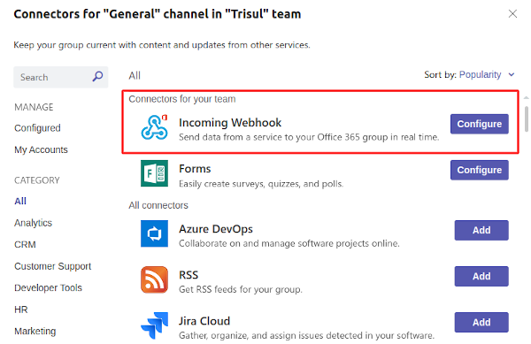
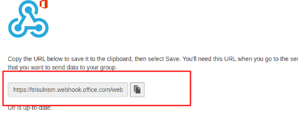

---

sidebar_position: 13

sidebar_label: Microsoft Teams Delivery

---

# Microsoft Teams delivery

Trisul can automatically send alerts to Microsoft Teams via an Incoming Webhook URL.  
This greatly enhances the workflow and productivity of users who are already using Teams for  
activity co-ordination.

A sample of the alert is shown here.

## Setting up Incoming Webhook URL

Create a channel within a Team for Trisul Alerts.

Select “Connectors” as shown below.

Then provide a name for the *Incoming Webhook* as shown below and press create

Copy the Incoming Webhook URL.

## Add to App Settings

To activate the Webhook and send alerts to Teams. Do the following steps

:::note navigation

login as *admin* Then go to [App Settings](/docs/ug/webadmin/web_options) > API >

:::

Enter the Incoming Webhook URL copied in the previous step.

Ensure that the Email Notification Service which also processes the MS Teams alert push is running.
