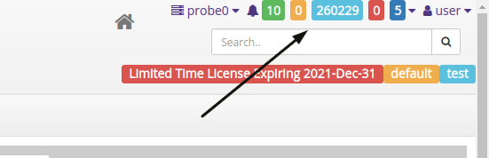
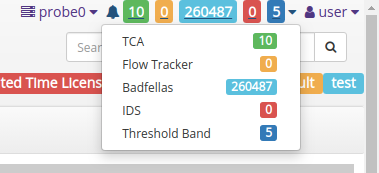
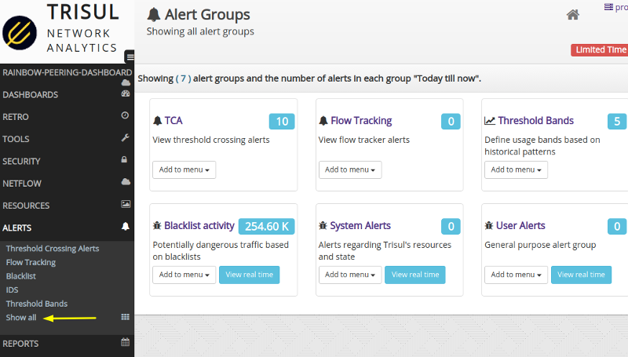

# 9.10. Summary of all alerts

There are many different types of alerts supported by Trisul. In 
addition to built in alert types you can add your own types using the 
Lua plugin mechanism.

This page describes how you can get an overview of alert activity across all types.

## 9.10.1 The top alert bar

On top of every page there is an alert bar which shows near real time alert counts. These numbers show only *new* alert counts you last saw it.

*Alert bar showing counts*

You can click on the bar to open the counts for each type of alerts. They are color coded.

*Click the bar to open up individual counts. Click*

You can click on any type of alert displayed to start searching and analyzing those alerts.

## 9.10.2 The Show All menu]

:::note navigation

Select Alerts → Show all

:::

*Show all alert type counts*

This shows alert counts per type for today. These counts indicate total number of alerts seen from midnight today till now.

1. click on the numbers to search and analyze those types of alerts
2. If the *view real time* button is present you can open a real time view of alerts as they come in
