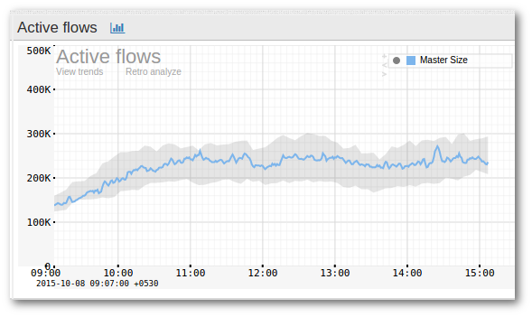

# Threshold Band Anomaly alerts

**NEW**

Trisul can look at long term history of any metric and compute a band within with the metric is usually found.

The band

1. is computed for every 5 minute interval
2. day of week based so weekends are tracked separately
3. can handle holidays and spikey days

The screenshot below shows a metric (Active Flows) for which 
“Threshold Banding” is enabled. The band is shown as a grayish 
background while the actual metric is shown as the curve.

## How it works

The feature is enabled by two separate processes.

### Band computation

The most important part is how the bands are computed. Currently there are two options.

1. Day of week based : This compares a Wednesday only with other 
   Wednesdays and excludes outliers. This features requires at least 3 
   weeks of training data.
2. Simple : Compare with yesterday.

> The Day of Week based banding requires a Licensed version of Trisul, because it needs atleast 3 weeks of training data. If you are running Trisul with a free license use the Simple band feature.

#### Metrics and automatic computation

You select any of the metrics available in Trisul and decide to use 
Threshold Banding on it. This requires you to select a metric which is 
identified by a counter group, a key, and a meter id.

Once you enable Threshold Banding on a metric, Trisul automatically 
updates the band every night as time passes to take into account recent 
trends. There is no configuration required to do that.

### Band alerting

The band computation process pre computes expected range of values 
for a particular metric for each time interval during the day. Trisul 
continuosly checks if the metric is within the expected band for that 
day and time period. If it is out of bounds it generates “Threshold Band
 Alert”.

## Configuring

### Creating a new Threshold Band Anomaly monitor for a particular counter

There are two ways

Method 1

:::note navigation

Select Alerts → Threshold Band → Configure → New

:::

Method 2

:::note navigation

Click on any key in any chart → From Key Dashboard → Create Threshold Band

:::

The following fields are shown in the form

#### Basic settings

You must fill this up. If you came to this page from the Key Dashboard the fields are already pre-filled.

| FieldName     | Description                                                                                                                                                                                             |
| ------------- | ------------------------------------------------------------------------------------------------------------------------------------------------------------------------------------------------------- |
| Counter Group | The counter group.                                                                                                                                                                                      |
| Stat ID       | Meter within the counter group                                                                                                                                                                          |
| TargetKey     | The key within the *target counter group* on which you want to create a Band. You can enter this in either human readable format eg:Port-80, 192.168.1.33 or in Trisul key format: p-0050, C0.A8.00.01  |
| Compare Day   | If Checked – use Day Of Week based band computations. If Unchecked – use yesterdays data to compute a band.  **NOTE** You need a licence for Day Of Week band because it needs 3 weeks of training data |

#### Advanced settings (optional)

Use this section to fine tune the band computation algorithm.

> Reccomend you first create a band using the default settings, then based on alert volume. You can come back here and tweak the advanced settings below

| FieldName         | Default | Description                                                                                                                                                                                                                                                                                                                              |
| ----------------- | ------- | ---------------------------------------------------------------------------------------------------------------------------------------------------------------------------------------------------------------------------------------------------------------------------------------------------------------------------------------- |
| Number of samples | 1       | The number of samples used to compute the band. The default is 1 which means last Wednesday will be compared with this Wednesday. If you set this to 5 last 5 Wednesdays will be used to compute expected band. The default is 1 so that our users can quickly use this feature without requiring many weeks of training data available. |
| Bucket Size       | 300     | The width of each interval.                                                                                                                                                                                                                                                                                                              |
| Exclude Upper     | 0       | For each interval exclude this many upper samples. Set this to 1 to exclude 1 upper outlier                                                                                                                                                                                                                                              |
| Exclude Lower     | 0       | For each interval exclude this many lower samples.                                                                                                                                                                                                                                                                                       |
| Margin upper      | 10      | Margin of allowance on the upper side before alert is generated                                                                                                                                                                                                                                                                          |
| Margin lower      | 10      | Margin of allowance on lower side before alert is generated                                                                                                                                                                                                                                                                              |

Then press the “Compute Band” button. This could take a few minutes. Once it is completed the band will be shown below.

### Cron

Once a band has been created. It is automatically updated by a 
special cron task every night. There is no further configuration 
required.

## Viewing alerts

Once an anomaly is detected Trisul generates an alert, similar to an 
Intrusion Detection or Flow Tracker alert. This appears in the top right
 panel.

#### Alerts view

:::note navigation

Select Alerts → Threshold Band Alerts

:::

1. You will now see a table listing all the alerts
2. Click on view threshold band to bring up a chart showing where the alert occurred

Alerts are indicated by a label. You can either ignore the alert if 
it is just over the band or you can take immediate action if the metric 
changes dramatically.

## Deleting alerts

The default approach of Trisul is not to delete anything. TCAs just rollover as they age out.

If you wish to delete all alerts for a particular band, you can 
delete the band itself. That deletes all the alerts, then you can 
recreate the band.

:::note navigation

Select Alerts → Threshold Band → Configure → Delete

:::
