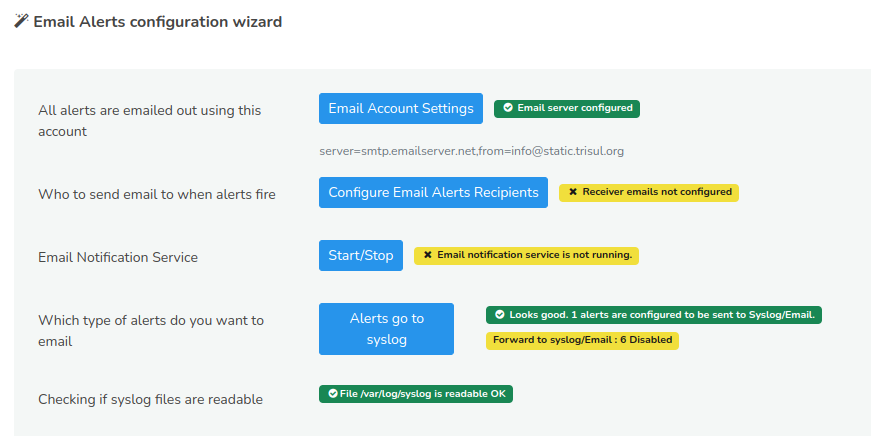
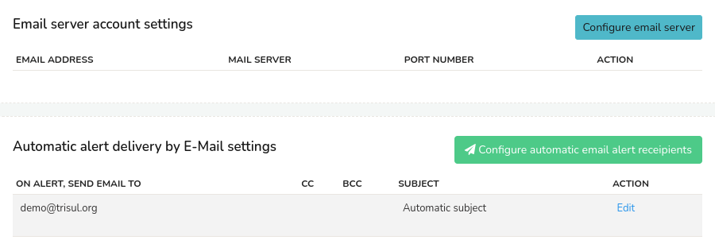
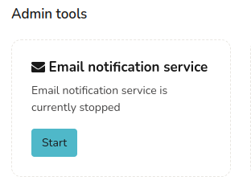
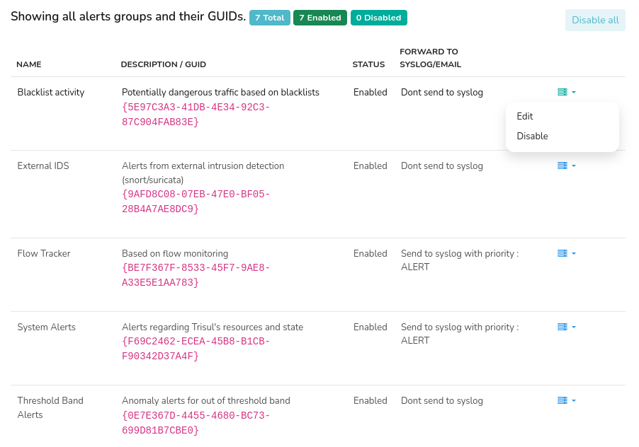

# Email Alert Delivery

This page describes how you can configure Trisul to send you an email when any alert fires.

The way the alerting pipeline works is the following.

- Alerts are first sent to syslog
- The email alert service watches syslog for alerts and dispatches them

## Using the Email Alerts Wizard

Trisul has a new Email Alert Wizard that lets you configure everything from one place.

To access that Login as Admin

:::info navigation
:point_right: Go to Context: default → Profile0 → Alerts → Setup Email
:::

This will take you to the Email Alerts Wizard as shown in this example. And against each settings it will be shown if the service is configured or disabled. 

*Figure: Email Alerts Configuration Wizard*

## Basic Steps to Enable Email Alerts

The following steps are needed to forward email alerts.

- ##### Setup SMTP Server to send emails
  
  In the Email Alerts Configuration Wizard, Click Email Account Settings. This will open the Email server account settings.
  
  
  
  *Figure: Email Account Settings Module*
  
  This is where you configure the email addresses that you want to be sent from and the recipient email addresses.
  
  In ths window, Click on Configure email server.  And you can configure an Email server using which Web Trisul will send outgoing mails by filling up the following fields.
  
  | Fields                        | Description                                                                   |
  | ----------------------------- | ----------------------------------------------------------------------------- |
  | Email Server                  | Hostname or IP of the SMTP server                                             |
  | SMTP Port Number              | SMTP Port (Usually 25. For Gmail use 587)                                     |
  | Authentication Protocol       | Click from the drop down list of authenticaton protocols                                                                                                       |
  | From Email Address            | This is displayed as the sender's address on the recipient's inbox                                                                                                           |
  | Password/API Key              | Email Password,API Key,or Provider password like pepipost,sendgrid                                                                                               |
  | Disable SSL Cert verification | Disable certificate verification. Eg, if your email server uses self signed certificates                                                                                                    |
  | SMTP Relay User (optional)    | Use this to send SMTP email via relays like sendgrid,mailchimp,pepipost etc. This is the user id given to you by the provider. Leave it blank if not required                                |

Once provoding all the fields, Click Save and the email server configuration for outgoing mails is done.

- ##### Ensure who receives the Alert Emails
  
  Again, from the Email server account settings, Click Configure automatic email alert recipients. Or you can also configure from Email Alerts Configuration Wizard and click Configure Email Alerts Recipients. This is where you specify where to send emails when alerts fire. 
  
  Provide the following fields to configure automatic email alert delivery to the recipients.
  
  | Fields                   | Descriptions                                                                      |
  | ------------------------ | --------------------------------------------------------------------------------- |
  | Send alerts via email To | Email address of receiver. You can only enter one address, use cc to add multiple |
  | Cc                       | Add multiple recipient addresses seperated by comma(,)                            |
  | Bcc                      | Add multiple recipient addresses seperated by comma(,)                            |
  | Signature                | Enter a block of text that can be automatically appended to the end of your email |
  
  Once providing all the fields, Click Save and the configuration for automatic email alert delivery to the recipients is done.

- ##### Start/Stop an Email Notification Service
  
  In the Email Alerts Configuration Wizard, Click Start/Stop. This will take you to the administrative tasks page. In the Email notification service module as shown in this example, it will be shown if the email notification service is enabled or stopped. 
  
  
  
  *Figure: Showing Email Notification Service Button in Admin Tasks*
  
  Click Start to start sending alerts as email notifications. Otherwise click Stop to stop the email notification service.
  
  The email notification service logtails the syslog and dispatches alerts. The service is careful not to flood < 5 minutes and can automatically create digests if alert volume are too high.

- ##### Ensure alerts are forwarded to syslog
  
  From the Email Alerts Configuration Wizard, click "Alerts go to syslog". This will open the alert groups window and you can see the list of all the alert groups and their GUIDs status. You can see the total number of alert groups and the number of alert groups currently enabled and disabled right next to the title. You can disable all the alert groups by clicking "Disable all" on the top right corner.
  
  
  
  *Figure: Email Alerts Groups and their GUIDs*
  
  The alert groups table contains the following components and options.
  
  | Components              | Descriptions                                                                    |
  | ----------------------- | ------------------------------------------------------------------------------- |
  | Name                    | Name of the Alert Group                                                         |
  | Description/GUID        | Description of the Alert group and its GUID                                     |
  | Status                  | Status of the Alert group if its enabled or disabled                            |
  | Forward to syslog/email | Syslog level to automatically forward all alerts in this group to syslog and email|
  | Option toolbar          | You can edit or disable each alert group by clicking on the three lines options against each alert group.                                                                                   |

These components can be edited or disabled by clicking on the option toolbar against each alert group. Once providing all the fields, click Update to save the configuration.

## Advanced Customization of Email Subjects and Bodies

Trisul uses ERB Templates to configure email subjects and bodies.

The config file is located in  
`/usr/local/share/webtrisul/config/initializers/emailalert_settings.rb`

The config file is well documented and should be self describing.

The file contains 5 sections. Each controlling a particular type of alert

1. TCA = Threshold Crossing Alerts
2. FT = Flow Tracker Alerts
3. BADFELLAS = Blacklist based Alerts
4. IDS = Snort/Suricata alerts
5. TBA = Threshold Band Alerts

### IDS Alerts

IDS alerts from Snort/Suricata processed via Trisul.

| EMAIL_BLOCK_PRIORITIES | []  | Block these priorities. Set this to `[3]` to block emails for low priority alerts|
| ---------------------- | --- | ---------------------------------------------------------------------------------|
| EMAIL_BLOCK_SIGS       | []  | Block these signatures for email alerts                                          |
