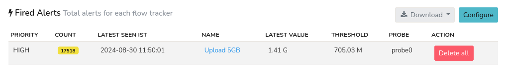
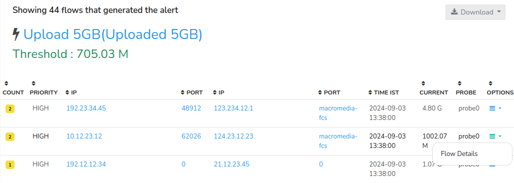

---

sidebar_position: 4
---

# Flow Tracker Alerts

Having previously configured [*Flow Trackers*](/docs/ug/flow/tracker) as described in our prior documentation, we will now proceed to outline the procedures for generating alerts based on these *Flow Trackers*. This section will focus on the creation and configuration of **Flow Tracker Alerts**, that enables the detection of specific flow activity and triggers notifications in response to pre configured threshold criteria.

## Overview
Trisul provides a powerful way to generate an alert when certain types of flow activity occurs.
Once configured, *Flow Tracker Alerts* can be triggered in near real-time (latency of 1-5 seconds) prompting notifications via:
- [Web Interface Alert Tracker](/docs/ug/ui/userlayout#alerts-and-notifications) (located in the top-right corner)
- Email notifications
- SMS (Text Message) notifications

## Applications

You can use *Flow Tracker Alerts* to be notified when a number of things happen. Some typical examples include,

1. When anyone *uploads* anything over 10MB from your network
2. When anyone establishes a long lived session more than 1 hour out of your network
3. When anyone *downloads* anything over 1G into your network

## Configuration of Flow Tracking Alerts

To Configure *Flow Tracking Alerts*, Login as `user`,

:::info navigation
:point_right: Select Alerts&rarr; Flow Tracking&rarr; Configure
:::

Or you can create *Flow Tracker Tracker Alerts* per probe.

For that, Login as `admin` user to create *Flow Tracker Alerts*.

:::info navigation
:point_right: Select *Context : default*&rarr; profile0&rarr; Alerts&rarr; Flow Tracker 
:::

### Create New Flow Tracker Alert

Click on **Create a New Flow Tracker Alert**

Filling in this form enables you to create an alert condition on a flow tracker. Find the fields and their description below to fill in the form.

| Field                              | Description                                                                |
| ---------------------------------- | ---------------------------------------------------------------------------|
| Alert Name                         | A unique name for the alert                                                |
| Select a Flow Tracker              | Which tracker, see section on Flow Trackers                                |
| Threshold Value (Bytes or Seconds) | For data xfer based trackers. Specify number of bytes. Eg 10MB, 6K, 2000 (default units = bytes). For Time based trackers like Long Lived flows. Specify number of seconds                  |
| Priority                           | Alert Priority (1=HIGH, 2=MEDIUM, 3=LOW)                                   |
| Alert Message                      | Message shown as part of the alert                                         |

Once providing all the details in the form, click *Create*. Now you have created a new *Flow Tracker Alert*.

### View Generated Alerts

There are couple of ways to see flow alerts that fired. To view the generated alerts,

:::info navigation
:point_right: Go to Alerts&rarr; Flow Tracking
:::
Or 
:::info navigation
:point_right: Go to Dashboards&rarr; Alerts&rarr; Flow Activity Alerts
:::

Here you can find the total alerts for each flow tracker with the following details. 

*Figure: Fired Alerts*

| Column                       | Description                                                                     |
|----------------------------------------------|-----------------------------------------------------------------|
| Priority                     | The level of severity assigned to the alert                                     |
| Count                        | The number of times the alert has been triggered. Click on the count to see individual alerts triggered and their details                                                                    |
| Last Seen IST                | The last time the alert was triggered (in Indian Standard Time)                 |
| Name                         | A descriptive name for the Flow Tracker Alert                                   |
| Latest Value                 | The latest value of the flow that triggered the alert                           |
| Threshold                    | The threshold value configured to trigger the alert                             |
| Probe                        | The data source that captured the flow for triggering the alert                 |
| Action                       | Click the *Delete All* button to delete all the alerts

- Click on the [*Download* button](/docs/ug/ui/elements#download-button) to download the *Flow Tracker Alerts* data in PDF, XLSX, and CSV formats.
- You can also search for *Flow Tracker Alerts* at any time interval. Clicking on the [*Show Search Form*](/docs/ug/ui/elements#hide-show-search-form) option on the top right will show you the [Time Frame](/docs/ug/ui/elements#time-selector) to customize alerts for specific dates.

### View Individual Alerts

Clicking on the *count* (yellow icon) with numbers on the *Fired Alerts* that indicate the number of *Flow Tracker Alerts* generated will display the list of many trackers with the following details.   

  
*Figure: List of Individual Alerts and their Details*

| Column     | Description                                                                                        |
|------------|----------------------------------------------------------------------------------------------------|
| Count      | The number of counts the alert has been triggered for that particular Flow> Clicking on the count takes you to further analyze the alert in more detail                                                             |
| Priority   | The level of severity assigned to the alert                                                        |
| IP         | The Source IP where the flow got originated                                                        |
| Port       | The Source Port from where the Flow got emanated                                                   |
| IP         | The Destination IP where the flow reached                                                          |
| Port       | The Destination Port where the flow got terminated                                                 |
| Time IST   | The time the alert got triggered (in Indian Standard Time)                                         |
| Current    | The volume value that triggered the alert                                                          |
| Probe      | The data source that captured the flow that triggered the alert                                    |
| Options    | Clicking on the option button enables you to view the flow details including end points, flow stats, timing and netflow details of that particular flow.                                                        |

- You can click on each IP and Port to drilldown for further analysis which will take you to the [*Key Dashboard*](/docs/ug/ui/key_dashboard) and each column has a [*Column Sorter*](/docs/ug/ui/elements#column-sorter) clicking on it will sort the data in the column.
 
- You can also [*Download*](/docs/ug/ui/elements#download-button) the *Flow Tracker Alerts* data from here in PDF, XLSX, and CSV formats.

## Sending Alerts by Email

You can set up email alert delivery for flow trackers as described in the section [Alerts via Email](/docs/ug/alerts/email_wizard)
