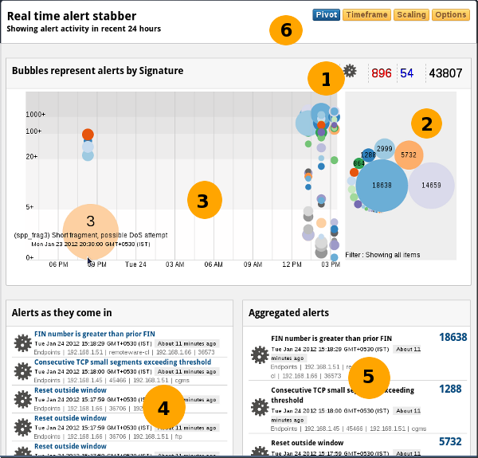

# Real Time Alert Stabber

The real time alert stabber is designed to be the central place for viewing IDS alerts. The idea is to explore alert activity from various angles using animation and an interactive UI.

1. Alerts activity over a period of time – say the past day
2. Types & Priorities of alerts
3. Individual alerts as they come in with details of endpoints
4. Aggregated alert activity over the period of time
5. Allow pivoting of view from alert signature, end points, priority, and classification

The bubbles are interactive – you can click on any of them to access 
various options. In keeping with overall Trisul philosophy you can pull 
up flows and packets for any alert.

### Accessing

:::note navigation

To access select Dashboards → Real Time Alerts

:::

### Requirements

The real time alert visualizer is a type of real time stabber. See the section of [Real Time Stabbers](/docs/ug/cg/stabber) for more. Since it requires browsers with support for WebSockets and LocalStorage, using the latest version of Google Chrome is a safe bet.

## Using the real time alert stabber

Let us examine each section of the console.

### Description

Consider the numbered orange circles in the screenshot above.

| Part # | Data                     | Description of UI module                                                                                                                                                                                                                                                                                                                                                                                                                             |
| ------ | ------------------------ | ---------------------------------------------------------------------------------------------------------------------------------------------------------------------------------------------------------------------------------------------------------------------------------------------------------------------------------------------------------------------------------------------------------------------------------------------------- |
| 1      | Alerts by priority       | Red = Priority 1, Blue = 2, Black = 3 (low). These numbers update dynamically, you can also click on them to view alerts of each category                                                                                                                                                                                                                                                                                                            |
| 2      | Alert types bubble chart | Shows each alert type seen in time interval as a bubble chart. This type of layout can pack a lot of information into a small space. Hover your mouse over any bubble to access further options. Hover over bubble to highlight alerts of that type on timeline Hide a particular type Hide all bigger bubbles so you can take a closer look at tiny ones As alerts come in the bubbles fill up and automatically adjust themselves to fit in space. |
| 3      | Timeline                 | Shows alert distribution over time. The Y-Axis scale is multilinear, the advantage of this scale is that single alerts (the quiet ones) get as much of your attention as the big ones. Within a range, the size of circles are proportional to their occurances. By default, the timeline shows alerts over 1 day in 1 hr intervals. Hover over a alert & click to view alerts of that type in that interval New alerts sprint across the screen     |
| 4      | Raw alerts               | A dynamically updating table showing the most recent 100 alerts.Table optimized for real time use, shows elapsed time, inspired by twitter’s timeline Clicking on any item takes you to that alert, from where you have other drilldown options                                                                                                                                                                                                      |
| 5      | Aggregated alerts        | Alerts by group. Most recently active groups migrate to the top of the table. Click on an alert group to view all individual alerts in that group                                                                                                                                                                                                                                                                                                    |
| 6      | The tool bar             | Controls various aspects of the visualization (see below)                                                                                                                                                                                                                                                                                                                                                                                            |

#### The toolbar

The toolbar (item 6 in the screenshot above) consists of :

***Pivot***

Change the display by showing a different aspect of alert data 
as the focus (pivot). By default, the stabber shows alert signatures 
(alert types) as the pivot. So the bubbles represent alert signatures 
over time. You can modify this to Source IP, the bubbles then represent 
Source IP addresses over time. This way you can analyze the alert data 
by the following :  

- Signature (default)

- Priority

- Classification

- Source IP

- Dest IP

- Port

***Timeframe***

Adjust the time window shown. The default is the past 24 hours.

***Scaling***

Adjust the scaling for High, Medium, and Low alert volume. This 
rearranges the display to help you focus on most frequently events or 
least frequent events. The default is medium.

***Options***

Clear name cache. The name cache is a browser based database 
used to show user friendly names, hostnames instead of IPs, etc. If you 
find hostnames, app names missing even after 10 minutes of running, try 
clearing the name cache. They are rebuilt.

## Links

Some useful links

1. [How to connect Trisul to accept IDS alerts from Snort](/docs/howto/setup_ids_alerts)
