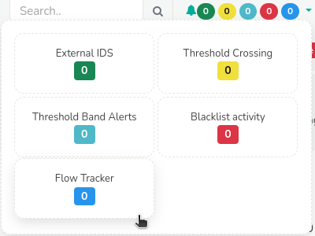
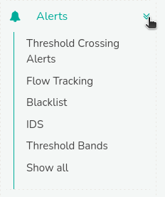

# Alerts

**Alerts** are automated notifications generated by Trisul's monitoring engine in response to predefined network activity, security anomalies, or system events.

Trisul allows administrators to set up alerts based on network activity, that enables real-time monitoring and notification of potential issues or security threats.

## Alerts Viewing Options

Generated alerts can be accessed through two methods:  
### Alert Bar   
Alerts are displayed on the top right corner of the [*user home screen*](/docs/ug/ui/userlayout), updating automatically within a 1-minute interval.  

  
*Figure: Alerts and Notification Bar*

### Alerts Menu  
Alerts can be analyzed in detail through the dedicated *Alerts* menu from the [*user home menu*](/docs/ug/ui/userlayout#menus), providing a comprehensive view of network activity.

  
*Figure: Alerts Menu*

## Alerts Notification Options
Trisul supports multiple notification channels for alert dispatch:  
- **SYSLOG**: Alerts can be forwarded to SYSLOG servers for centralized logging and analysis.  
- [**EMAIL**](/docs/ug/alerts/email_settings): Alerts can be sent to designated email addresses, enabling prompt notification and response.  
- [**SMS**](/docs/ug/alerts/sms_settings): Alerts can be dispatched via SMS notifications, ensuring timely alerting and escalation.  

> The Email and SMS services work by reading the SYSLOG alerts. Ensure SYSLOG forwarding is enabled for each alert type.

## Types of Alerts in Trisul

Trisul ships with 7 types of alerts.

| Alert Types                     | Description                                                                 |
|---------------------------------|-----------------------------------------------------------------------------|
| Threshold Crossing Alerts       | Alerts triggered when a meter value (example: network traffic, bandwidth usage) exceeds fixed high or low watermarks for a specified time.                                                      |
| Flow Tracking Alerts            | Alerts generated when network flow behavior deviates from expected patterns.|
| Blacklist Alerts                | Alerts generated when blacklisted indicators (example: known malicious IP addresses, domains, or URLs) are detected.                                                                      |
| IDS Alerts                      | Alerts triggered when the system interfaces with external Intrusion Detection Systems (IDS) like Suricata.                                                                                    |
| Threshold Band Anomaly Alerts   | Alerts triggered when a meter value drifts outside a "trained" band of normal values.                                                                                                         |
| System Alerts                   | Alerts generated by Trisul's self-monitoring system, including Packet drops, Memory pressure.                                                                                                |
| User Alerts                     | User-defined alerts triggered to notify them of specific events or conditions that are important to them                                                                                      |

This documentation covers a comprehensive guide on Trisul's alerting system including **Alerts Classifications, Managing Alerts, Alerts Notification Channels and their Configuration**.  

Navigate the following topics in a sequential manner to facilitate a logical flow of information.

import DocCardList from '@theme/DocCardList';

<DocCardList />