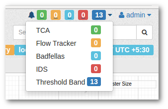

# Alerts

You can set up Trisul to generate alerts based on network activity.

These alerts can be

- viewed on the alert bar on the top right (automatically within 1 minute)
- analyzed from the alerts menu
- dispatched via SYSLOG, EMAIL, or SMS notification

import DocCardList from '@theme/DocCardList';

<DocCardList />

## Types of alerts

Trisul can generate 5 different types of alerts.

### Threshold Band Anomaly alerts

**NEW**

Threshold bands are created for selected metrics based on past 
historical activity. Metrics are continously compared with expected 
values and alerts are generated if they fall out of bounds.

- [Threshold Band Anomaly alerts](/docs/ug/alerts/tband)

### Threshold Crossing Alerts

Notifies you when ever any traffic meter crosses pre-configured hi and lo water marks.

- [Working with TCAs](/docs/ug/alerts/tca)

### Flow Tracker Alerts

Alert on certain predefined flow activity. For example : Alert on 
flows that upload 20MB or more out of your network. There are many other
 types of flow activity that can be alerted upon as well.

- [Flow Tracker Alerts](/docs/ug/alerts/ft)

### Intrusion Alerts (IDS)

Trisul interfaces with Snort/Suricata using Unix Sockets. The alerts are correlated with other traffic metrics.

- [The web based Real Time Alert Console](/docs/ug/alerts/ids_stabber)
- [Connecting Trisul with Snort via a Unix Socket](/docs/howto/setup_ids_alerts)

### Blacklist alerts (Badfellas)

Requires the Badfellas plugin. Trisul will continuously monitor your 
traffic and hold it up against millions of blacklisted entities. Any 
traffic that trips one of the blacklists, be it spam, phishing attacks, 
botnet C&C, is flagged.

- [Installing the BadFellas plugin](/docs/ug/install/badfellas)
- [Badfellas Alerts](/docs/ug/alerts/mw)

## Viewing and forwarding alerts

The alerts generated appear immediately on the user interface. You can also setup the following

1. Sending alerts to [SYSLOG](/docs/ug/Alerts/manage) – from where you can send it to your other logging / alerting tools
2. Send alerts via [email](/docs/ug/alerts/email_settings)
3. Send alerts via [SMS service](/docs/ug/alerts/sms_settings)
4. Send alerts to [Microsoft Teams](/docs/ug/alerts/msteams)

The Email and SMS services work by reading the SYSLOG alerts. So you need [ensure SYSLOG alerting is enabled](/docs/ug/Alerts/manage) in trisulConfig.xml. It is enabled by default.

