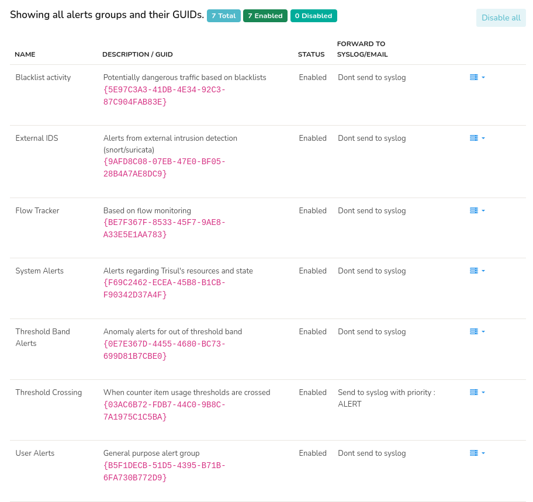
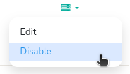
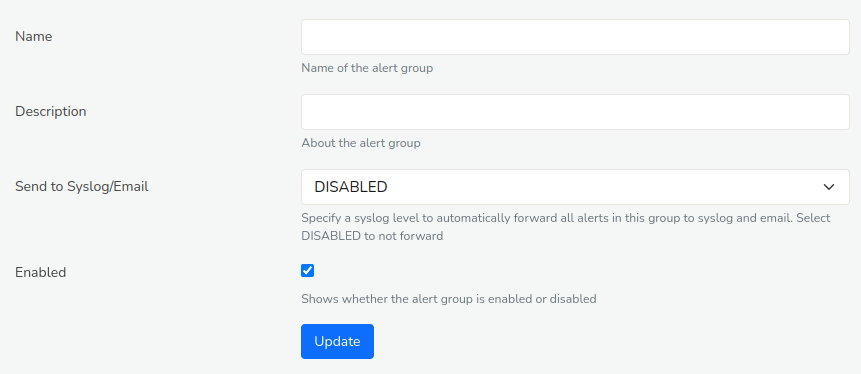
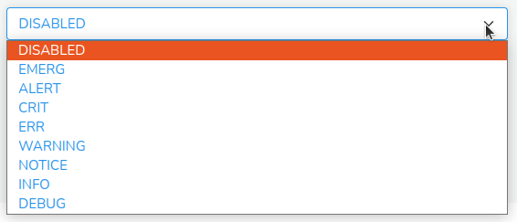

# Manage Alert Groups

An “**Alert Group**” represents a type of alert. Trisul is pre-configured with [7 alert types](/docs/ug/alerts/#types-of-alerts-in-trisul). Each *Alert Group* serves as the logical container for organizing and managing alerts based on their respective types. This section explains how admins can manage individual *alert groups* and configure them in the [*Admin panel*](/docs/ag/ui/adminlayout).

> **For Developers**: You can create your own alert types using the [alertgroup LUA API](/docs/lua/alert_group). *Alert groups* you create using the LUA API will also show up in Trisul and be managed along with the built in alert groups.

## Alert Groups Page Overview

### View Alert Groups

To view all alert groups currently in the system, Login as *Admin*
:::info navigation
:point_right: Go to Context Profile&rarr; Alerts&rarr; All Alert Groups
:::

Upon navigation to the Alert Groups page, a comprehensive list of Alert Groups and their GUIDs are displayed, accompanied by a summary header indicating the **total** count, **enabled** count, **disabled** count of *alert groups*. 

*Feature: Manage Alerts*

By default all *Alert Groups* are enabled. To disable all *Alert Groups* simultaneously, click the **Disable All** button located in the upper right corner of the page. 

The *Alert Group* page contains the following information.

| Column                      | Description                                                         |
|-----------------------------|---------------------------------------------------------------------|
| Name                        | Name of the *Alert Group*                                           |
| Description/ GUID           | Brief description of the *alert group* and its corresponding GUID   |
| Status                      | Current state of the *alert group* (Enabled/Disabled)               |
| Forward to Syslog/Email     | Indicates if the alerts are forwarded to Syslog and/or Email        |
| Option button               | Click on the option button to edit/enable/disable the *alert group* |

## Alert Group Settings

### Enable and Disable Alerts

You can enable or disable each alert group by clicking on the option button against each alert group. And click Disable or Enable. 

  
*Figure: Enable or Disable Alert Group*

When alerts are disabled, it just means that any alerts generated by 
Trisul or plugins will be ignored by the streaming analytics engine. 
This means the alerts wont be stored, displayed, or available to your LUA plugins.

### Edit Alert Group

You can edit the alert group details by clicking on the option button against each alert group. And click Edit.

  
*Figure: Edit Alert Group*

The Edit form of Alert group can be edited with the help of the following fields and their description.

| Field                                                                  | Description                        |
|------------------------------------------------------------------------|------------------------------------|
| Name                                                                   | Enter a Name for the *Alert Group* |
| Description/ GUID                                                      | Enter a brief description of the *alert group*                                                                                                        |
| [Send to Syslog/Email](/docs/ug/alerts/manage#forward-alerts-to-syslog)| Specify a syslog level to automatically forward all alerts in this group to syslog and email. Select DISABLED to not forward                           |
| Enabled                                                                | Check this button to enable of remove if you want to disable                                                                                            |

Once you have edited the form. Click *Update*.
 

### Forward Alerts to Syslog

In Trisul, SYSLOG forwarding allows alerts to be sent to a SYSLOG server for centralized logging and analysis including,

1. Logging of email dispatching service to send alerts via email to you
2. Logging of alerts to send to other systems

You can configure the level of severity indicating the level of importance of each alert by selecting from the *Send to syslog/email* drop down menu in the *Alert Groups Edit* form.

  
*Figure: Send to Syslog/ Email*

Select DISABLED if you would like to prevent sending alerts to SYSLOG and Select ALERTS which ll automatically start sending alerts.

> Once you have clicked ALERTS it is mandatory to restart the probe using [Start/Stop Tasks](/docs/ag/admintasks/startstop)