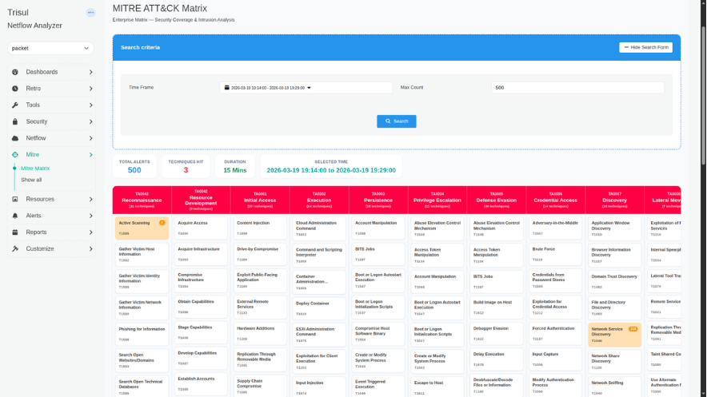
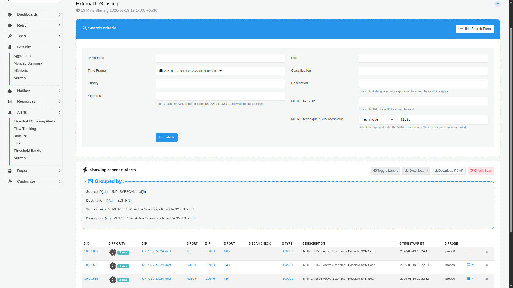
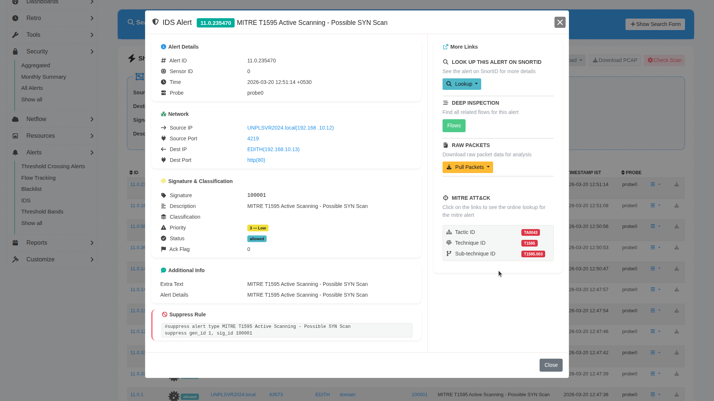

# MITRE ATT&CK Framework Integration

The MITRE ATT&CK® integration in Trisul Network Analytics enables mapping of network detections to the MITRE ATT&CK framework. This provides structured visibility into observed adversarial techniques, helping analysts correlate alerts with known tactics and techniques.

---

## Overview

Trisul integrates with Suricata-generated alerts and maps them to MITRE ATT&CK techniques. Once configured, detections are visualized in the MITRE ATT&CK Matrix, allowing users to:

- View alerts categorized by ATT&CK techniques  
- Identify attack patterns across time ranges  
- Drill down into individual alerts  
- Access MITRE knowledge base references directly  

---

## Prerequisites

Before using the MITRE ATT&CK feature, ensure the following:

### 1. Switch to NSM Mode
Use the [**Product Mode Selector**](/docs/next/ag/install/selectmode) to enable **NSM (Network Security Monitoring)** mode.

### 2. Install Suricata App
Follow the official setup guide:  
https://www.trisul.org/devzone/doku.php/tips:suricata-eve-unixsocket  

This enables ingestion of Suricata EVE JSON alerts into Trisul.

---

## Configure MITRE Rules for Suricata

After installing the Suricata app, you must configure the MITRE rules and Suricata settings.

### 1. Add MITRE Rules File

Copy the provided `mitre.rules` file to: `/var/lib/suricata/rules/`

### 2. Update Suricata Configuration

Replace or update the Suricata configuration file with the provided `suricata.yaml` at: `/etc/suricata/suricata.yaml`

This step ensures that Suricata generates alerts enriched with MITRE ATT&CK technique mappings.

---

## Verifying Alert Flow

After completing setup:

- Confirm that Suricata alerts are being received by Trisul  
- Ensure alerts are visible in the system before proceeding  
- MITRE ATT&CK mapping depends on incoming alert data  

If no alerts are present, the matrix will remain empty.

---

## Navigating to MITRE ATT&CK Matrix

:::info Navigation

:point_right: Go to **MITRE** from the main sidebar  
:point_right: Click on **MITRE Matrix**

:::

This opens the ATT&CK Matrix view within Trisul.

---

## Understanding the MITRE Matrix

The matrix displays techniques organized according to the MITRE ATT&CK framework.

- Each cell represents a **Technique ID**.  
- The **number of alerts** mapped to that technique is flagged inside the cell.
- Visualization updates based on selected filters.  

### Time and Alert Filters

You can refine the matrix using:

- **Time Frame** – Define the duration for analysis  
- **Max Count** – Set the minimum number of alerts to display  

Provide the time frame and the number of alerts to be displayed in that time frame and click **Search**

## Understanding the MITRE ATT&CK Matrix Parameters

| Parameter | Section | Description | How to Use |
|----------|--------|-------------|------------|
| **Total Alerts** | Summary Metrics | Displays the total number of alerts retrieved based on applied filters. | Use this to understand overall alert volume in the selected timeframe. |
| **Techniques Hit** | Summary Metrics | Indicates the number of unique MITRE techniques triggered. | Helps assess how widespread the activity is across different attack techniques. |
| **Duration** | Summary Metrics | Shows the time span covered by the selected data. | Useful for understanding alert density and activity frequency. |
| **Selected Time** | Summary Metrics | Displays the exact time range currently applied. | Confirms the active filter window before analyzing results. |
| **Technique Cells (Txxxx)** | MITRE Matrix | Each cell represents a MITRE ATT&CK technique and shows the number of alerts mapped to it. | Click on a technique to view all associated alerts and investigate further. |
| **Alert Count per Technique** | MITRE Matrix | Number displayed within each technique cell indicating alert frequency. | Use this to identify high-activity techniques that may require immediate attention. |
| **Technique Drilldown** | MITRE Matrix | Opens detailed view of alerts for a selected technique. | Click a technique → view alerts → use Action button to inspect full alert details and MITRE mappings. |

---

## Investigating Alerts

### Viewing Alerts by Technique

- Click on any highlighted **Technique ID** in the matrix  
- This opens a detailed view showing all alerts mapped to that technique within the selected time range  

| Parameter | Section | Description | How to Use |
|----------|--------|-------------|------------|
| **Search Criteria** | Filter Panel | Allows filtering of alerts using parameters like IP Address, Port, Time Frame, Priority, Classification, Signature, Description, and MITRE IDs. | Use these filters to narrow down alerts for precise investigation. Combine multiple fields to refine results. |
| **IP Address** | Search Criteria | Filters alerts based on source or destination IP. | Enter a specific IP to isolate activity related to a host. |
| **Port** | Search Criteria | Filters alerts based on network port. | Useful for identifying service-specific attacks (e.g., HTTP, FTP). |
| **Time Frame** | Search Criteria | Defines the time range for displayed alerts. | Adjust to focus on a specific incident window. |
| **Priority** | Search Criteria | Filters alerts based on severity or priority level. | Use to focus on high-priority or critical alerts first. |
| **Classification** | Search Criteria | Categorizes alerts based on type (e.g., reconnaissance, exploitation). | Helps group alerts by attack nature. |
| **Signature** | Search Criteria | Filters based on Suricata rule/signature ID or name. | Use known signatures (e.g., `sid:1390`) to track specific detections. |
| **Description** | Search Criteria | Text or regex-based filter on alert descriptions. | Useful when searching for keywords like "scan" or "exploit". |
| **MITRE Tactic ID** | Search Criteria | Filters alerts by MITRE tactic. | Helps isolate alerts under a specific attack phase. |
| **MITRE Technique / Sub-technique** | Search Criteria | Filters alerts using specific MITRE technique or sub-technique IDs. | Enter IDs (e.g., `T1595`) to focus on a particular behavior. |
| **Find Alerts** | Action Button | Executes the search based on selected filters. | Click to refresh the alert list after applying filters. |
| **Grouped By** | Alert Summary | Displays alerts grouped by Source IP, Destination IP, Signature, and Description. | Use this to quickly identify patterns or repeated behaviors. |
| **Alert Table** | Results Table | Lists individual alerts with detailed fields such as ID, Priority, IPs, Ports, Type, Description, Timestamp, and Probe. | Scan rows for anomalies and click into specific alerts for deeper inspection. |
| **Priority Indicator** | Alert Table | Visual label indicating alert severity (e.g., allowed, high priority). | Helps quickly identify critical alerts. |
| **Scan Check** | Alert Table | Indicates scan-related detection or classification. | Useful for identifying reconnaissance activities. |
| **Timestamp** | Alert Table | Shows when the alert was triggered. | Correlate events across time for incident analysis. |
| **Probe** | Alert Table | Identifies the sensor or probe that generated the alert. | Useful in multi-probe deployments. |
| **Download / PCAP / Actions** | Controls | Options to download alert data or packet captures. | Use for offline analysis or sharing with other teams. |

### Alert Details

Each alert entry provides:

- Technique ID  
- Sub-technique ID  
- Tactic ID  

Use the **Action** button to view detailed alert information.

| Parameter | Section | Description | How to Use |
|----------|--------|-------------|------------|
| **Alert ID** | Alert Details | Unique identifier for the alert. | Use this ID to track, reference, or correlate the alert across systems. |
| **Sensor ID** | Alert Details | Identifier of the sensor generating the alert. | Useful in multi-sensor environments to trace alert origin. |
| **Time** | Alert Details | Timestamp when the alert was generated. | Helps correlate with other network events. |
| **Probe** | Alert Details | Indicates the probe or monitoring instance. | Useful for identifying where the alert was captured. |
| **Source IP** | Network | Originating IP address of the activity. | Identify the potential attacker or source system. |
| **Source Port** | Network | Port used by the source. | Helps determine the type of communication initiated. |
| **Destination IP** | Network | Target IP address. | Identify the affected system. |
| **Destination Port** | Network | Target service port (e.g., HTTP 80). | Helps understand the targeted service. |
| **Signature** | Signature & Classification | ID of the detection rule (e.g., Suricata SID). | Use to identify the rule that triggered the alert. |
| **Description** | Signature & Classification | Human-readable description of the alert. | Quickly understand the nature of the activity. |
| **Classification** | Signature & Classification | Category of the alert (e.g., scanning, exploitation). | Helps group alerts by attack type. |
| **Priority** | Signature & Classification | Severity level of the alert. | Focus on higher priority alerts first. |
| **Status** | Signature & Classification | Indicates if the alert was allowed or blocked. | Helps assess whether action was taken. |
| **Ack Flag** | Signature & Classification | Indicates if the alert has been acknowledged. | Use for tracking investigation progress. |
| **Extra Text** | Additional Info | Additional contextual information. | Provides extended insight into the alert. |
| **MITRE Mapping** | MITRE ATT&CK | Displays associated Tactic ID, Technique ID, and Sub-technique ID. | Click on IDs to view details in the MITRE ATT&CK knowledge base. |
| **Snort/External Lookup** | More Links | Option to look up the alert externally (e.g., Snort ID). | Use for additional threat intelligence. |
| **Flows** | Deep Inspection | Shows related network flows. | Investigate traffic patterns related to the alert. |
| **Pull Packets** | Raw Packets | Downloads packet-level data (PCAP). | Use for deep packet inspection and forensic analysis. |
| **Suppress Rule** | Suppression | Provides rule syntax to suppress similar alerts. | Use to reduce noise from known or benign alerts. |

---

## Accessing MITRE Knowledge Base

From the alert details view:

- Click on:
  - **Technique ID**
  - **Sub-technique ID**
  - **Tactic ID**

These links redirect to the official MITRE ATT&CK knowledge base for deeper context.

---

## Summary

Once configured, the MITRE ATT&CK integration provides:

- Structured mapping of detections to ATT&CK techniques  
- Visual representation via the ATT&CK matrix  
- Drill-down analysis of alerts  
- Direct linkage to MITRE knowledge base  