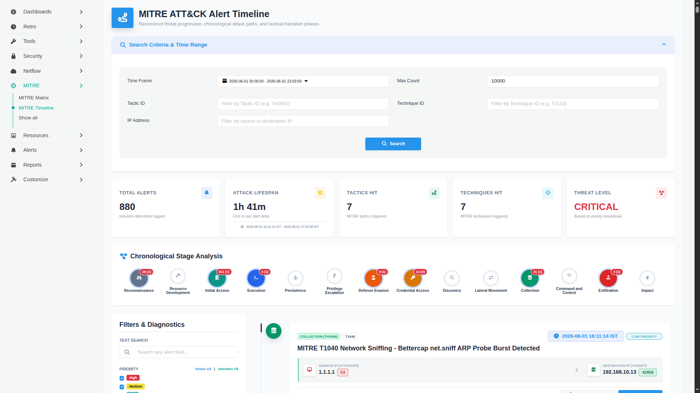
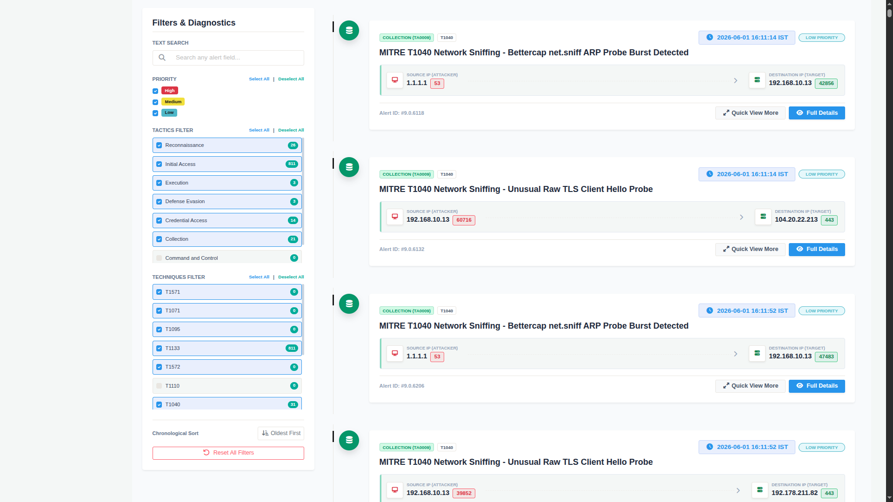
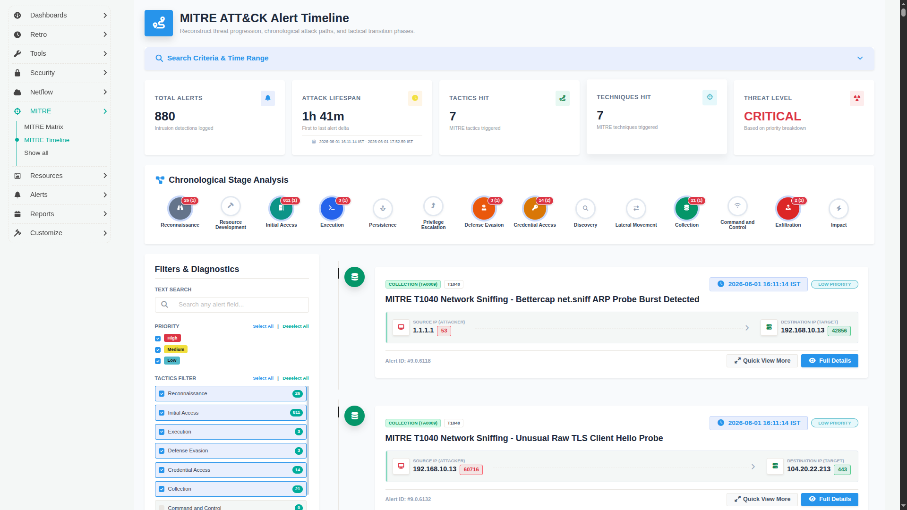
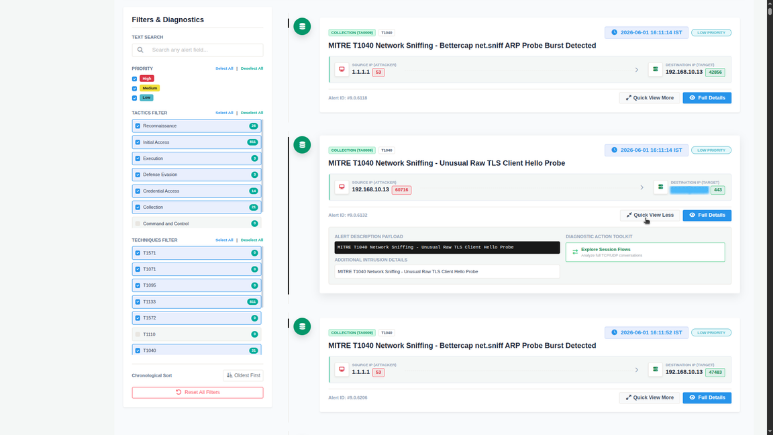
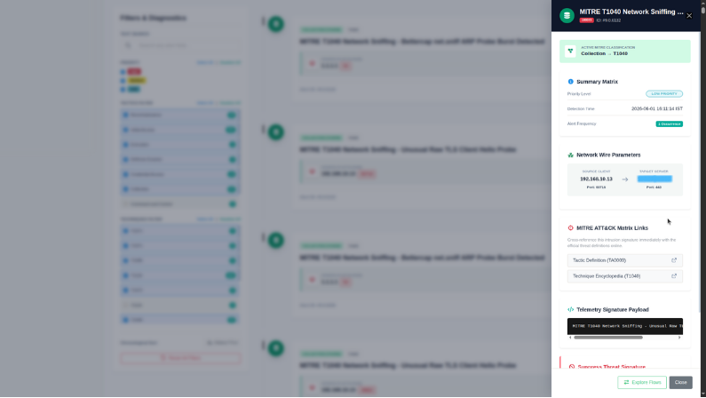

# MITRE ATT&CK Alert Timeline

The **MITRE ATT&CK Alert Timeline** provides a chronological view of intrusion detections mapped to the MITRE ATT&CK framework. It enables analysts to reconstruct the progression of observed attack activity over a selected time period, correlate alerts across MITRE tactics and techniques, and investigate individual detections without leaving the timeline.

The Timeline combines search filters, summary metrics, attack stage visualization, timeline-based alerts, and detailed investigation panels into a single workflow.

---

## Navigation

:::info Navigation

:point_right: Go to **MITRE** from the main sidebar and click **MITRE Timeline**

:::

This opens the MITRE ATT&CK Timeline dashboard.

---

## Searching the Timeline

Begin an investigation by selecting the required **Time Frame**.

The **Time Frame** is mandatory for every search. All remaining search fields are optional.

Available search parameters include:

- Time Frame
- Max Count
- Tactic ID
- Technique ID
- IP Address

When multiple search filters are specified, only alerts matching all selected criteria are returned.

After selecting the required filters, click **Search** to retrieve matching timeline alerts.

---

## Understanding the Timeline Dashboard

Once the search completes, the dashboard displays a high-level overview of the returned alerts together with their progression across the MITRE ATT&CK framework.

The dashboard contains the following sections:

- Dashboard Summary
- Chronological Stage Analysis
- Filters & Diagnostics
- Timeline Alerts

| Parameter | Section | Description | How to Use |
|----------|--------|-------------|------------|
| **Time Frame** | Search Criteria | Selects the investigation time window. | This field is mandatory before running a search. |
| **Max Count** | Search Criteria | Specifies the maximum number of timeline alerts returned. | Increase the value when investigating larger datasets. |
| **Tactic ID** | Search Criteria | Filters alerts by MITRE ATT&CK Tactic ID. | Enter a tactic ID such as `TA0009`. |
| **Technique ID** | Search Criteria | Filters alerts by MITRE ATT&CK Technique ID. | Enter a technique ID such as `T1040`. |
| **IP Address** | Search Criteria | Filters alerts using a source or destination IP address. | Use to investigate activity related to a specific host. |
| **Search** | Action | Retrieves alerts matching the selected filters. | Click after selecting the required search criteria. |
| **Total Alerts** | Dashboard Summary | Displays the total number of alerts returned. | Indicates the overall alert volume for the selected search. |
| **Attack Lifespan** | Dashboard Summary | Displays the duration between the first and last alerts within the selected time frame. | Helps determine how long the observed activity persisted. |
| **Tactics Hit** | Dashboard Summary | Displays the number of MITRE ATT&CK tactics represented in the returned alerts. | Provides a quick overview of attack progression. |
| **Techniques Hit** | Dashboard Summary | Displays the number of unique MITRE ATT&CK techniques observed. | Indicates the breadth of attacker behaviour. |
| **Threat Level** | Dashboard Summary | Displays the overall threat level calculated from the alert priorities and alert count. | Provides a high-level severity assessment for the investigation. |

---

## Chronological Stage Analysis

The **Chronological Stage Analysis** visualizes the progression of observed activity across the MITRE ATT&CK lifecycle.

Each stage corresponds to a MITRE ATT&CK tactic. The badge displayed on each stage contains:

- Total alerts mapped to that tactic.
- Number of unique technique IDsrepresented by those alerts (shown in brackets).

This provides a quick overview of how the attack progressed through different stages of the ATT&CK framework.

| Parameter | Description | How to Use |
|----------|-------------|------------|
| **MITRE ATT&CK Stages** | Displays the tactics observed during the investigation period. | Review attack progression across the ATT&CK lifecycle. |
| **Alert Count** | Displays the total number of alerts mapped to each tactic. | Identify the most active attack stages. |
| **Unique Techniques** | Displays the number of unique techniques for each tactic (shown in brackets). | Helps determine the diversity of activity within a tactic. |

---

## Filters & Diagnostics

The **Filters & Diagnostics** panel allows analysts to refine the displayed timeline after the initial search.

Available filters include:

- Text Search
- Priority
- Tactics
- Techniques
- Chronological Sort

Use **Reset All Filters** to restore the default filter configuration.

| Parameter | Description | How to Use |
|----------|-------------|------------|
| **Text Search** | Searches across displayed timeline alerts. | Filter alerts using keywords. |
| **Priority** | Filters alerts by High, Medium, or Low priority. | Select one or more priority levels. |
| **Tactics** | Filters alerts by MITRE ATT&CK tactic. | Display only alerts mapped to selected tactics. |
| **Techniques** | Filters alerts by MITRE ATT&CK Technique ID. | Narrow the investigation to selected techniques. |
| **Chronological Sort** | Changes the order of timeline entries. | Switch between oldest-first and newest-first ordering. |
| **Reset All Filters** | Clears all applied filters. | Returns the timeline to its default view. |

---

## Investigating Timeline Alerts

Each matching alert is displayed as a chronological timeline entry.

Every alert card includes:

- MITRE tactic classification
- MITRE Technique ID
- Alert title
- Detection timestamp
- Alert priority
- Source IP and source port
- Destination IP and destination port
- Alert ID

Two investigation options are available for every alert:

- **Quick View More**
- **Full Details**

| Parameter | Description | How to Use |
|----------|-------------|------------|
| **MITRE Tactic** | Displays the ATT&CK tactic associated with the alert. | Identify the attack stage. |
| **Technique ID** | Displays the associated MITRE ATT&CK technique. | Correlate related detections. |
| **Alert Title** | Displays the alert description. | Understand the detected activity. |
| **Priority** | Displays the alert priority. | Prioritize investigations. |
| **Source IP / Port** | Displays the originating host and port. | Identify the communication source. |
| **Destination IP / Port** | Displays the target host and port. | Identify the affected system or service. |
| **Alert ID** | Displays the alert identifier. | Reference the detection during investigation. |
| **Quick View More** | Expands the selected alert within the timeline. | Review additional details without opening the detailed panel. |
| **Full Details** | Opens the detailed investigation panel. | Access complete alert information. |

---

## Quick View

Selecting **Quick View More** expands only the selected timeline entry and displays additional information without leaving the timeline.

The expanded view includes:

- Alert Description Payload
- Additional Intrusion Details
- Diagnostic Action Toolkit

The **Explore Session Flows** option opens [**Explore Flows**](/docs/ug/tools/explore_flows) with the selected source IP and destination IP already populated, allowing analysts to continue investigating the corresponding network communication.

| Parameter | Description | How to Use |
|----------|-------------|------------|
| **Alert Description Payload** | Displays the payload associated with the detection. | Review the generated alert content. |
| **Additional Intrusion Details** | Displays additional contextual information for the selected alert. | Gather more information before deeper investigation. |
| **Diagnostic Action Toolkit** | Displays investigation actions available for the alert. | Launch additional investigation tools. |
| **Explore Session Flows** | Opens Explore Flows using the selected source and destination IP combination. | Continue network-level investigation. |

---

## Full Details

Selecting **Full Details** opens a detailed investigation panel on the right side of the dashboard.

The panel provides complete information about the selected detection together with links to MITRE ATT&CK references.

| Parameter | Section | Description | How to Use |
|----------|--------|-------------|------------|
| **Active MITRE Classification** | MITRE | Displays the mapped tactic and technique. | Verify the ATT&CK classification. |
| **Summary Matrix** | Summary | Displays the priority level, detection time, and alert frequency. | Review key alert attributes. |
| **Network Wire Parameters** | Network | Displays the source client, destination server, and associated ports. | Review the communication involved in the alert. |
| **MITRE ATT&CK Matrix Links** | References | Provides links to the official MITRE ATT&CK Tactic Definition and Technique Encyclopedia. | Open the corresponding MITRE documentation for additional context. |
| **Telemetry Signature Payload** | Payload | Displays the telemetry payload associated with the detection. | Review the captured signature payload. |
| **Suppress Threat Signature** | Suppression | Displays a suppression rule containing the MITRE Technique ID, MITRE Tactic ID, and Signature ID. | Use the generated rule to exclude known or trivial alerts from future detections when required. |
| **Explore Flows** | Investigation | Opens Explore Flows for the selected source and destination IP communication. | Continue traffic analysis from the selected alert. |

---

## Investigation Workflow

A typical investigation using the MITRE ATT&CK Timeline consists of the following steps:

1. Select the required **Time Frame**.
2. Optionally filter by Tactic ID, Technique ID, or IP Address.
3. Specify the **Max Count** and click **Search**.
4. Review the dashboard summary.
5. Examine the **Chronological Stage Analysis** to understand attack progression.
6. Refine the displayed alerts using **Filters & Diagnostics**.
7. Expand an alert using **Quick View More**.
8. Open **Full Details** for complete investigation information.
9. Review the associated MITRE ATT&CK references.
10. Continue traffic investigation using [**Explore Flows**](/docs/ug/tools/explore_flows).
11. If required, use the generated suppression rule to exclude known or expected alerts.

---

## Summary

The MITRE ATT&CK Alert Timeline provides a chronological investigation interface for MITRE-mapped detections. By combining search filters, attack stage visualization, timeline-based alert analysis, detailed alert information, and direct integration with Explore Flows, analysts can efficiently investigate attack progression and continue network-level analysis from a single workflow.