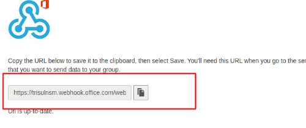

# Microsoft Teams delivery

Trisul can automatically send alerts to Microsoft Teams via an Incoming Webhook URL.  
This greatly enhances the workflow and productivity of users who are already using Teams for activity co-ordination.

A sample of the alert is shown here.

  
*Figure: Alert Sample*

## Setting up Incoming Webhook URL

Create a channel within a Team for Trisul Alerts.

Select “Connectors” as shown below.

  
*Figure: Configure Connectors*

Then provide a name for the *Incoming Webhook* as shown below and press create

  
*Figure: URL for Configuration*

Copy the Incoming Webhook URL.

## Add to App Settings

To activate the Webhook and send alerts to Teams. Login as `admin` and,

:::info navigation

:point_right: Go to [App Settings](/docs/ag/webadmin/web_options)&rarr; API Keys&rarr; Microsoft Teams Webhook URL

:::

Enter the Incoming Webhook URL copied in the previous step.

Ensure that the Email Notification Service which also processes the MS Teams alert push is running.
