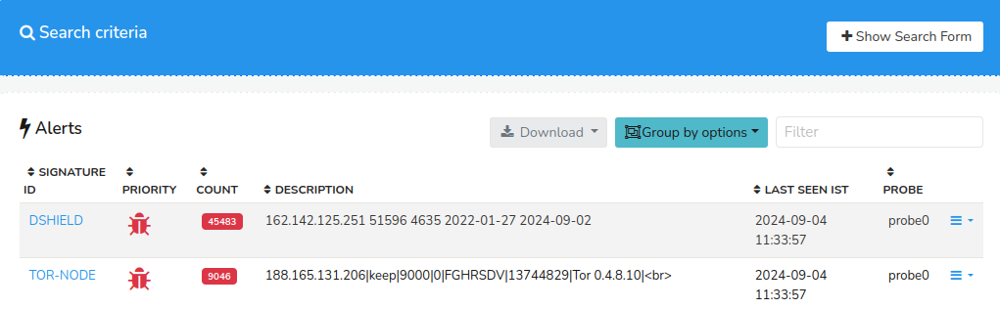
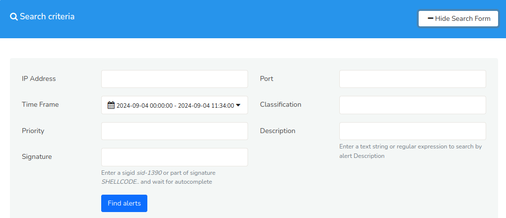
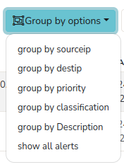
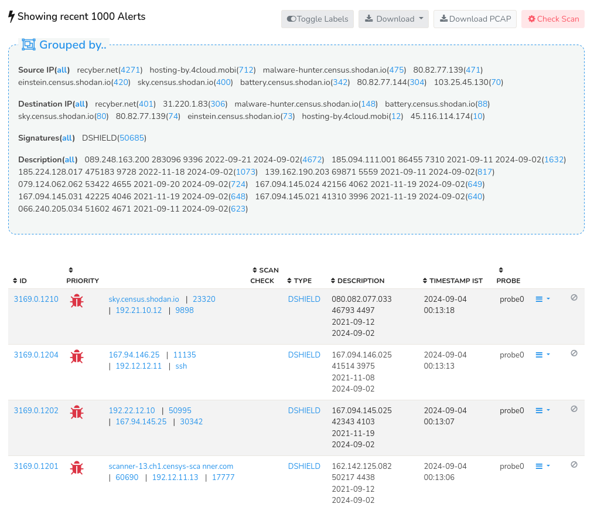
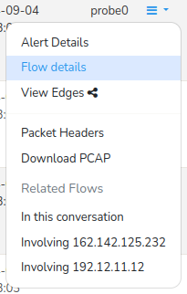

# Malware and Blacklist Alerts

**This feature requires the Trisul Badfellas plugin**  
See [Trisul Badfellas](/docs/ag/install/badfellas)

The Trisul Badfellas plugin adds comprehensive threat detection 
capabilities to Trisul based on multiple blacklists which are included 
with the plugin

Some of the alerts

1. Communication with known malicious IPs
2. Retrieving malware from malicious URLs
3. Falling victim to Phishing sites
4. Trying to query DNS for known malicious domain names

## What Can You Do With These Alerts ?

You can get useful reports like

1. Top 100 hosts with malware in my enterprise
2. Infection trends over time
3. Breakup of malware types (ZeUS, Gumblar, GhostNet, etc)
4. Retrieve suspected malware flows
5. Pull suspected malware packets into Wireshark or Unsniff
6. Script using TRP

## Viewing Blacklist Alerts

To view *Blacklist Alerts*,

:::info navigation
:point_right: Go to Alerts&rarr; Blacklist
:::

*Figure: Blacklist Alerts*

A number of alerts generated for different signature IDs are listed in the table with a *Show Search Form* button. The table contains the alerts details as follows.

| Column           | Description                                                                                  |
|------------------|----------------------------------------------------------------------------------------------|
| Signature ID     | A unique identifier for the specific threat or attack pattern detected                       |
| Priority         | The level of severity assigned to the alert                                                  |
| Count            | The number of times the threat or attack pattern has been detected on that Signature ID      |
| Description      | A brief summary of the threat or attack pattern                                              |
| Last Seen IST    | The timestamp in IST (Indian Standard Time) when the threat or attack pattern was last detected                                                                                                          |
| Probe            | The probe that captured the traffic of the associated alert                                  |
| Drilldown Button | Click on the Drilldown button to view the [edge graph](/docs/ug/edges/) of the Signature ID, and to delete that alert                                                                                          |

- By clicking on the *Signature ID* and the count value you will be able to view a list of recent 1000 alerts grouped by for that particular Signature ID.
- By clicking on the *Priority value* on the column, you will be able to view a list of recent 1000 alerts grouped by for that particular   
- Interactive functionalities of the table include : [*Column Sorter*](/docs/ug/ui/elements#column-sorter), [*Download Button*](/docs/ug/ui/elements#download-button), [*Show/Hide Search Form*](/docs/ug/ui/elements#hide-show-search-form)

### Show Search Form

The [*Show Search Form*](/docs/ug/ui/elements#hide-show-search-form) enables you to search and filter alerts based on certain criteria to narrow down alert volumes.

*Figure: Show Search Form*

Fill in the fields of the *Search Form* with the following details.

| Field          | Description                                                                                  |
|----------------|----------------------------------------------------------------------------------------------|
| IP Address     | Enter the IP address to search for alerts related to the IP address                          |
| Time Frame     | Enter a specific time range to search for alerts within that time frame                      |
| Priority       | Enter a priority level to filter alerts by severity level                                    |
| Signature      | Enter a Signature ID to filter alerts by specific threat or attack pattern                   |
| Port           | Enter a port number to search for alerts related to traffic on that port                     |
| Classification | Enter a specific classification to search for the alerts with that classification            |
| Description    | Enter a keyword or phrase to search for alerts containing that text in the description field |

Click *Find Alerts* to retrieve the alerts based on the search criteria.

### Group By Options

  
*Figure: Group By Options for the Blacklist Alerts*

By clicking on the *Group by Options* on the top of the table, you can filter and group the generated *Blacklist Alerts* by various groups including source IP, destination IP, priority, classification, description, and view all alerts.

### Filter

By applying *Filter* you can quickly narrow down the list of alerts based on specific criteria such as signature IDs, descriptions, and probe names.

## Showing Recent 1000 Alerts

Upon selecting a specific *Signature ID* or *Count* value, the system redirects the user to a detailed alert listing page, displaying:
- A list of 1000 recent alerts associated with the chosen *Signature ID*, grouped by that specific signature.
- A list of alerts corresponding to the selected *Count* value, showcasing the specific alerts that contribute to the aggregated count.

  
*Figure: Recent 1000 Alerts*

In this page you can find a summary of alert groupings, offering a categorical overview of alert distribution. By selecting a specific value within a grouping category, the system executes a drill-down query, redirecting you to a detailed list of alerts filtered by the chosen group, thereby facilitating in-depth analysis.

The grouping categories on the summary include:
      - Grouped by Source IP
      - Grouped by Destination IP
      - Grouped by Signatures
      - Grouped by Description

Below the summary section, a detailed alert table is displayed, presenting a comprehensive list of recent 1000 alerts associated with the Signature ID or Count value you initially selected. The data on the table includes the following details.

| Column            | Description                                                                                |
|-------------------|--------------------------------------------------------------------------------------------|
| ID                | Alert ID is the unique identifier for each alert                                           |
| Priority          | The severity level assigned to each alert to identify the most critical alerts that require immediate attention                                                                                              |
| Scan Check        | Indicates if the system has only scanned for malware or if its infected  by malware        |
| Type              | The category of alert                                                                      |                                                                  
| Description       | A short summary of alert including relevant details                                        |
| Timestamp IST     | The date and time the alert was generated, displayed in Indain Standard Time (IST)         |
| Probe             |  The specific probe that detected and reported the alert                                   |
| Drilldown Options | Clicking on the drilldown button enables a number of drilldown options including alert details, flow details, packet headers, download PCAP etc.                                                        |

Interactive functionalities of the table include : [*Column Sorter*](/docs/ug/ui/elements#column-sorter), [*Toggle Labels*](/docs/ug/ui/elements#toggle-labels), [*Download Button*](/docs/ug/ui/elements#download-button), [*Download PCAP*](/docs/ug/ui/elements#download-pcap-button), and the
*Check Scan* button that initializes the scan status for all the generated alerts indicating if the system has only scanned for malware or if its infected by malware.

### Drilldown Options

Clicking on the *Drilldown* button on the right side of each alert enables you to drilldown to a number of options to perform on the alert.

  
*Figure: Drilldown Options for each Alert*

The drilldown options available for each alert are described below.

| Option                   | Description                                                                       |
|--------------------------|-----------------------------------------------------------------------------------|
| Alert Details            | Displays comprehensive details about the alert, including Timestamp, Severity, Signature, Description,and Relevant metadata                                                                   |
| Flow Details             | Shows the network flow associated with the alert, including Source IP address, Destination IP address, Ports, Protocols, and Network communication details                                    |
| View Edges               | Displays the edge graph of the selected signature ID of the alert                 |
| Packet Headers           | Provides the raw packet headers associated with the alert                         |
| Download PCAP            | Enables download of the packet capture (PCAP) file associated with the alert      |
| In this Conversation     | Displays all flow activity in the same conversation or session                    |
| Involving Source IP      | Displays all flow activity nvolving the source IP address associated with the original alert                                                                                                 |
| Involving Destination IP | Displays all flow activity nvolving the destination IP address associated with the original alert                                                                                                 |

## Evasions

Trisul is resistant to :

- TCP frag attacks – it reassembles TCP before constructing the URL requested & HTTP Host
- Both DNS requests and replies are checked for any malicious domains
- Minor permutations in domains and URLs are automatically handled.