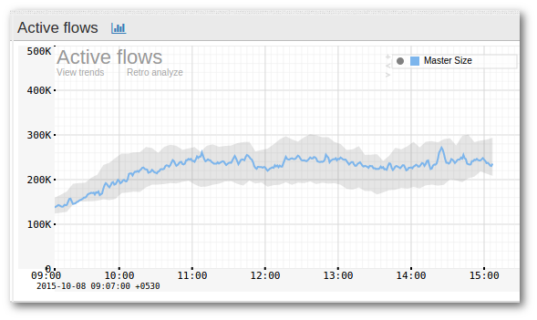
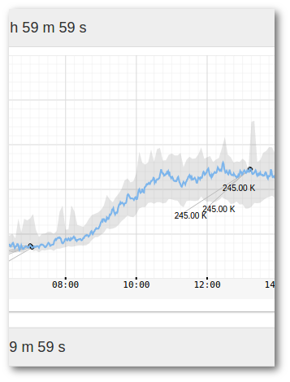

# Threshold Band Anomaly Alerts

## **Overview**

*Threshold Band Anomaly* (TBA) Alerts is a ML driven feature in Trisul which uses historical data (Requires at least 3 weeks of training data) to establish a dynamic threshold range for the metrics. This range serves as the baseline to identify unusual patterns in real time, alerting the users to potential issues before they escalate.

## **How It Works**

Trisul employs a refined analytical technique to look at long term history of any metric and compute a band within the metric is usually found. So the band is,

1. **Sampling Interval**: Threshold bands are computed for every 5-minute interval providing high-resolution anomaly detection.
2. **Temporal Baseline Configuration**: Computation is [*Day of week based*](/docs/ug/alerts/tband#day-of-week-based) ensuring weekends are tracked separately for recognizing distinct usage patterns
3. **Anomaly Filtering**: The Algorithm handles holidays and spikey days to adjust for irregular usage patterns, identifying and excluding outliers.

The screenshot below shows a metric (Active Flows) for which 
“Threshold Banding” is enabled. The band is shown as a grayish 
background while the actual metric is shown as the curve.

*Figure: Active Flows where Threshold Banding is Enabled*

## Threshold Band Computation Methods
There are two flexible computation options to compute the threshold band:
1) Day of Week Based  
2) Simple

### Day of Week Based

This method takes into account the natural variations that occur from week to week. Like recognizing mondays might have higher traffic due to post-weekend activity, tuesdays to thursdays might have consistent traffic due to stable network usage, and fridays might have reduced server activities as employees wrap up tasks. So to capture these kind of patterns, the *Day of the Week Based* method. 
  1) Identifies typical behavior for each day and compares the same day of the week (say wednesdays to previous wednesdays) as they often exhibit unique patterns.
  2) Establish dynamic thresholds based on these daily patterns.
  3) Excludes outliers

> This method is available in Licensed version of Trisul since it requires atleast 3 weeks of training data

### Simple

This method uses a straightforward approach, comparing today's data with yesterday's data. It's ideal for metrics with minimal seasonal variations. Suitable for users with a Trisul Trial License.

## Threshold Band Anomaly Alerting Process

To enable Threshold banding Trisul requires you to select a metric which is identified by a unique combination of counter group, a key, and a meter id. Once a metric is selected, Trisul updates the threshold to keep track of the latest trends and changes in the metric's behavior. This requires no further configuration or manual intervention.

Trisul employs a proactive approach to metric monitoring by pre-computing expected value ranges for each metric for defined time intervals throughout the day. Each Metric's real-time values are continuously evaluated against the pre-computed expected bands and *Threshold Band Anomaly* (TBA) alerts are generated when the metric's value exceeds the predicted range for the corresponding time period, indicating an anomalous behavior.

## Configuration of TBA

### Creating a New Threshold Band Anomaly Monitor for a Particular Counter

There are two ways

Method 1

:::note navigation

Select Alerts → Threshold Band → Configure → New

:::

Method 2

:::note navigation

Click on any key in any chart → From Key Dashboard → Create Threshold Band

:::

The following fields are shown in the form

#### Basic Settings

You must fill this up. If you came to this page from the Key Dashboard the fields are already pre-filled.

| FieldName     | Description    |
| ------------- | ---------------|
| Counter Group | The counter group. 
| Stat ID       | Meter within the counter group |
| TargetKey     | The key within the *target counter group* on which you want to create a Band. You can enter this in either human readable formateg:Port-80, 192.168.1.33 or in Trisul key format: p-0050, C0.A8.00.01  |
| Compare Day   | If Checked – use Day Of Week based band computations.If Unchecked – use yesterdays data to compute a band.**NOTE** You need a licence for Day Of Week band because it needs 3 weeks of training data |

#### Advanced Settings (Optional)

Use this section to fine tune the band computation algorithm.

> Reccomend you first create a band using the default settings, then based on alert volume. You can come back here and tweak the advanced settings below

| FieldName         | Default | Description                                                                    |
| ----------------- | ------- | ------------------------------------------------------------------------------ |
| Number of samples | 1       | The number of samples used to compute the band. The default is 1 which means last Wednesday will be compared with this Wednesday. If you set this to 5 last 5 Wednesdays will be used to compute expected band. The default is 1 so that our users can quickly use this feature without requiring many weeks of training data available.                                                                                       |
| Bucket Size       | 300     | The width of each interval.                                                    |
| Exclude Upper     | 0       | For each interval exclude this many upper samples. Set this to 1 to exclude 1 upper outlier          
| Exclude Lower     | 0       | For each interval exclude this many lower samples.                             |
| Margin upper      | 10      | Margin of allowance on the upper side before alert is generated                                                                                                      |
| Margin lower      | 10      | Margin of allowance on lower side before alert is generated                    |

Then press the “Compute Band” button. This could take a few minutes. Once it is completed the band will be shown below.

### Cron

Once a band has been created. It is automatically updated by a 
special cron task every night. There is no further configuration 
required.

## Viewing Alerts

Once an anomaly is detected Trisul generates an alert, similar to an 
Intrusion Detection or Flow Tracker alert. This appears in the top right
 panel.

#### Alerts View

:::note navigation

Select Alerts → Threshold Band Alerts

:::

1. You will now see a table listing all the alerts
2. Click on view threshold band to bring up a chart showing where the alert occurred

Alerts are indicated by a label. You can either ignore the alert if 
it is just over the band or you can take immediate action if the metric 
changes dramatically.

*Figure: Showing Alerts Indicated by Labels*

## Deleting Alerts

The default approach of Trisul is not to delete anything. TCAs just rollover as they age out.

If you wish to delete all alerts for a particular band, you can 
delete the band itself. That deletes all the alerts, then you can 
recreate the band.

:::note navigation

Select Alerts → Threshold Band → Configure → Delete

:::
