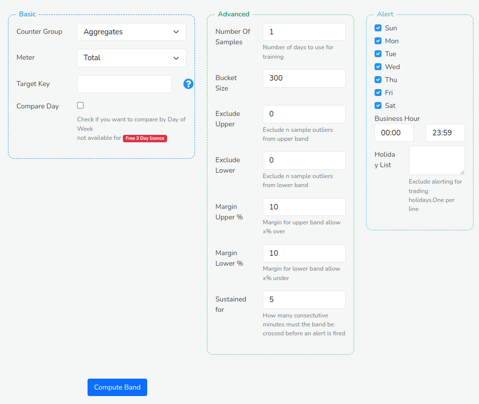
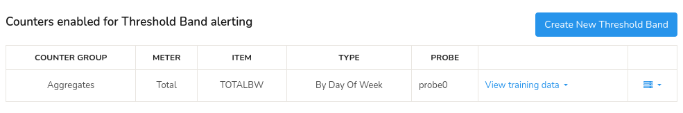
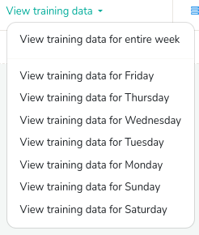
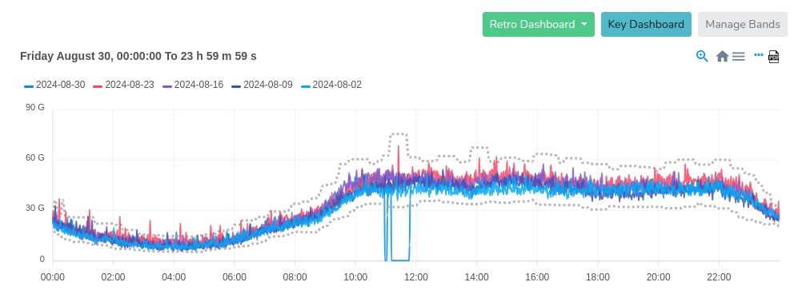

# Threshold Band Anomaly Alerts

## Overview

*Threshold Band Anomaly* (TBA) Alerts is a ML driven feature in Trisul which uses historical data (Requires at least 3 weeks of training data) to establish a dynamic threshold range for the metrics. This range serves as the baseline to identify unusual patterns in real time, alerting the users to potential issues before they escalate.

## How It Works

Trisul employs a refined analytical technique to look at long term history of any metric and compute a band within the metric is usually found. So the band is,

1. **Sampling Interval**: Threshold bands are computed for every 5-minute interval providing high-resolution anomaly detection.
2. **Temporal Baseline Configuration**: Computation is [*Day of week based*](/docs/ug/alerts/tband#day-of-week-based) ensuring weekends are tracked separately for recognizing distinct usage patterns
3. **Anomaly Filtering**: The Algorithm handles holidays and spikey days to adjust for irregular usage patterns, identifying and excluding outliers.

## Threshold Band Computation Methods
There are two flexible computation options to compute the threshold band:
1) Day of Week Based  
2) Simple

### Day of Week Based

This method takes into account the natural variations that occur from week to week. Like recognizing mondays might have higher traffic due to post-weekend activity, tuesdays to thursdays might have consistent traffic due to stable network usage, and fridays might have reduced server activities as employees wrap up tasks. So to capture these kind of patterns, the *Day of the Week Based* method. 
  1) Identifies typical behavior for each day and compares the same day of the week (say wednesdays to previous wednesdays) as they often exhibit unique patterns.
  2) Establish dynamic thresholds based on these daily patterns.
  3) Excludes outliers

> This method is available in Licensed version of Trisul since it requires atleast 3 weeks of training data

### Simple

This method uses a straightforward approach, comparing today's data with yesterday's data. It's ideal for metrics with minimal seasonal variations. Suitable for users with a Trisul Trial License.

## Threshold Band Anomaly Alerting Process

To enable Threshold banding Trisul requires you to select a metric which is identified by a unique combination of counter group, a key, and a meter id. Once a metric is selected, Trisul updates the threshold to keep track of the latest trends and changes in the metric's behavior. This requires no further configuration or manual intervention.

Trisul employs a proactive approach to metric monitoring by pre-computing expected value ranges for each metric for defined time intervals throughout the day. Each Metric's real-time values are continuously evaluated against the pre-computed expected bands. And *Threshold Band Anomaly* (TBA) alerts are generated when the metric's value exceeds the predicted range for the corresponding time period, indicating an anomalous behavior.

## Configuration and Management of TBA

### Create a New TBA 

There are two ways to create a new Threshold Band Anomaly(TBA) monitor for a particular counter.

Method 1

:::info navigation
:point_right: Click on any *key* in a chart&rarr; From [Key Dashboard](/docs/ug/ui/key_dashboard)&rarr; Create Threshold Band
:::

This will take you to the TBA Form but the fields of the form will be already pre-filled for you.

Method 1

:::info navigation
:point_right: Go to Alerts&rarr; Threshold Bands&rarr; Configure&rarr; Create New Threshold Band
:::

You can find the configuration of TBA Form where you can fill the fields to setup and specify the threshold values.

  
*Figure: Threshold Band Anomaly Alert Form*

The TBA configuration form comprises settings of three sections: Basic Configuration Settings, Advanced Settings for threshold definition, and setting alert criteria. With the help of the following fields and their description, fill in the fields to setup threshold values.

#### Basic Settings

| Fields                             | Description                                                               |
|------------------------------------|---------------------------------------------------------------------------|
| Counter group                      | Select the counter group that corresponds to the metric you want to monitor                                                                                                          |
| Meter                              | Choose the specific meter within the selected counter group that you want to monitor                                                                                                       |
| Target Key                         | Enter the unique key associated with the metric you want to monitor                                                                                                          |
| Compare Day                        | Select this checkbox to enable day-of-week-based comparison, which considers the natural variations in traffic patterns across different days of the week                                                                                                             |

#### Advanced Settings

| Fields                             | Description                                                               |
|------------------------------------|---------------------------------------------------------------------------|
| Number of Samples                  | Specify the number of samples used to compute the band. The default is 1 which means last Wednesday will be compared with this Wednesday. If you set this to 5 last 5 Wednesdays will be used to compute expected band. The default is 1 so that our users can quickly use this feature without requiring many weeks of training data available                                                                                 |
| Bucket Size                        | Define the time interval (in minutes) for aggregating data points         |
| Exclude Upper                      | Specify the upper bound value to exclude from the threshold calculation. This helps remove outliers.                                                                                      |
| Exclude Lower                      | Specify the lower bound value to exclude from the threshold calculation. This helps remove outliers.                                                                                      |
| Margin Upper (%)                   | Set the upper margin for the threshold range to determine how far above the baseline the metric can deviate before triggering an alert                                                       |
| Margin Lower (%)                   | Set the lower margin (percentage) for the threshold range to determine how far below the baseline the metric can deviate before triggering an alert                                         |
| Sustained For                      | Specify the duration (in minutes) that the metric must remain outside the threshold range to trigger an alert                                                                              |

> Advanced Settings enables you to fine tune the band computation algorithm. So, it is reccomended you first create a band using the default settings, then based on alert volume. You can come back here and tweak the advanced settings below

#### Alert Settings

| Fields                             | Description                                                               |
|------------------------------------|---------------------------------------------------------------------------|
| Sun, Mon, Tue, Wed, thu, Fri, Sat  | Select the specific weekday (Monday to Sunday) checkboxes to include or exclude from threshold calculation and alerting                                                                  |
| Business Hour                      | Select this checkbox to consider only business hours (Monday to Friday, 9 am to 5 pm) for threshold calculation and alerting                                                               |
| Holiday List                       | Provide a list of holidays to exclude from threshold calculation and alerting                                                                                                         |

> Once a band has been created. It is automatically updated by a special *Cron* task every night. There is no further configuration required.

### View TBA

Once an anomaly is detected Trisul generates an alert, similar to an Intrusion Detection or Flow Tracker alert. This appears in the top right panel.

:::info navigation
:point_right: Go to Alerts&rarr; Threshold Bands&rarr; Click View Training Data button
:::

You will see a table of data showing a list of all counters enabled for Threshold Band Alerting. 

*Figure: Table of List of all Counters Enabled for Threshold Band Alerting*

The table of data contains the following details.

| Column               | Description                                                                             |
|----------------------|-----------------------------------------------------------------------------------------|
| Counter Group        | The category of metrics for which the alert is configured                               |
| Meter                | The Specific metric being monitored for alerts                                          |
| Item                 | The individual entity for which the metric is being monitored                           |
| Type                 | The threshold band computation method type                                              |
| Probe                | The data source providing the metric data                                               |
| [View Training Data](/docs/ug/alerts/tband#view-training-data)   | Select one from the drop down menu to view training data separately for each day (sun, mon, tue, wed, thu, fri, sat)                                                                                    |
| [Option Button](/docs/ug/alerts/tband#option-button)        | By clicking on the option button you can choose to view alerts, edit, and delete        |

#### View Training Data 

The *View Training Data* generates a graphical representation of the threshold band anomaly patterns for each day of the week separately and also for the entire week.

  
*Figure: Options for View Training Data*

  
*Figure: View Alerts Chart*

- The chart displays pre-computed threshold bands represented by dotted lines with actual data points represented by colored lines for clear identification. Alerts are indicated by a label. You can either ignore the alert if it is just over the band or you can take immediate action if the metric changes dramatically.
- Additionally, the chart supports [interactive drill-down capabilities](/docs/ug/ui/charts#chart-interaction-controls), allowing users to zoom in on specific segments, enabling high-resolution visualization of sudden drops and spikes in the data.  
- Click on the *Retro Dashboard* button to further analyze using *Retro Counters* and *Retro Tools*.  
- By clicking on the *Key Dashboard* button, you can navigate to the [*Key Dashboard*](/docs/ug/ui/key_dashboard) of the *key* associated with the Threshold Band Anomaly alerting.

#### Option Button

  
*Figure: Options for View Training Data*
- **View Alerts**: Displays a list of alerts generated for the selected counter, that allows you to investigate and troubleshoot issues.
- **Edit**: Enables you to modify the counter's TBA configuration settings, from the TBA Configuration Form.
- **Delete**: Removes the counter from the Threshold Band Alerting list, stopping any further monitoring or alerting.