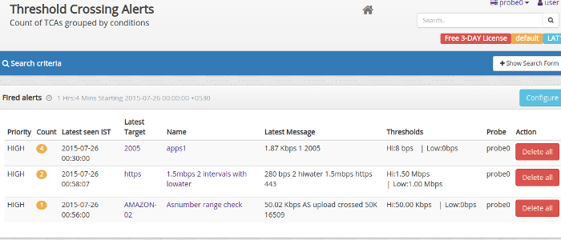
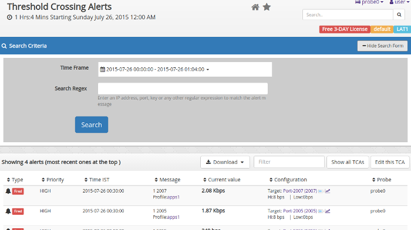

# Threshold crossing alerts (TCAs)

You can assign thresholds to any meter value. Trisul continuously 
monitors the value of the traffic meter against the configured 
thresholds and generates a “Threshold Crossing Alert” if the value 
crosses the thresholds.

### Examples

You can monitor a single Key or a Key Range. Some examples:

1. monitor **DNS Port-53** traffic and raise an alert if it crosses 50kbps for 3 minutes
2. monitor **IP Address 10.28.28.223** if it crosses 10Mbps for 5 minutes raise alert then CLEAR if it dips below 5 Mbps
3. monitor **IP Range 10.28.9.0 to 10.28.10.255** raise alert if ANY IP in that range crosses 1 Gbps for 1 minute

## High and Low Watermarks for alerts

The two knobs you use are Watermarks and Sustained Intervals.

***Watermarks***

You assign Hi-Water and Lo-Water marks to the meter value you want
 to keep an eye on. When the meter value crosses the Hi-Water mark it 
is treated as a ***FIRED*** event and when it crosses the Lo-Water mark, it is treated as a ***CLEAR*** event.

***Sustained Intervals***

To prevent flapping of alerts due to meter value fluctuating around the watermarks, you can also specify a number called *Sustained Interval*. If you specify a *sustained interval* of 3, then the meter value has to be above or below the high and low 
watermarks respectively for 3 consecutive time bucket intervals (by 
default 60 seconds) before the corresponding **FIRE** or **CLEAR** alert is fired. The Low Watermark is optional.

The following picture illustrates this. Here we are setting up a TCA for :

- If value of meter exceeds 100Kbps for 3 consecutive intervals – we FIRE a TCA
- If value of meter drops less than 80Kbps for 2 consecutive intervals – we CLEAR a TCA

Note that :

- The TCA does not fire in the zone between HI and LO water marks
- The TCA fires only once even when multiple consecutive values are over the HI water mark
- For a TCA to fire again, the values have to dip below the LO water mark and re-cross the HI water threshold again

## Configuring

### Creating a new TCA based on Counter group

:::note navigation

Select Alerts → Threshold Crossing Alerts → Configure TCA

:::

1. Click **New Threshold Crossing Alerts** , which leads to the page whose fields are described below

| FieldName                    | Optional | Description                                                                                                                                                                                                                                                                                                                                                                                                                                                                  |
| ---------------------------- | -------- | ---------------------------------------------------------------------------------------------------------------------------------------------------------------------------------------------------------------------------------------------------------------------------------------------------------------------------------------------------------------------------------------------------------------------------------------------------------------------------- |
| Name of the alert            |          | A name for this alert, this will show up on screen and reports                                                                                                                                                                                                                                                                                                                                                                                                               |
| Target counter group         |          | Select the target counter group from the dropdown                                                                                                                                                                                                                                                                                                                                                                                                                            |
| Target Key or Range          |          | The key or key range within the *target counter group* on which you want to create a TCA. You may enter a single key or a key range Single key You can enter this in either human readable format eg:Port-80, 192.168.1.33 or in Trisul key format: p-0050, C0.A8.00.01 Key range Enter the first and last key in the range inclusive using a tilde *~* or *to*. Example IP range : `10.18.18.0 ~ 10.18.18.255` or port range (1 to 1024) `1 to 1024` using the *to* keyword |
| Target Metric                |          | Meter within the counter group                                                                                                                                                                                                                                                                                                                                                                                                                                               |
| Hi Water Mark                |          | High threshold mark. Eg: 10Mbps, 6Kbps, 2000. Default units = bytes/sec so if you just say 10M it would be interpreted as 10Mbps depending on the meter selected                                                                                                                                                                                                                                                                                                             |
| Hi Water Sustained Intervals |          | TCA triggered if over Hi Water for this many intervals                                                                                                                                                                                                                                                                                                                                                                                                                       |
| Lo Water Mark                | optional | Low threshold mark                                                                                                                                                                                                                                                                                                                                                                                                                                                           |
| Lo Water Sustained Intervals | optional | TCA cleared if below Lo Water for this many intervals                                                                                                                                                                                                                                                                                                                                                                                                                        |
| TCA Message                  |          | When the TCA fires or clears, this message is emitted. You can see this message on Trisul UI modules and on email alerts                                                                                                                                                                                                                                                                                                                                                     |

## Example DNS TCA

This example creates a TCA when DNS traffic crosses **1.2Mbps** for 2 minutes and clears when it drops below **600Kbps**

| FieldName                    | Input                                                                   |
| ---------------------------- | ----------------------------------------------------------------------- |
| Name                         | DNS over 1.2Mbps                                                        |
| Target                       | Apps                                                                    |
| TargetKey                    | *Port-53* , *53*, or *domain* or in Trisul Internal Key format *p-0035* |
| Stat ID                      | Total                                                                   |
| Hi Water Mark                | 1.2Mbps                                                                 |
| Hi Water Sustained Intervals | 2                                                                       |
| Lo Water Mark                | 600Kbps                                                                 |
| Lo Water Sustained Intervals | 1                                                                       |
| TCA Message                  | DNS traffic is double of expected at 1.2Mbps, action required team !    |

## Viewing TCAs

There are many methods to view, search and export TCAs.

:::note navigation

Select Alerts → Threshold Crossing Alerts

:::

1. You will now see a table listing all the alerts grouped by alert type and count
2. Clicking on the number seen under the **Count** column of an alert takes you to a more detailed view of the alerts

*Showing counts of alerts generated for each TCA type*

### Viewing individual alerts

Clicking on alert count on a TCA will take you to the alerts view.

*Showing list of fired and cleared alerts*

You can see the search form in this page

1. To query for specific alerts enter the time window and a regex to 
   search for alerts with message matching a certain pattern. For example 
   enter an IP address to pick all alerts from that IP address.

### Drilldowns

When alerts are displayed you have the option to drilldown even further.

1. press the tag button to bring up drilldown options similar to those found on other dashboards (see image)
2. press the chart button to show a traffic chart around the time the 
   alert occurred showing the Low and High water marks for reference.

*TCA drilldown options and traffic charts showing the alert traffic*

#### Exporting to PDF, CSV, Excel

> When a table shows list of alerts

1. Locate the Download button above the table
2. Select “Download PDF”, “Download CSV” or “Download XLSX” options

This allows you to export and share displayed alerts

### Alerts dashboard

- Add the **Threshold Crossing Alert** module to any dashboard

This module auto updates itself as new TCAs are generated. You can add this module to any dashboard position.

[How to add modules to dashboard](/docs/ug/ui/dashmod_intro#modules)

## Deleting TCAs

The default approach of Trisul is not to delete anything. TCAs just 
rollover as they age out. Yet if you wish to explicitly delete TCAs you 
can use the following steps :

:::note navigation

Select Alerts → Threshold Crossing Alerts

:::

1. Click the **Delete all** icon under each TCA to delete it

> This deletes all the alerts fired under that TCA , but not the TCA itself

## Automatically emailing TCAs

There are two types of email reports you can use for notifying these TCA alerts.

:::note

TCA Email Alerts intelligently pull up the following relevant pieces of 
information and include them in the email. Top Hosts, Top Apps, Top 
Flows, and Top Conversations related to the alert.

:::

#### Intelligent TCA Email reports for routers interfaces

A commonly used TCA is on Netflow mode routers and interfaces. When a TCA is created on such an interface the following information is automatically included in the alert email.

1. Top applications on that interface which alerted
2. Top hosts
3. Top conversations.

This allows the receiver of the email to immediately spot the source 
of the alert without even logging on to Trisul Network Analytics.

> Enabling inteface tracking allows for richer TCA alerts. See [Netflow Interface Trackers](/docs/ug/netflow/interface_tracker)

### Real time email

Configure [Email Alerting](/docs/ug/alerts/email_settings) for real time alerts.

### Periodic email digest

You can [schedule](/docs/ug/reports/schedreports#schedule-a-new-report) a **Threshold Crossing Alert** report which will automatically email you a list of TCAs that fired on a hourly or daily basis.

1. A single consolidated email is sent out containing details of all TCAs
2. No email is sent out if there are no TCAs to report

## Bulk configuration

We can also configure TCAs for one or more interfaces from a particular router in bulk rather the one by one.

You can throw an alert if the Interface crosses 200 Mbps.

:::note navigation

Login as Admin. Select *Context : default* → profile0 → Netflow Wizard → Interfaces

:::

You can select one or more interfaces from a router and Click on **Configure TCA** option to create an alert.

| Field Name                   | Description                                                              |
| ---------------------------- | ------------------------------------------------------------------------ |
| Interfaces                   | Key for Interface                                                        |
| Meter                        | Total,in or out                                                          |
| Hi Water Mark                | Hi Threshold Mark                                                        |
| Hi Water Sustained Intervals | TCA Fired only if metric values is over Hi Water for this many minutes   |
| Lo Water Mark                | Low Threshold Mark                                                       |
| Lo Water Sustained Mark      | TCA Cleared only if metric value is below Lo Water for this many minutes |
| TCA Message                  | A custom message that appears when these alerts fire                     |
