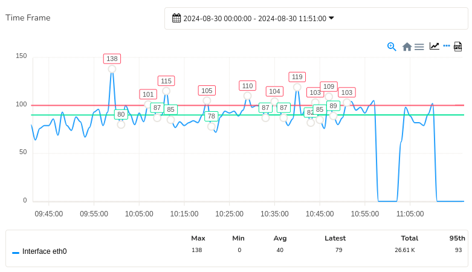

# Threshold Crossing Alerts (TCAs)

## Overview

You can assign thresholds to any meter value. Trisul continuously 
monitors the value of the traffic meter against the configured 
thresholds and generates a “Threshold Crossing Alert” if the value 
crosses the thresholds.

**Examples**

You can monitor a single Key or a Key Range. Some examples:

1. Monitor **DNS Port-53** traffic and raise an alert if it crosses 50kbps for 3 minutes
2. Monitor **IP Address 10.28.28.223** if it crosses 10Mbps for 5 minutes raise alert then CLEAR if it dips below 5 Mbps
3. Monitor **IP Range 10.28.9.0 to 10.28.10.255** raise alert if ANY IP in that range crosses 1 Gbps for 1 minute

### High and Low Watermarks for Alerts

The two knobs you use are Watermarks and Sustained Intervals.

***Watermarks***

You assign Hi-Water and Lo-Water marks to the meter value you want
 to keep an eye on. When the meter value crosses the Hi-Water mark it 
is treated as a ***FIRED*** event and when it crosses the Lo-Water mark, it is treated as a ***CLEAR*** event.

***Sustained Intervals***

To prevent flapping of alerts due to meter value fluctuating around the watermarks, you can also specify a number called *Sustained Interval*. If you specify a *sustained interval* of 3, then the meter value has to be above or below the high and low 
watermarks respectively for 3 consecutive time bucket intervals (by 
default 60 seconds) before the corresponding **FIRE** or **CLEAR** alert is fired. The Low Watermark is optional.

The following picture illustrates this. Here we are setting up a TCA for :

- If value of meter exceeds 100Kbps for 3 consecutive intervals – we FIRE a TCA
- If value of meter drops less than 80Kbps for 2 consecutive intervals – we CLEAR a TCA

*Figure: Showing Illustration of Sustained Intervals*

Note that :

- The TCA does not fire in the zone between HI and LO water marks
- The TCA fires only once even when multiple consecutive values are over the HI water mark
- For a TCA to fire again, the values have to dip below the LO water mark and re-cross the HI water threshold again

## TCA Configuration

You can configure a TCA by defining the threshold values for alerts to be generated with the following details.

### Create a new TCA 

To create a new TCA based on Counter Group, Login as *User*,

:::info navigation
:point_right: Go to Alerts&rarr; Threshold Crossing Alerts&rarr; Configure&rarr; New Threshold Crossing Alert
:::

TCA configuration form opens up. Fill in the threshold conditions for alerts to be generated with the help of the following fields and their description.

| FieldName                    | Optional |Description                                                         |
| ---------------------------- | -------- | -------------------------------------------------------------------|
| Name of the alert            |          | A name for this alert, this will show up on screen and reports     |
| Target counter group         |          | Select the target counter group from the dropdown                  |
| Target Key or Range          |          | The key or key range within the *target counter group* on which you want to create a TCA. You may enter a single key or a key range  - **Single key** You can enter this in either human readable format Example: Port-80, 192.168.1.33 or in Trisul key format: p-0050, C0.A8.00.01  - **Key range** Enter the first and last key in the range inclusive using a tilde *~* or *to*. Example IP range : `10.18.18.0 ~ 10.18.18.255` or port range (1 to 1024) `1 to 1024` using the *to* keyword                                                           |
| Target Metric                |          | Meter within the counter group                                     |
| Hi Water Mark                |          | High threshold mark. Example: 10Mbps, 6Kbps, 2000.   Default units = bytes/sec so if you just say 10M it would be interpreted as 10Mbps depending on the meter selected                       |
| Hi Water Sustained Intervals |          | TCA triggered if over Hi Water for this many intervals             |
| Lo Water Mark                | optional | Low threshold mark                                                 |
| Lo Water Sustained Intervals | optional | TCA cleared if below Lo Water for this many intervals              |
| TCA Message                  |          | When the TCA fires or clears, this message is emitted. You can see this message on Trisul UI modules and on email alerts                                                               |

Upon filling all the threshold values, click *Create*

**Example: DNS TCA**

This example creates a TCA when DNS traffic crosses **1.2Mbps** for 2 minutes and clears when it drops below **600Kbps**

| FieldName                    | Input                                                                   |
| ---------------------------- | ----------------------------------------------------------------------- |
| Name                         | DNS over 1.2Mbps                                                        |
| Target                       | Apps                                                                    |
| TargetKey                    | *Port-53* , *53*, or *domain* or in Trisul Internal Key format *p-0035* |
| Stat ID                      | Total                                                                   |
| Hi Water Mark                | 1.2Mbps                                                                 |
| Hi Water Sustained Intervals | 2                                                                       |
| Lo Water Mark                | 600Kbps                                                                 |
| Lo Water Sustained Intervals | 1                                                                       |
| TCA Message                  | DNS traffic is double of expected at 1.2Mbps, action required team !    |

### View TCAs

There are many methods to view, search and export TCAs.

To view TCAs,

:::info navigation
:point_right: Go to  Alerts&rarr; Select Threshold Crossing Alerts
:::

1. You will now see a table listing all the alerts grouped by alert type and count
2. Clicking on the number seen under the **Count** column of an alert takes you to a more detailed view of the alerts

*Figure: Showing counts of alerts generated for each TCA type*

The subsequent Threshold crossing *Alert Group* Table presents the following detailed information:

| Column            | Description                                                                             |
| ----------------- | --------------------------------------------------------------------------------------- |
| Count             | The number of times this threshold has been crossed                                     |
| Latest Type       | Indicates whether the threshold crossing was due to a high or low watermark event       |
| Latest Seen IST   | The timestamp (in Indian Standard Time) when the threshold was last crossed             |
| Latest Target     | The *key* that crossed the threshold                                                    |
| Name              | The name of the TCA                                                                     |
| Latest Message    | The message associated with the latest threshold crossing event                         |
| Thresholds        | The specific threshold values that triggered the alert                                  |
| Probe             | The monitoring probe that detected the threshold crossing                               |
| Option Button     | Click on the Option button and select Delete all. This deletes all the alerts fired under that TCA , but not the TCA itself                                                                             |

## Individual Alerts

With Individual Alerts you can perform the following functions:
1) [**View individual alerts**](/docs/ug/alerts/tca#view-individual-alerts)
2) [**Filter Individual Alerts**](/docs/ug/alerts/tca#filter-individual-alerts) using the *Search Form* based on certain search criteria, filter indivial alerts based on certain search criteria 
3) [**In-Depth Analysis of Individual Alerts**](/docs/ug/alerts/tca#in-depth-analysis-of-individual-alerts) using the *Drilldown* button
4) [**View Traffic Chart**](/docs/ug/alerts/tca#traffic-chart) with watermarks around the alert timestamp.

### View Individual Alerts

Clicking on alert count on a TCA *Alert Group*  table will take you to the list of individual alerts fired/cleared by that particular key and metric.

  
*Figure: Showing list of fired and cleared alerts*

The details that you can analyze on the individual alerts result are as follows:
| Column            | Description                                                                           |
|-------------------|---------------------------------------------------------------------------------------|
| Type              | The type of alert triggered                                                           |
| Priority          | The severity level of the alert                                                       |
| Time IST          | The timestamp of hwne the alert was triggered in Indian STandard Time (IST)           |
| Message           | A brief description of the alert                                                      | 
| Current Value     | By how much the threshold limit has exceeded or reduced                               |
| Configuration     | The threshold limits of the target *key*                                              |
| Probe             | The monitoring probe that detected the threshold crossing                             |

> Each column in the search result table are sortable, where you can rearrange data in ascending or descending order by clicking the adjacent arrow(up/down) button, for flexible data analysis and visualization.
- **Download Button**: Click on the [download](/docs/ug/ui/elements#download-button) button at the top of the alerts to get the alert details downloaded in the form of PDF and XLSX. 
- **Show All TCAs Button**: Clicking on the *Show all TCAs* button enables you to display the list of all Threshold Crossing Alerts (TCAs) configured from where you can again edit or delete that particular TCA.
- **Edit This TCA**: You can click on the *Edit this TCA* button to edit that particular Threshold Crossing Alert (TCA) that you are currently into.
- **Filter Box**: You can use the *Filter* box on the upper right corner for a quick, simple search and to narrow down large datasets of alerts.

### Filter Individual Alerts

To facilitate targeted queries, a *search form* with [*Hide/Show Search Form*](/docs/ug/ui/elements#hide-show-search-form) option is provided, that allows you to specify a temporal range and a regular expression (*regex*) pattern to filter alerts.   

  
*Figure: TCA Search Form*

With this *search form* you can retrieve alerts with messages matching a particular pattern, such as extracting all alerts originating from a specific IP address by entering the corresponding IP address in the search field.

#### Search Form Parameters

[**Time Frame**](/docs/ug/ui/elements#time-selector) Specify a temporal range to restrict search results to alerts generated within that timeframe.  
**Search Regex** Enter a regular expression to match specific patterns in alert messages, enabling targeted filtering (example: extracting alerts from a particular IP address).

### In-Depth Analysis of Individual Alerts

When alerts are displayed you have the option to drilldown even further on the enabling deep analysis on the target *key* by clicking on the *Drilldown* button against each individual alert.
| Options                    | Description                                                                       |
|----------------------------|-----------------------------------------------------------------------------------|
| Drilldown                  | View detailed information on the selected interface including its utilization details and report details.                                                                                      |
| Interface Activity         | Analyze the interface's traffic statistics including flow activities, conversations and their relationships.                                                                                         |
| Traffic Chart              | Visualize the interface's traffic patterns over time to identify trends and anomalies.                                                                                                       |
| Long Term Traffic Chart    | View extended traffic trends for the target interface, showing how traffic has changed over hours, days, or weeks.                                                                              |
| View Edge Graph            | Display the target interface's connections and relationships within the network topology, helping you understand its role and dependencies.                                                      |
| Download PCAP              | Capture packets from the target interface for in-depth analysis of traffic.       |
| Query Flows by Tag         | Filter traffic on the target interface by specific tags                           |
| Aggregate Flows by Tag     | Aggregated statistical information for each unique combination of tags, providing a comprehensive view of network traffic patterns.                                                                  |
| Statistics                 | Display detailed statistics about the target interface, including utilization and  throughput details                                                                                               |

  
*Figure: TCA Drilldown*

### Traffic Chart 

Click on the *chart* button to show a traffic chart around the time the alert occurred showing the Low and High water marks for reference.  

*Figure: Traffic Chart of Target Interface with Watermarks*

The chart plots the amount of network traffic over a specified time period, centered around the alert timestamp.

**Low Watermark**: A Green line indicating the minimum expected traffic volume, serving as a baseline for comparison.  
**High Watermark**: A Red line indicating the maximum expected traffic volume, highlighting potential peaks or anomalies.

> You can create a Threshold Crossing Alerts(TCA) Module using [Module Templates](/docs/ug/ui/module_templates#alert-list) and add that module to any dashboard. And this module keeps auto updating itself as new TCA are generated. 

## Real Time Email Alerts and Scheduling

- You can configure email alert delivery for Threshold Crossing Alerts (TCA) using the [**Email Alerts Wizard**](/docs/ug/alerts/email_settings).  
- You can [**Schedule a TCA Report**](/docs/ug/reports/schedreports) which will automatically email you a list of Threshold Crossing Alerts (TCAs) that got fired/cleared on a hourly or daily basis. The Report email is a single consolidated email that contains the details of all the TCAs. And no email is sent if no TCAs are generated.

A commonly used Threshold Crossing Alert (TCA) is on Netflow mode: *routers and interfaces*. When a TCA is created on such an interface the following information is intelligently included in the alert email.

1. Top applications on that interface which alerted
2. Top hosts
3. Top conversations.

This allows the receiver of the email to immediately spot the source 
of the alert without even logging on to Trisul Network Analytics.

> Enabling [interface tracking](/docs/ug/netflow/interface_tracker) allows for richer TCA alerts.

## Bulk Configuration

You can also configure Threshold Crossing Alerts (TCAs) for one or more interfaces from a particular router in bulk rather the one by one.

For example: You can throw an alert if the Interface crosses 200 Mbps.

To Setup Bulk Configuration, Login as *Admin*

:::info navigation
:point_right: Go to *Context : default*&rarr; profile0&rarr; Netflow Wizard&rarr; Interfaces
:::

  
*Figure: Bulk Configuration of TCA Sample Form*

You can bulk configure by filling the form using the following details and their descriptions.

You can select one or more interfaces from a router and Click on **Configure TCA** option to create an alert.

| Field Name                   | Description                                                              |
| ---------------------------- | ------------------------------------------------------------------------ |
| Interfaces                   | Enter the Target *Key* for Interface                                     |
| Meter                        | Enter the type of traffic meter to measure: Total,in or out              |
| Hi Water Mark                | Set the high threshold value (in bytes or packets) that triggers an alert when exceeded.                                                                                                 |
| Hi Water Sustained Intervals | Specify the number of times (intervals) that the traffic must sustain above the Hi Watermark threshold to trigger an alert.                                                               |
| Lo Water Mark                | Set the low threshold value that triggers an alert when traffic falls below this value.                                                                                                    |
| Lo Water Sustained Mark      | Specify the number of times (intervals) that the traffic must sustain below the Lo Watermark threshold to trigger an alert.                                                               |
| TCA Message                  | A custom message that appears when these alerts fire                     |

Click Create.