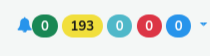
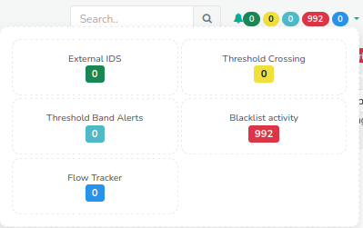
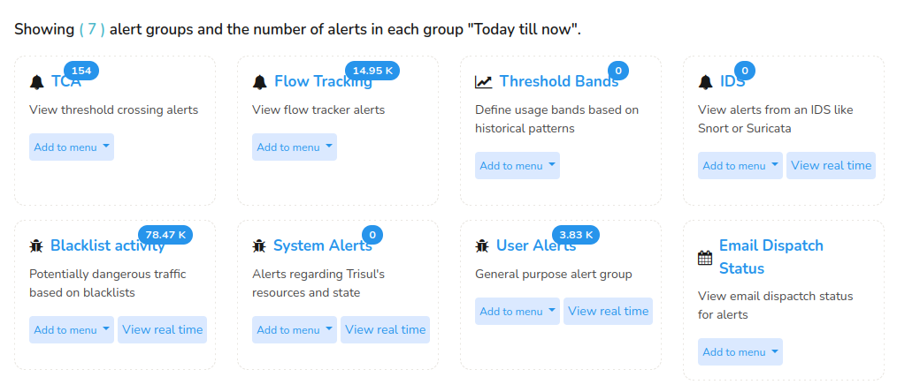

# Summary of All Alerts

Trisul provides two convenient ways to view a summary of all alerts:
1) [*Alert Bar*](/docs/ug/alerts/viewall#the-alert-bar) ( Top right corner of every page)
2) [*Show All*](/docs/ug/alerts/viewall#the-show-all-alerts) Alerts

>There are many different types of alerts supported by Trisul. In 
addition to built in alert types you can add your own types using the 
Lua plugin mechanism.

## The Alert Bar

The *Alert Bar* is located in the top right corner of every page on the [User's Layout](/docs/ug/ui/userlayout). 

  
*Figure: Alert bar showing counts*

- Located in the top right corner of every page
- Displays near real-time alert counts, showing only new alerts since the user's last viewing session.
- Color-coded alert counts are displayed for each alert type.

Clicking on the *Alert Bar* expands the alert types.

  
*Figure: Alert Bar Expanded View*

This allows users to:
- Search and analyze specific alert types.
- Visualize alert counts per type.

## The Show All Alerts

The *Show All* option, which offers a comprehensive overview of alert activity for the current day, thereby providing users to access and assess alert information. 

:::info navigation
Go to Alerts-> Show all
:::

This shows alert counts per type for today. These counts indicate total number of alerts seen from midnight today till now.

  
*Figure: Show all alert type counts*

1. Click on the numbers to search and analyze those types of alerts.
2. If the *View real time* button is present you can open a real time view of alerts as they come in.
