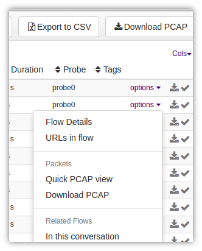
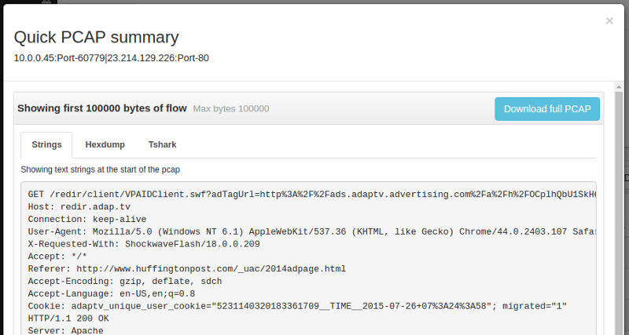
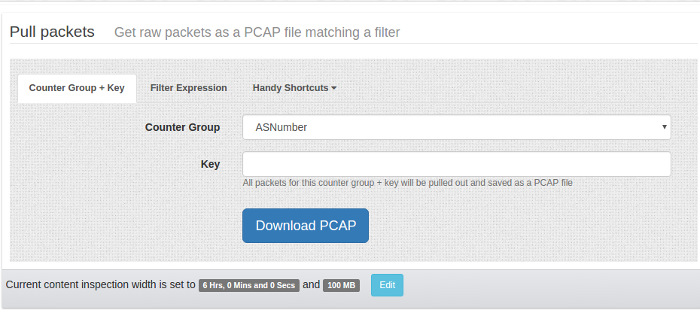

# PCAP Drilldown Methods

This document describes the different ways you can drilldown to raw 
packet captures from the Trisul user interface. If you are interested in
 programatically retreiving PCAPs refer to the [Trisul Remote Protocol guide](/docs/trp/) Trisul allows you to directly drilldown into packets from a number of 
investigation points. The key thing to look for are the following two 
menu items

1. “Download PCAP”
2. “Quick PCAP view”

*Figure: View PCAP/ Download PCAP Options*

## Download PCAP

The Download PCAP option can be accessed via two places. You can see both the places in the image shown above.

1. the Download PCAP **button** at the top of any table showing flows, alerts, resources.
2. the Download PCAP **menu** when you click on the “Options” against any single item in the table

When you click on the Download PCAP button at the top of the table

- Trisul brings at once the PCAPs related to all the items shown in 
  the table. It does this by computing a packet query plan first and then 
  pulling and merging all the packets into a single PCAP file. This is a major productivity time saver.

## Quick PCAP View

The Quick PCAP menu item was created to 
make working with raw packets dead easy. When you select this menu 
items, only the 1st 100K of the requested packet output is selected and 
shown in three panes.

1. Strings : all text strings that can be found are shown
2. Hexdump : a hexdump like Wireshark is shown
3. Tshark : if tshark is available on the Trisul-Hub node, the per-packet view of the PCAP is shown

See image below

*Figure:  Showing Quick PCAP Summary*

Once you are satisfied you can download the PCAP file and save it for further analysis or problem report.

## PCAPs from Flows, Alerts

 You can download PCAPs from the following other Trisul data types. In

- **flows** : Explore Flows results allow you to download PCAP for ANY flow. Not just TCP/UDP.
- **alerts** : Intrusion Detection alerts allow you get PCAPs for all alerts of a type, or from an IP or any other query.
- **resources** : Directly jump to Packets from DNS, HTTP URLs, TLS Certificates analysis
- **full text search** : FTS documents like TLS traffic, HTTP Headers, File extraction. Click on any document and then “Download PCAP”

## PCAPs for Particular Keys

For any counter item you can get the PCAPs by accessing the key dashboard and then clicking on “Download PCAP” option. This is truly unique feature of Trisul because you get PCAPs for all types of counter not just TCP/IP flows. Examples

1. Key dashboard for **Counter Group : Country, Key: CN** : clicking on Download PCAP will get you packets from country=China.
2. Key dashboard for **Counter Group : MAC, Key: 06:b4:83:e3:e3:30** : packets for a MAC address

## PCAPs for Anything

If you want to download PCAPs for any timeframe in the past for any criteria, you need to use the Retro Tools > PCAP download tool.

To create a flow tagger

:::info navigation

:point_right: Goto Retro → Retro Tools → Select Timeframe → Pull Packets

:::

*Figure: Pull Packets Form*

You have three options here

1. **Counter Group + Key** : select counter group and key to get packets for that item
2. **Filter Expression** : Any arbitrary filter expression in Trisul Filter Format
3. **Shortcuts** : “Get all packets” downloads everything in that selected time. Can be very useful.

## Packet Capture Settings

To make the feature usable and resistant to massive download requests
 Trisul uses two configuration parameters to protect the feature.

| Content inspection time limit | 6 hours | caps the maximum inspection interval. protects you from initiating a search for weeks                                                                                                  |
| ----------------------------- | ------- | --------------------------------------------------------------------- |
| Content download limit        | 100MB   | maximum download needs to be < 100MB|

both these parameters can be edited from [App Settings](/docs/ag/webadmin/web_options)
