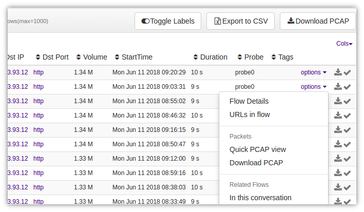

# FAQ

### Quickly see packet contents without pulling out the pcap

In a majority of situations, you can identify what a particular flow is 
about by examining the initial packets of the flow. Previously you had 
to click on “Pull Packets” next to a flow to pull out a PCAP into an application like Unsniff or Wireshark. Now you can click on “Show Headers” along side each flow.

Figure: “Show Headers” for a text and hex dump of packets at top of flow

This is extremely useful for quick analysis of flow packets without 
leaving Trisul. If you want the entire flow, you can always click on 
“Download” to get it right now, or “Add to briefcase” to add the PCAP to the briefcase and download later as a single ZIP files.

### Disable full packet capture

Set the [Ring – Enabled](/docs/ref/trisulconfig#ring) parameter to `False` and restart Trisul. Packet logging will be disabled.

### Allocate a fixed 100GB disk space for full packet captures

To store 100×1GB files in the Operational area.

1. Locate the [Ring – Slice Policy – Operational – SliceCount](/docs/ref/trisulconfig#ring) paramter
2. Set the SliceCount to 100

### I dont want to store SYSLOG packets because I send them to splunk

You have to use Rules to exclude the SYSLOG protocols from getting stored. Check out the [controlling storage example](/docs/ug/caps/packetstorage#examples)

### I want to find all flows containing a malware payload pattern

Use the [payload search tool](/docs/ug/tools/payload_search)

### How can I change the AES CTR password ?

The passphrase is read from the file specified in [Ring – Passphrase File](/docs/ref/trisulconfig#ring) If you change the passphrase, older data is currently not accessible. 
Trisul will support rekeying of old data in a future release.
