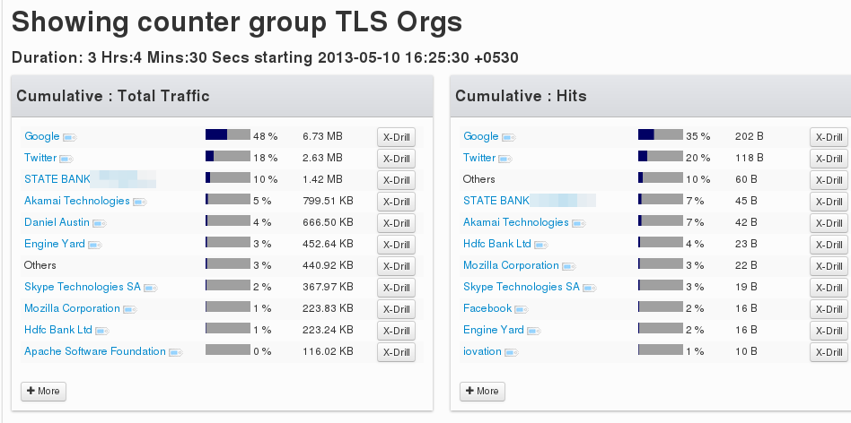
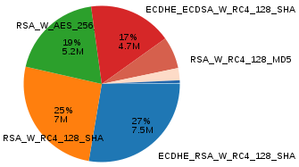
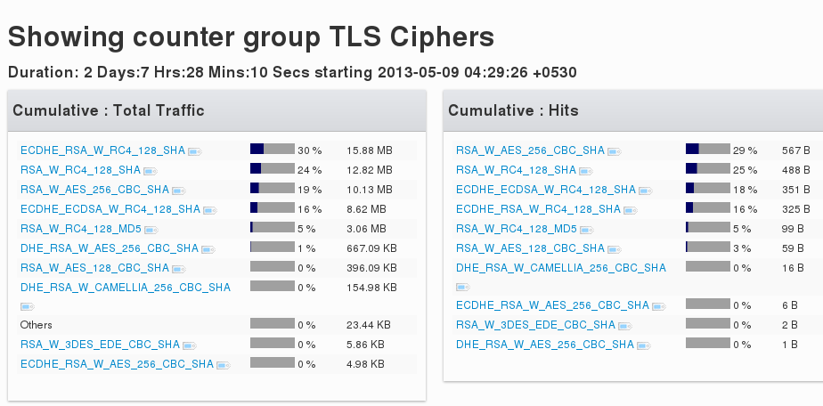
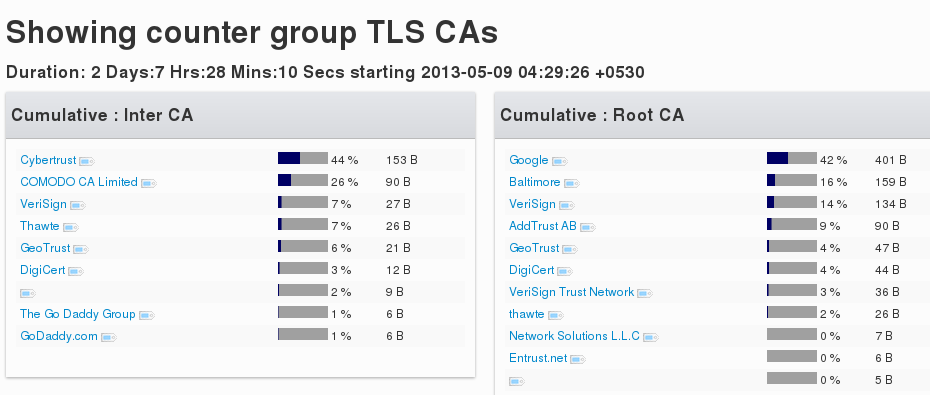

# SSL/TLS Metering

Three new counter groups give you great visibility into the SSL
encrypted traffic in your network.

1. **TLS Orgs** - Traffic by servers from subject part of the
   certificate
2. **TLS Ciphers** - Traffic by encryption and key exchange algorithm
3. **TLS CAs** - Traffic by certificate authority

> Trisul detects usage of SSL/TLS using port independent heuristics.  
> Trisul handles SSL/TLS session resume.

## TLS Orgs

Meter traffic by the entity in the Subject Common Name in the X.509
Certificate. This counter group tells you how much of your SSL traffic
is Google, Twitter, Dropbox, etc. Visibiliy you cannot have otherwise.

:::note navigation

Select Retro -\> Retro Counters -\> Choose TLS Orgs from the dropdown
list

:::

  
*Figure: Meter 0 (Total Traffic) = Bytes per org, Meter 1 (Hits) = Number of
SSL/TLS flows*

You can also generate long term usage reports with several charts like
the pie chart shown below using Retro Tools.

:::note navigation

Select Retro -\> Retro Tools -\> Select Counter Group Toppers -\> Select
TLS Orgs

:::

## TLS Ciphers

Meters traffic by the “cipher suite” used by SSL/TLS connections. The
cipher suite is a combination of the encryption and the key-exchange
algorithm used.

  
*Figure: Meter 0 (Total Traffic) = Bytes per suite, Meter 1 (Hits) = SSL/TLS
flows per suite*

## TLS Certificate authorities

Tracks the certificate chains of SSL/TLS connections. It takes the
Issuer Common Name of each certificate in the chain and meters it in the
following manner.

1. Issuer CN for last cert in chain -\> Metered as Root CA
2. Issuer CN for others -\> Metered as Intermediate CA

#### Usage tip

This is optimized for long term queries, you can select a week or a
month as look at any suspicious root or intermediate CAs.

  
*Figure: Meter 0 (Inter CA) = flows as intermediate CA, Meter 1 (Hits) = flows as
root CA*

## Usage tips

1. [SSL Cert resources](/docs/ug/resources/sslcerts) allow you to search for hashes in bulk
2. [SSL Cert FTS](/docs/ug/resources/ftsssl) allow you to search for arbitrary strings in certificates
