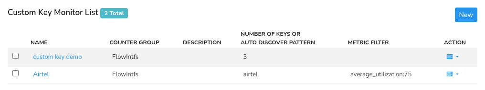
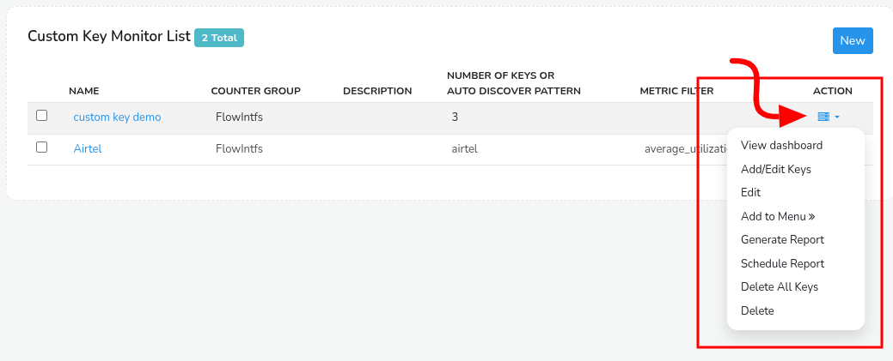
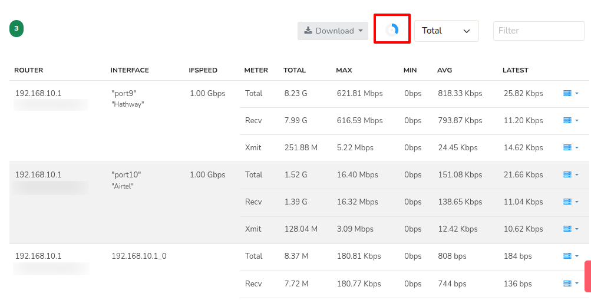
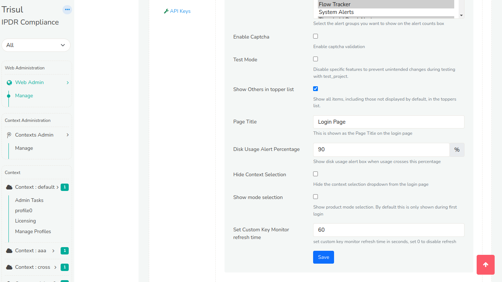
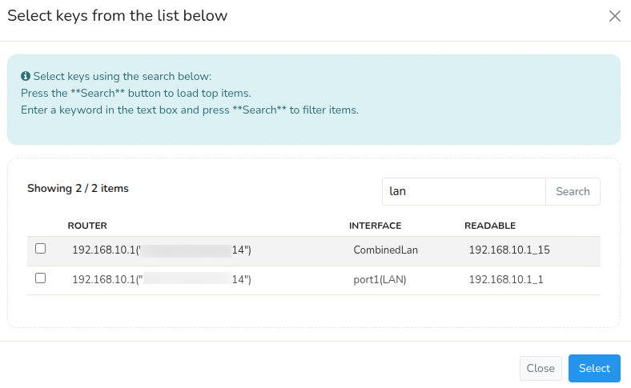
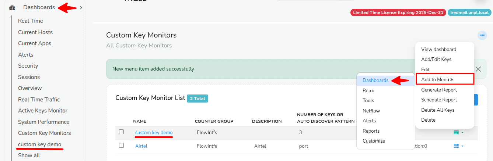

# Custom Key Monitors

**Custom Key Monitors** allow you to monitor a set of key items in real time, irrespective of whether they show up in the toppers list or not. You can think of them as subset of a counter group that is “special” to you. For example, the IP (Hosts counter group) 192.168.14.16 is our internal build server, so we want to monitor it separately, generate reports for it separately, even though we may have thousands of other hosts.

You would want to use custom key monitors if :  

- If you want to keep an eye on a set of servers  

- You want to track certain VSAT (Satellite links)  

- You want near real time views  

- You want to generate custom reports of just these items

So, this feature is especially useful in high-scale environments where you may have thousands of entities (like IPs, interfaces, or applications) but only a handful need close, focused attention.

## How to Set Custom Key Monitors

Custom key monitors can be configured in two ways:

| Method |	Description |
|--------|--------------|
| Regex-based |	Ideal for **dynamic keys** that follow a naming pattern. Simply provide a regular expression, and **all keys matching the pattern** will be included automatically. |
| Static keys |	Best for **known, fixed keys**. You manually select and add each key you want to monitor. Only those keys will be included in the monitor list. |

Use **regex-based** monitors when your key names follow a convention or when new keys are expected to appear frequently. Use **static** key monitors when you have a specific, stable list of key items you want to keep under watch.

## Create Custom Key Monitor

Directions to create new custom key monitors

:::info navigation

:point_right: Select Customize &rarr; Show all &rarr; Custom Key Monitors

:::

1. Click **New**  

2. The page displays a series of fields which are discussed below

| Field Name    | Description                                                 |
| ------------- | ----------------------------------------------------------- |
| Name          | Denotes the name of the Custom key monitor                  |
| Description   | Few words describing the function of the custom key monitor |
| Counter Group | Select one counter group from the dropdown list             |
| Meters        | Select any number of meters from the list                   |
| Auto Discover Keys | Automatically search for keys matching this regex. Use re2 regex format |
| Filter Rule | Only show the keys if matches the rule. (For Example: average_utilization:75 will filter only the keys that have utilized 75 percentage)

After completing all the fields , click **Create**. This leads to page listing all the custom key monitors. 

## Viewing Custom Key Monitors

Directions to view Custom Key Monitors

:::info navigation

:point_right: Select Customize &rarr; Show all&rarr; Custom Key Monitors

:::

*Figure: Custom Key Monitor List*

The page show a list of created custom key monitors with the following details:

| Detail    | Description                                                 |
| ------------- | ----------------------------------------------------------- |
| Name | Name of the Custom Key created. |
| Counter Group | The counter group to which the custom key monitor belongs to. |
| Description | Description of the custom key monitor if any. |
| Number of Keys or Auto Discover Pattern | Shows the number of keys added in that particular custom key monitor incase the added keys are static keys or the regex keyword of that custom key monitor if dynamic keys. |
| Metric Filter | Shows the filter condition applied on that particular custom key monitor if any. |

## Action Button Options (Custom Key Monitors)

*Figure: Action Button Options*

The following are the **Action Button Options** explained in detail. For your convenience, click on an option on the table to quickly jump to that option without having to scroll through the page .

| Action Button Options    |       |
| ------------- |------------------|
| [**View Dashboard**](/docs/ug/cg/ckey#view-dashboard) | [**Generate Report**](/docs/ug/cg/ckey#generate-report) |
| [**Add/Edit Keys**](/docs/ug/cg/ckey#add-or-edit-keys) |[**Schedule Report**](/docs/ug/cg/ckey#schedule-report) |
| [**Edit**](/docs/ug/cg/ckey#edit) | [**Delete All Keys**](/docs/ug/cg/ckey#delete-all-keys) |
| [**Add to Menu >>**](/docs/ug/cg/ckey#add-to-menu) | [**Delete**](/docs/ug/cg/ckey#delete) |

### View Dashboard

When you select a custom key monitor or click **View Dashboard** option from the action button menu the page shows a dashboard of in depth details of the keys in that custom key monitor. 

The statistics in the custom key monitor dashboard are explained in the following descriptions.

| Field | Description |
|-------|-------------|
| Router |  The name of the router/firewall |
| Interface | The name of the interface on that router |
| IFSpeed | Interface speed shown only if the counter group is a Flow Interface. |
| Meter | The specific aspect of traffic being measured — e.g., Total Bytes, Received Packets, Transmit Bytes, etc. |
| Total | Cumulative value for the meter over the selected time window. |
| Max | The highest recorded value in a single sampling interval during the selected period. |
| Min | The lowest recorded value in a sampling interval. |
| Avg | The average value across all intervals in the selected time range. |	
| Latest | The most recent recorded value for this meter. |

- You can download the custom key monitor report by clicking on the **Download** button on top of the dashboard to download that report.
- Click on the **Dropdown Menu** right to the refresh button to choose from **Total/Recv/Xmit** to display statistics of the Total data/ Received data/ Transmitted data of the selected custom key monitor respectively.
- Use the **Filter Box** on the top right corner of the dashboard to enter the keywords to display only the filtered keys stats.

#### Set Refresh Time

The custom key monitor is refreshed automatically every minute, indicated by a rotating **Refresh Icon** next to the download button. As it keeps refreshing every minute the custom key fetches the new data updating with the latest data.  

  
*Figure: Custom key Refreshing*

To adjust the refresh interval, navigate as follows,

:::info navigation
:point_right: Login as `admin` & Go to Web Admin &rarr; Manage &rarr; UI &rarr; App Settings
:::

   
*Figure: Set Custom Key Refresh Time*

Locate the **Set Custom Key Monitor Refresh Time** and enter the desired refresh interval time (in seconds). To **disable** the refresh button enter **0**. This setting allows you to customize the frequency of custom key refreshes to suit your requirements.

### Add or Edit Keys

Clicking on the **Add/Edit Keys** from the action button options allows you to manually add or edit keys (i.e.static keys) on that particular custom key monitor. 

*Figure: Create Custom Key Monitor Form* 

This shows a page with the field **Keys** (as in the sample form above) to add or edit keys, user can type in the application keys which are to be traced (For Example: p-0050, p–0016) and click **Add Keys** button and add as many keys as you want.

Click on the **Plus button** to filter keys using the search tool.

  
*Figure: Select keys Using Search*   

- Leave the search box empty and click the **Search** button to load top items.
- Enter a keyword in the text box and click the **Search** button to filter items (For Example: As in the sample screenshot the keyword "lan" will fetch all the keys with "lan") 
- Use the checkboxes to select the keys and click the **Select** button to add those keys.

And click **Done adding** when completed.

> :point_right: **Add or Edit Keys** from the action button menu is by default **disabled** for custom key monitors that are created using regex.

### Edit

Click on the **Edit** option from the action button menu to edit the selected custom **key monitor** (do not confuse custom key monitors with keys inside the custom key monitors). This takes you to the [**Create the custom key monitor form**](/docs/ug/cg/ckey#create-custom-key-monitor) that you already filled to configure this custom key monitor. You can change the current inputs of the form to edit and when done, click **Update** to update the custom key monitor accordingly.

### Add to Menu

- The **Add to Menu** option allows you to pin the selected Custom **Key Monitor dashboard** to the **main navigation menu** for quick access. 

- You can choose which main section you want to add it under — such as **Dashboard, Retro, Tools, NetFlow, Alerts, Reports, or Customize**.

*Figure: Selected Custom Key Monitor added to the Dashboards Menu*

### Generate Report

From the custom key monitor list, click on the **Action button** on the right side against the custom key monitor you want and click **Generate Report**. Select a time range from the [Time Selector](/docs/ug/ui/elements#time-selector) for the period which you want the report. This will generate a report in PDF format which can be downloaded.

### Schedule Report

Click on the **Schedule Report** from the action button menu to schedule a report periodically for the selected custom key monitor. Follow the steps as in the [**"Schedule a New Report"**](/docs/ug/reports/schedreports) doc and configure the report according to your requirements.

### Delete All Keys

Clicking on the **Delete All Keys** option from the action button menu allows you to delete all keys in the custom key monitor (only the keys inside the selected custom key monitor not the custom key monitor itself). This option is helpful in custom key monitor added with **static keys** where you can delete the current keys and add news ones to the custom key monitor.

### Delete

Clicking on the **Delete** option from the action button menu deletes the selected custom key monitor itself.
