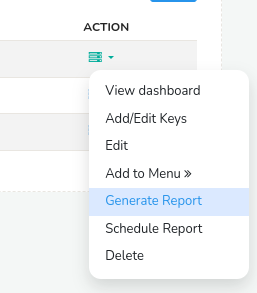

# Custom Key Monitors

Custom Key Monitors allow you to monitor a set of key items in real time,
irrespective of whether they show up in the toppers list or not. You can
think of them as subset of a counter group that is “special” to you. For
example, the IP (Hosts counter group) 192.168.14.16 is our internal
build server, so we want to monitor it separately, generate reports for
it separately, even though we may have thousands of other hosts.

You would want to use custom key monitors if :  

- If you want to keep an eye on a set of servers  

- You want to track certain VSAT (Satellite links)  

- You want near real time views  

- You want to generate custom reports of just these items

## Create Custom Key Monitor

Directions to create new custom key monitors

:::info navigation

:point_right: Select Customize &rarr; Show all&rarr; Custom Key Monitors

:::

1. Click **New**  

2. The page displays a series of options which are discussed below

| Field Name    | Description                                                 |
| ------------- | ----------------------------------------------------------- |
| Name          | Denotes the name of the Custom key monitor                  |
| Description   | Few words describing the function of the custom key monitor |
| Counter Group | Select one counter group from the dropdown list             |
| Meters        | Select any number of meters from the list                   |

After completing all the fields , click create. This leads to page listing all the custom key monitors. Now click **Add/Edit Keys**, which shows a page with a text-area , user
can type in the application keys which are to be traced (eg: p-0050, p
–0016) and click **Add Keys** and add as many keys as you want and click **Done adding** when completed.

*Figure: Create Custom Key Monitor Form*

## Viewing Data

Directions to view Custom Key Monitors

:::info navigation

:point_right: Select Customize &rarr; Show all&rarr; Custom Key Monitors

:::

*Figure: Custom Key Monitor List*

1. The page show a list of created custom key monitors  

2. Click the name of the particular custom key , which gives an in depth
   view of the custom key

## Generate Reports

Directions to generate reports for custom key monitors

You can generate custom key reports in two ways.

1) From the custom key monitor list, click on the option toolbar on the right side against each custom key and click **Generate**. This will generate a report is PDF format which can be downloaded.

*Figure: Generate Report Option from Custom Key*

2) You can also download the custom key report by clicking on a particular key and entering into its detailed view page to view the report before downloading. On that page, on top right corner you can click on the option toolbar. And click Download PDF to download that report.

*Figure: Download Report from Key Dashboard*
