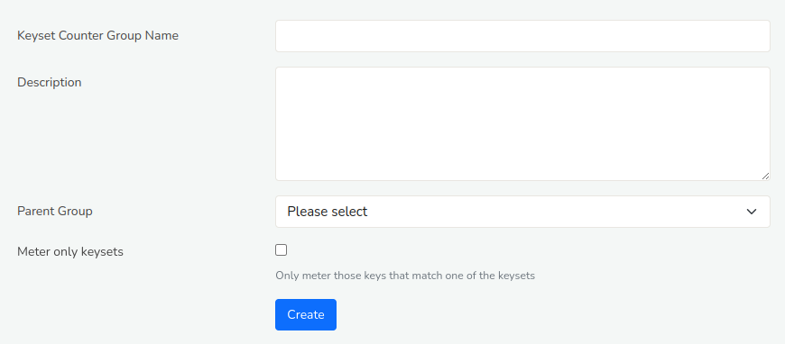
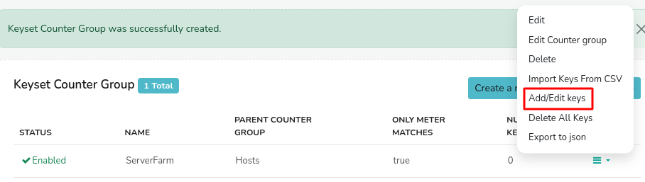
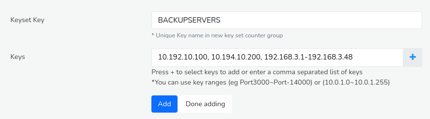
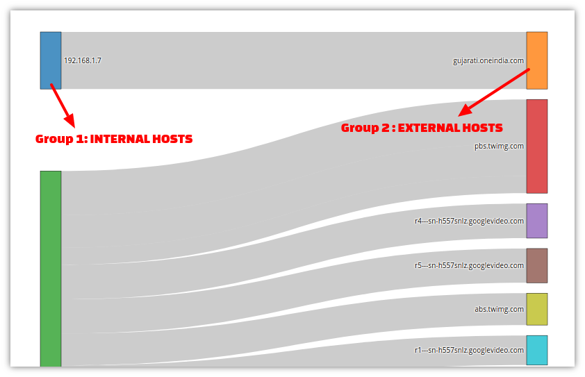
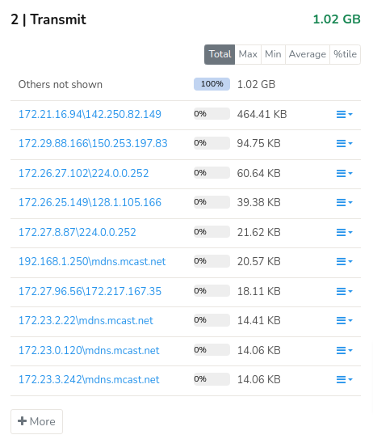
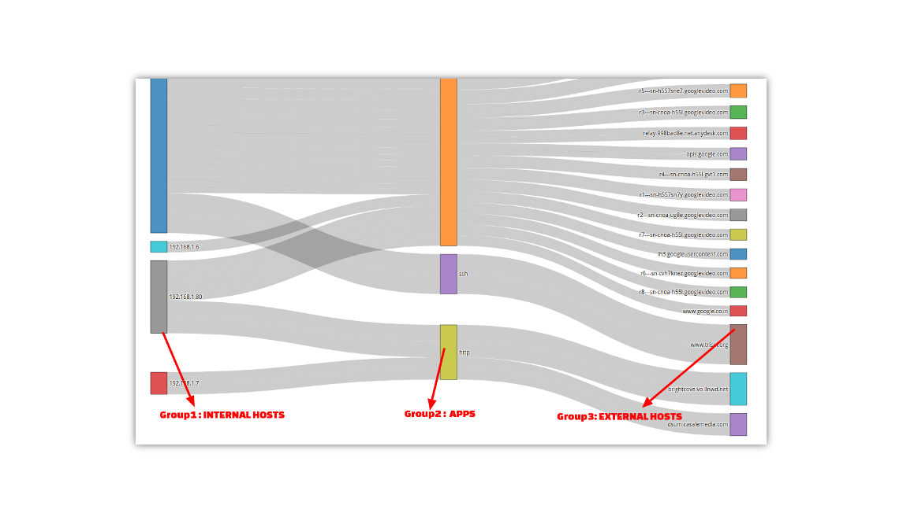
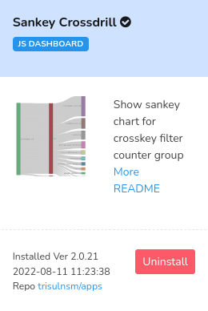

# Custom Counter Groups

Trisul ships with 40-50 counter groups. Often users want some special
type of metering for their environment. Trisul lets you build your own
advanced traffic metering on top of the existing counter groups. The
following types of custom counter groups are supported.

[Filtered Counter Group](/docs/ug/cg/custom#filtered-counter-groups)  
**Meter only a subset of an existing counter group by applying a
filter**

Example : A counter group called “Web Hosts” that only counts HTTP and
HTTPS traffic. The parent group is “Hosts” and the filter is “Apps
80(http) and 443(https)”

[Keyset Counter Group](/docs/ug/cg/custom#keyset-counter-groups)  
**Meter groups of keys rather than individual keys from a host group**

Example : A new counter group called *My apps* which extends the *Apps*
counter group. Then specificy groups of ports {4569,5060,3000-4000} as
VoIP, as Web,  as Email. These groups are called
keysets. Similarly you can count groups of IPs as Web Servers,
Workstations, VOIP Phones by specifying those groups from the Hosts
counter group.

[Stat Based Counter Group](/docs/ug/cg/custom#stat-based-counter-groups)  
**Count only keys that whose values match a mathematical value**

Example : A new counter group called *Scanners*, which extends the
*Hosts* counter group but only when the meter *Security Alerts* is more
than 0.

[Rule Based Counter Group](/docs/ug/cg/custom#rule-based-counter-groups)  
**Specify arbitrary rules matching your business needs**

Example : A new counter group called *Corporate apps* which extends the
*Apps* counter group. Then adds these rules *CCTV Cameras* - if Port =
80 and subnet = 10.2.2.0/24. You can chain any number of rules to build
your custom metering.

[Cross Keys Counter Group](/docs/ug/cg/custom#cross-key-counter-groups)  
**Cross product of two or three counter groups**

Example : A new counter group called *Traffic Flows* which is cross
product of two counter groups *Internal Hosts X External Hosts*. The
keys in this new counter group will be a combination of both. Another
example is *Geo Flows* which is a cross product of three counter groups
*Internal Hosts X Country X External Hosts*

[Cardinality Counting](/docs/ug/cg/custom#cardinality-counting)  
**Count uniques X of Y**

Cardinality counters are not a new counter group. You can add up to two
cardinality meters to any counter group. For example : You can add to
the *Hosts* counter group a meter for tracking *Unique Apps* This allows
you to track *for every host* a new metric called *unique apps*

------------------------------------------------------------------------

## Filtered Counter Groups

A cross-product counter group.

Meter a subset of a group that matches a set of keys from another group.

### Uses

Filtered counter group are invaluable in setting up cross-group
counters.

Some examples :

| Counter Group       | Description and Parameters                                          |
| ------------------- | ------------------------------------------------------------------- |
| Users of Youtube    | All IPs connecting to known YouTube IPs can be monitored separately |
| HTTP Hosts          | Parent = Hosts, Filter = Apps (Keys = http)                         |
| China Ukraine Hosts | Parent = Hosts, Filter = Country (Keys = cn,ua)                     |
| Server Apps         | Parent = Apps, Filter = Hosts (Key = 10.10.1.18)                    |

### Create New Filtered Counter Groups

:::note navigation

Login as Admin -\> Select Context and profile0 -\> Under Custom Counters
-\>Filtered

:::

1. Click the button “Create New”  

2. You will be redirected to a page with following fields

| Field Name         | Description                                                                                                 |
| ------------------ | ----------------------------------------------------------------------------------------------------------- |
| Counter Group Name | Counter Group name                                                                                          |
| Description        | Descriptiom about the counter group                                                                         |
| Parent Group       | Choose parent counter group from the drop down list                                                         |
| Filter Group       | Choose filter counter group from the drop down list                                                         |
| Key List           | Comma separated list of keys/ranges: `Port-80, 192.168.1.2, Port-5000~Port-8000, 192.168.1.1~192.168.1.255` |
| Inverse Key List   | The parent will be filtered by all keys Except those in this list.                                          |

### Custom Group

For more advanced custom counters you can use the [LUA API](/docs/lua/tutorial1)
to measure any subset of metrics

------------------------------------------------------------------------

## Keyset Counter Groups

A new counter group that aggregates sets of keys from a host counter
group. This can be used to group IP addresses , port numbers, network
interfaces and then count the aggregate. Some examples are shown below

| New Keyset Counter Group | Host/Parent Group | Key sets                                                                                                                                    |
| ------------------------ | ----------------- | ------------------------------------------------------------------------------------------------------------------------------------------- |
| MyApps                   | Apps              | Ports 80,445,8080 = WEB<br/>Ports 3000-4000 = VoIP<br/>Ports 18001,18002,19001 = TRADING                                                    |
| ServerFarm               | Hosts             | IPs 10.1.17.1,10.1.18.1 = GATEWAYS<br/>IPs 10.1.17.40 to 50 = MANAGEMENT IPs<br/>10.1.19.1 to 255 = HR<br/>..build other business groupings |

### Creating a Keyset Counter Group

:::note navigation

Login as Admin -\> Select Context:default-> profile0 -\> Custom Counters
-\> Keysets

:::



*Figure: Creating a new Keyset Counter Group*

Fill out these fields

| Field Name                | Description                                                                                                                                                                                                                       |
| ------------------------- | --------------------------------------------------------------------------------------------------------------------------------------------------------------------------------------------------------------------------------- |
| Keyset Counter Group Name | The name of the new counter group. Keep this short.                                                                                                                                                                               |
| Description               | A description of the new counter group                                                                                                                                                                                            |
| Parent Group              | The parent counter group from which you will be selecting keys. Select from dropdown                                                                                                                                              |
| Meter only keysets        | The default behavior is when keys seen in traffic do not match any groups they will be counted as-is in the new group. If this box is checked, then only those keys that match a group will be metered, others will be discarded. |

Now you have created the counter group. Next you need to group keys
together.

### Group Keys Together

Directions to Create new keyset counter groups

:::note navigation

Login as Admin -\> Select Context :default -> profile0 -\>  Custom Counters
-\> Keysets

:::

1. The list of keyset counter groups will appear
2. Click the option “Add/Edit keys” against the group name.



*Figure: How to group keys together*

1. Click the *Add/Edit Keys* to edit keysets
2. You will be redirected to a page with following fields


*Figure: Adding two IPs and an IP range to a group called BACKUPHOSTS*

| Field Name | Description                                                                                                   |
| ---------- | ------------------------------------------------------------------------------------------------------------- |
| Keyset Key | Key name in new key set counter group                                                                         |
| Keys       | Keys from parent counter group separated by a comma. To add Key Ranges use a ~ tilde character. For example : |
| \+ button  | Press the + button to select keys from a list based on top keys in that group                                 |

1. Enter new Keys and group items then press *Add*. It will appear in
   the bottom.
2. Repeat the process one by one until you have added all the groups.
   Then press *Done Adding*

Your keyset group is ready.

> **Restart**  
> Restart the Probe for changes to take effect.

You can then view the new counter group in *Retro \> Retro Counters*

------------------------------------------------------------------------

## Stat Based Counter Groups

A new counter group consisting of items based on an observed meter
value.

### Usage

Creates a subset of a parent group consisting only of items who meet a
certain meter criteria.

Examples :

| Counter Group         | Description     | Meter Criteria                                                                             |
| --------------------- | --------------- | ------------------------------------------------------------------------------------------ |
| Internal hosts only   | Subset of hosts | When Hosts meter “Homenet” \> 0                                                            |
| Under the radar hosts | Subset of hosts | When Hosts meter “Total” \< 2000 (hosts who only xmit or recv \< 2K bytes in an interval ) |

### Creating New Meter Value Counter Group

:::note navigation

Login as Admin -\> Select Context 

:default-> profile0 -\> Custom Counters-\> Stat Based

:::

1. The list of Configure Statval Counter Groups will appear  

2. Click the option found at the bottom section **New Counter Group
   Statval**  

3. You will be redirected to a page with following fields

| Field Name           | Description                                                        |
| -------------------- | ------------------------------------------------------------------ |
| Counter Group Name   | The Counter Group statval Name                                     |
| Description          | Description about counter group statval                            |
| Parent Counter Group | Select a Parent from the drop down list of parent counter groups   |
| Stat ID              | Select a Stat ID from the drop down list of Stat IDs               |
| Operator             | Choose an operator that you want to perform from the dropdown list |
| Stat Val             | Example : 8Mbps, 2000, 6Kbps (default units is bytes/sec)          |

------------------------------------------------------------------------

## Rule Based Counter Groups

A rule based counter group allows you the maximum flexibility to
custom-meter your network traffic.

It works like this :

1. Derive from a parent group such as hosts / applications / macs  

2. Specify a chain of rules in [Trisul Filter Format](/docs/ref/trisul_filter_format)  

3. The first rule that matches determines the meter key  

4. If no rule matches the key falls through to the parent counter group

### An Example : Corporate Applications

You are a network admin in an enterprise and wish to meter traffic in
terms of your applications.

Here are your requirements.

| This kind of traffic                | Should be metered as                                     |
| ----------------------------------- | -------------------------------------------------------- |
| Ports 80 on IPs 10.10.17.20, 21, 22 | HR-Attendance                                            |
| Ports 3000-9000 on IP 10.10.18.35   | Trisul-NSM                                               |
| Ports 8000 on IPs 10.10.18.25 - 45  | Security-Cam                                             |
| All traffic to IP 10.10.19.3        | Exchange-Email                                           |
| All others                          | Use the default application (eg 80 = HTTP, SSH = 22 etc) |

You would specify the rules as follows

Counter Group Name : **ACME APPS**  
Parent Group : **Applications** (guid = {})

| No     | Rule in Trisul Filter Format                                                                                                | New Key                                                          |
| ------ | --------------------------------------------------------------------------------------------------------------------------- | ---------------------------------------------------------------- |
| Rule 1 | `{4CD742B1-C1CA-4708-BE78-0FCA2EB01A86}=0A.0A.11.14,0A.0A.11.15,0A.0A.11.16&{C51B48D4-7876-479e-B0D9-BD9EFF03CE2E}=Port-80` | HR-Attendance                                                    |
| Rule 2 | `{4CD742B1-C1CA-4708-BE78-0FCA2EB01A86}=0A.0A.12.23&{C51B48D4-7876-479e-B0D9-BD9EFF03CE2E}=Port-3000~Port-8000`             | Trisul-NSM                                                       |
| Rule 3 | `{4CD742B1-C1CA-4708-BE78-0FCA2EB01A86}=10.10.18.25~10.10.18.45&{C51B48D4-7876-479e-B0D9-BD9EFF03CE2E}=Port-8000`           | Security-Cams                                                    |
| Rule 4 | `{4CD742B1-C1CA-4708-BE78-0FCA2EB01A86}=10.10.19.3`                                                                         | Exchange-Email                                                   |
| \-     | Catch-all                                                                                                                   | Uses the same application key as the parent group (applications) |

### Creating a Rule Based Counter Group

Directions to create a new Rule Based Counter Group  
:::note navigation

Login as Admin -\> Select Context and profile -\> Under Custom Counters
-\> Rule Based

:::

1. Click the option **Create new rule based counter group**

This leads you to a page , whose fields are explained below

| FieldName                     | Description                                |
| ----------------------------- | ------------------------------------------ |
| Rule Based Counter Group Name | Name of the counter group                  |
| Description                   | Words about the goals of the counter group |
| Parent Group                  | The parent counter group                   |

After creation , the user is redirected to a page which lists the
available rule based counter groups

Now click the ***Edit Rules*** option for the counter group , which
leads you to another page , whose fields are as follows

| FieldName   | Description                       |
| ----------- | --------------------------------- |
| Target Key  | Name of the target                |
| Target Rule | The rule which should be followed |

#### Specifying a Target Rule

```
    {4CD742B1-C1CA-4708-BE78-0FCA2EB01A86}=80.79.32.7A&{C51B48D4-7876-479e-B0D9-BD9EFF03CE2E}=p-0050
```

The above rule tracks the activities of the key `80.79.32.7A` only for
`HTTP` application

------------------------------------------------------------------------

## Cardinality Counting

Cardinality counters allow you to measure unique hits for keys within a
counter group. For example, we can track how many unique IPs did each
country see.

By default, Trisul ships with the following three cardinality counters
enabled.

| Cardinality Counter   | Description                                                  |
| --------------------- | ------------------------------------------------------------ |
| Unique Apps per Host  | For each host, track how many unique apps were seen          |
| Unique Hosts per Host | For each host, track how many unique hosts (peers) were seen |
| Unique Hosts per App  | For each app, track how many unique hosts were seen          |

You may add your own cardinality counters to any counter group with the
following restriction :

1. A maximum of 2 cardinality counters are allowed per counter group.

### Creating cardinality counters

:::note navigation

Login as Admin -\> Select Context:default-> profile0 -\> Custom Counters
-\> Cardinality

:::

1. A list of existing counters is displayed
2. Click on *New Cardinality Counter*
3. Enter the following three fields

| Fields              | Description                                                        |
| ------------------- | ------------------------------------------------------------------ |
| Host Counter        | The counter group whose members you want to attach this counter to |
| Cardinality Counter | The counter group whose uniqueness you want to count               |
| Description         | Recommended \< 16 chars, describing the counter                    |

#### Example

If you wanted a cardinality counter to count unique hosts for each
country.

1. Host Counter Group = `Country` from dropdown
2. Cardinality Counter Group = `Hosts` from dropdown
3. Description = `Unique Hosts`

### Using Cardinality Counters

Once configured, cardinality counters behave just like other counters.
They appear as extra counters in the drop down lists, you can draw
charts, trend over time, even set threshold crossing alerts on them.

------------------------------------------------------------------------

## Cross Key Counter Groups

This lets you monitor a cross product of two or three counter groups.
This takes advantage of the fact that Trisul is capable of monitoring
millions of unique keys for any counter group. By crossing the
*Applications X Hosts* counter group you setup a new counter group with
*Unique(hosts) x Unique(apps)* keys.

### Example 1 : Two Groups Host Flows

Say you want to see Internal Hosts to External Host traffic flows - you
can get this by querying the *Flows database* using the *Explore Flows*
tool, but this is impractical for large deployments which can have
billions of flows. To solve this we setup a Cross Key Counter group of
*Internal Host x External Hosts*



*Figure: CrossKey Counter Group Showing Two Groups Host Flows*

> We use the Sankey Crosskey Trisul APP to visualize the flows. 

To install Sankey Crossdrill,

:::note navigation

Go to Admin \> Web Admin \> Manage \> Apps 

:::

Using the normal Retro Counters tool you can see the composite keys



*Figure: Composite Keys in Retro Counter*

### Example 2 : Three Groups Hosts App Flows

You can cross 3 groups as well. Here we setup a new Cross Keys counter
group with *Internal Hosts X Applications X External Hosts*



*Figure: CrossKey Counter Group Showing Three Groups Hosts App Flows*

> We use the Sankey Crosskey Trisul APP to visualize the flows. 

:::note navigation

Go to Admin \> Web Admin \> Manage \> Apps

:::

### Creating a Cross Key Counter Group

:::note navigation

Login as Admin -\> Select Context:default-> profile0 -\> Custom Counters
-\> Crosskeys

:::

1. Click the option **New Crosskey Counter Group**

This leads you to a form with these five fields.

| Field Name         | Description                                                                 |
| ------------------ | --------------------------------------------------------------------------- |
| Counter Group Name | Name of the counter group                                                   |
| Description        | Description of the group                                                    |
| Parent Group       | The parent counter group *G1*                                               |
| Crosskey Group     | The first cross product counter group group with the parent group *G1 x G2* |
| Crosskey Group 2   | The optional second cross product *G1 x G2 x G3*                            |

After creation , the user is redirected to a page which lists the newly
created group.

#### Enable and Disable Crosskeys

The parent counter group and the crosskey group 1 and crosskey group 2
(if used) must be enabled. If any of them are disabled the crosskey
counter group will not be created by Trisul.

### Viewing

Once created , the new Cross Key counter group is just like any other
group.

:::note navigation

Select Retro -\> Retro Tools -\> Select counter group

:::

The cross key counter group is intended for visualizing relationships as
Flows. You can use the *Sankey Crosskey* Trisul APP to visualize the
cross key counter group.

> We use the Sankey Crosskey Trisul APP to visualize the flows. 

:::note navigation 

Go to Admin \> Web Admin \> Manage \> Apps 

:::



*Figure: Sankey Crossdrill Apps from Trisul Apps*
