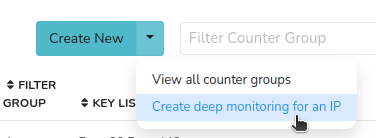

# Deep Monitoring of IP assets

A common use case is to enable enhanced monitoring of specific assets.
These assets are identified by IPv4/IPv6 addresses.

Deep Monitoring is a feature that enables the following features :

1. for each IP : monitor all **Hosts** communicating with it
2. for each IP : monitor all **Applications** communicating with it
3. for each IP : monitor all **Network layer protocols**
   (TCP/UDP/ICMP/etc)

Once Deep Monitoring is configured, Trisul enables streaming analytics
for the above three groups. This allows you to pull up long term reports
for these.

## Use Case

Most commonly used in the following scenarios

1. Service provider environment : Customers are assigned Static IP
   addresses - Deep Monitoring allows monthly usage reports
2. Enterprise : Enable Deep Monitoring for File servers, App servers,
   Mail servers, and other key assets.

## How to Enable Deep Monitoring

Login as admin.

:::note navigation

Select Context (default) -> profile0 -> Custom Counters-> Filtered Counter Groups

:::

You are shown a list of Filtered Counter groups.

:::note navigation

Click Create New-> Create deep monitoring for an IP

:::



*Figure: Create Deep Monitoring for an IP from Filtered Counter Group*

Now fill out the following form fields.

| Fields                       | Description          |
| ---------------------------- | -------------------- |
| Name associated with this IP | A name associated with this IP address, can be a customer name, server name, etc                                                                          |
| Description                  | A description for this IP, this is shown in PDF reports for this IP. You can setup group by prepending a GROUP Name and then a Pipe character (see below) |
| IP Address                   | The IP Address you want to setup deep monitoring                 |
| Bandwidth cap                | Enter full value; eg 512000 for 512Kbps        |
| Track Hosts                  | Disable this if you do not want to track hosts communicating with this IP. |

You can also optionally schedule a daily E-Mail report for this IP by
filling out the optional fields. And click Create.

> Important: Restart Trisul Probes for this feature to take effect

### Groups

You can group IPs together by using a group name. This is useful if you
need to combine multiple IPs into a single PDF report. This is placed in
the Description field by prepending a GROUPNAME with a Pipe character.

```
    IP = 10.0.0.17   
    Description = CORPORATE |  Email server This part of description is shown in the report 

    --

    IP = 10.0.0.177

    Description = CORPORATE |  This part of description is shown in the report app server
```

Now the two IP are grouped with the name `CORPORATE`

## View Reports

To view deep monitoring reports

:::note navigation

Login as user -> Reports -> Show All-> Static IPs

:::

You will then be shown a list of IPs configured for deep monitoring.

You can pull up PDF reports from this page.

The reports include the following information

1. Total bandwidth of the IP
2. Transmit bandwidth of the IP
3. Received Bandwidth of the IP
4. Timeframes where usage overshot bandwidth cap
5. Total Excess Bandwidth
