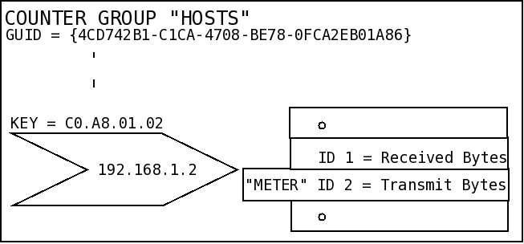

# Traffic metering concepts

This section attempts to briefly explain the basic concepts of counter
groups, meters, and keys.

## Counters, meters, and keys

***Counter Group***  
A type of network entity being measured.

[Built-in counter groups](/docs/ug/cg/intro#types) ship with Trisul. You can create your own [custom counter groups](custom)

Trisul measures Hosts, MACs, Applications, Subnets, VLANs, and 12 other
counter groups.

***A Meter***  
A parameter or data point within a counter group.

Trisul collects info about Total Bytes, Packets,Receive, Transmit, Num
active connections, Alerts and 10 other items. Each of these is called a
meter. So the *Host* counter group tracks 12 meters.

***A Key***  
An instance or a member of a counter group

Within the Host counters group, the IP Address `10.10.255.7` is a key. A
counter group can have millions of keys.

### A picture

The following example illustrates the concept of  

1. Counter Groups  

2. Keys  

3. Meters

As an example, if we wanted to refer to **“Transmit traffic of host
192.168.1.2”** :

The entities of interest are

|               |                                                                   |                                                                                                    |
| ------------- | ----------------------------------------------------------------- | -------------------------------------------------------------------------------------------------- |
| Counter Group | The Hosts counter group                                           | `{4CD742B1-xxx}` identifies the *host* counter group.                                              |
| Key           | The individual host within the counter group, also known as a Key | C0.A8.01.02 identifies the host with IP 192.168.1.8                                                |
| Meter         | The statistic                                                     | 2 identifies Transmit Bytes in Bytes/Sec. The hosts counter group tracks about 12 different meters |

## Statistics tracked for each group

Trisul meters the same set of statistics for each of these keys. Each
meter, known as stat-id, represents a statistic of interest over time.
The meters available depend on the counter group.

For each Key (counter group item), Trisul tracks and stores :  

1. Values of several meters for each Key over time.  

2. Top-N keys for selected meters.  

3. Aggregate meter values of all keys.

**Example:** The Hosts counter group tracks the following meters
(stat-ids).

| Stat ID | Represents                                                | Type    | Toppers Tracked |
| ------- | --------------------------------------------------------- | ------- | --------------- |
| 0       | Total Traffic                                             | Bps     | 50              |
| 1       | Received                                                  | Bps     | 10              |
| 2       | Transmit                                                  | Bps     | 10              |
| 3       | Packets                                                   | pps     | 0               |
| 4       | Active TCP Conns                                          | conns   | 0               |
| 5       | Attacker alerts \_ alerts originating from this host\_    | count   | 10              |
| 6       | Homenet *Total traffic for hosts is in home network*      | Bps     | 20              |
| 7       | External *Total traffic for hosts is not in home network* | Bps     | 20              |
| 8       | TCP SYN sent                                              | packets | 10              |
| 9       | TCP SYN recv                                              | packets | 10              |
| 10      | TCP SYNACK sent                                           | packets | 0               |
| 11      | TCP RSTFIN sent                                           | packets | 0               |
| 12      | Victim alerts *alerts targeting this host*                | alerts  | 10              |

> Click on any counter group to see what meters are available. You can
> also edit the number of toppers tracked

## Data resolution

There are two parameters of importance.  

1. Bucket Size  

2. Topper Bucket Size

|                    |                              |                                                                                                      |
| ------------------ | ---------------------------- | ---------------------------------------------------------------------------------------------------- |
| Bucket Size        | Default 30 seconds           | Traffic data is bucketized (averaged) over this many seconds                                         |
| Topper Bucket Size | Default 300 secs (5 minutes) | For those stat-ids for which we are tracking toppers, the toppers are stored every this many seconds |

> You can adjust both these parameters for each counter group via the web interface.

**Storing Topper Traffic only**

Some counter groups have extremely high key diversity, such as the
counter group “Hosts” an ISP. This represents all internet sites browsed
by all customers. In such an environment, you may only want to store
detailed statistics of say the top 5000 IPs. This can help reduce disk
space requirements yet give you sufficient coverage.

> You can set any counter group to only save meters for the top keys via
> the web interface

> A key which makes any of the topper lists (eg, Top TCP SYNS, Top
> Received, etc) will be considered a topper for this option.

## Types

Counter groups fall into two categories

***Built in***  
Basic metering primitives provided by Trisul. This is backed by C code
that uses the Trisul API.

<!-- -->

***User defined***  
Customized metering derived from the built-in counter groups. You get to
create the statistics that make sense for your business.

### Built-in

Trisul ships with a set of built-in counter groups. These provide
primitive statistics which you can build upon to create more complex
counter groups. Built-in counter groups are backed by C code in the core
Trisul software.

### User defined

You can build upon the primitive counter groups to create advanced
custom counters for your business needs. 

> Combine Hosts and Applications to create a counter group that just
> counts *Hosts talking HTTP protocol*.
