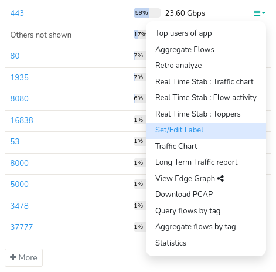
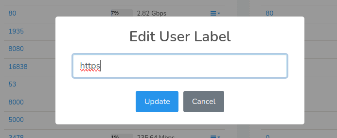

# Name Resolution

You can assign a user friendly name for any type of item.

## Manually Assign a Name

Name Resolution for *keys* can be done in three ways
1) [From the Key Dashboard](/docs/ug/cg/resolve#from-the-key-dashboard)
2) [From Top Keys](/docs/ug/cg/resolve#from-top-keys)
3) [Resolve Names in Bulk using CSV file](/docs/ug/cg/resolve#resolve-keys-in-bulk-from-csv-file)
4) [Set/Edit Label](/docs/ug/cg/resolve#setedit-label)

### From the Key Dashboard

This is the easiest way to edit. You can come to the key dashboard by
clicking on a link or by searching for a specific item.

1. You can also edit by clicking the link on the IP or Port from any
   module or table  

2. You will be redirected to [Key Traffic](/docs/ug/ui/key_dashboard) dashboard  

3. Find the module **Key Details** and click the “Set Label/Edit” from the menu.

### From Top Keys

Use this if you want to see recently active keys and assign them names
in one page.

:::info navigation

:point_right: Select Customize &rarr; Show All&rarr; Keys

:::

1. List of counter groups will appear  

2. Click the **show recently active** option against any counter group  

3. You will get list of keys and click the **edit** icon against any key you would like to edit

4. You will be redirected to a page with following fields

| Field Name  | Description                                                                                    |
| ----------- | ---------------------------------------------------------------------------------------------- |
| Key         | A unique identifier for the entity.                                                            |
| Represents  | Represents this human readable identifier                                                      |
| Name        | A user friendly name for this key. Examples: Host names for IP Addresses, Application names for port numbers, etc                                                                                              |
| Description | More information about this entity. This doesn’t show up anywhere except in the key details panel.                                                                                                         |
| Valid From  | Statistics before this time are not shown                                                      |
| Attributes  | One attribute per line Example a=b                                                         |

### Resolve Keys in Bulk from CSV file

:::info navigation

:point_right: Select Customize &rarr; Show All&rarr; Keys

:::

List of counter groups will appear  

1. Click the **Import from csv**  from the option button against any key

2. Upload a csv file  

3. Select the column numbers that contain the key and label  

4. Click Import CSV File

### Set/Edit Label

Click on the drilldown option against any key from any dashboard as in the figure. And click Set/Edit Label.

  
*Figure: Set or Edit Label*  

Set the label name in the box prompted "Edit User Label".

  
*Figure: Update Label*  

And click Update.

## Automatic Name Resolution

Trisul comes with a sophisticated way to resolve keys automatically in
the background. This works magically by only resolving those keys which
are likely to be “interesting”. The process is designed to place as
little load on your DNS servers as possible.

> Automatic name resolution is disabled by default

### How to Enable Automatic Name Resolution

By default in hub config the "resolve ip"" is set to true which automatically resolves IP addresses. You can disable by configuring it in the [hubconfig](/docs/ref/trisulhubconfig#resolveip).

## Export Labels to CSV file

You can export assigned labels to csv file

:::info navigation

:point_right: Select Customize &rarr; Show All&rarr; Keys

:::

1. List of counter groups will appear  

2. Click the **Export to CSV** from the option toolbar against any counter group

### Troubleshooting

If for some reason you are not able to see hostnames in Trisul, try
these steps.

1. Check if there are any errors in the log. Go to *Admin &rarr; Web server logs
   &rarr; Background Tasks Log*
2. Check if crontab is enabled. Type `crontab -l` to check entries
3. Check if DNS works, click on any IP to bring up key dashboard, then
   click on *Resolve*
