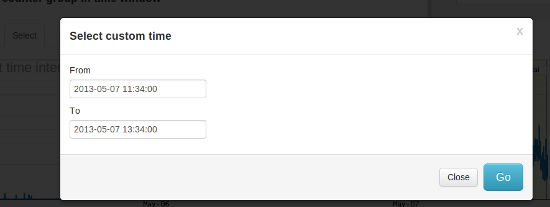

# Performing Retro analysis

Retro analysis is short for retrospective analysis. When applied to
network monitoring, it means re-examining past data sets looking to get
more information about an event that has occurred or is suspected to
have occurred.

> Trisul excels in this type of investigation because it stores all
> types of data in **unsummarized** form. Since everything is correlated
> to traffic, you can drill in any direction from traffic patterns,
> flows, alerts, URLs and Domains. You are always one step away from
> pulling up raw packets relevant you where you are at in your analysis.

### Introduction

Retrospective analysis is basically a two part process :  

1. Identifying a time frame  

2. Applying an analysis tool

### Tips

1. A narrower time window if possible will be faster

2. Analysis tools that depend on raw packets will need a smaller time window.

## Selecting a time window

The time selector allows you to select a time interval based on visually
observing a traffic chart.

### Interactive selection

To select a time window  

1. Simply click and drag your mouse  

2. Details of the current time selection is shown in the band  

3. All tools and FAQ now correspond to the time interval selected

  
Retro time selector

### Select using a calendar

You may also skip the chart entirely and use a calendar to manually
select a time window.

1. Click on the *Select \>* tab above the chart as shown in the image
   below

### Expanding the selection window

Click on the tabs Hours, Days, Weeks to display wider windows in the
chart below.

|       |                           |
| ----- | ------------------------- |
| Hours | Shows the recent 48 hours |
| Days  | Shows the recent 8 days   |
| Weeks | Shows the recent 16 weeks |

You can then zoom in to the timeframe of interest

### Zoom / Pan

When you move your mouse over the time selector the zoom/pan tools are
shown. You can select a time interval and zoom into it multiple times as
well as zoom out. You can also pan left and right which is a way to see
the previous time window.

### Raw packet / full content availability

The time selector will have a pale yellow background for the time window
where full packet data is available. In practice, full content capture
is stored only for a few days but statistics and flows can be available
for months.

If you select a time frame in the yellow area you can have access to
full capture based analysis tools like :

1. PCAP export

> This feature is not applicable to Netflow mode or when full
> content storage is disabled.

## Running an analysis tool

Once you have selected a time window of interest, you have two options.

***Use the Retro FAQ***  
An innovative Q&A style set of tagged questions in plain English.

Example : Click on *Which internal hosts had maximum number of
connections ?* or *What are my top hosts and applications ?*

***Use Tools***   
A set of tools to help you control and drilldown into the time interval

### Retro FAQ

Allows you to analyze your network traffic, flows, and alerts by asking
questions in plain English. You can build you own FAQ questions as you
continue to work with Trisul.

[See the Retro FAQ section for more on this](retrofaq)

### Retro Tools

Individual analysis tools you can use to drilldown into the selected
time interval in dozens of ways.

[See the Retro Tools section for more](retrotools)
