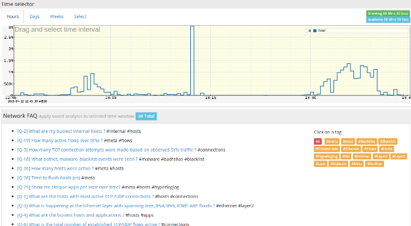
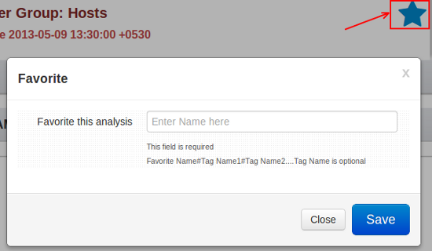

# Retro Q & A

Complex network analysis in plain English.

> Powerful network analysis presented in a “Stack Overflow” style
> **tagged Q & A** format.

If you deal with networks on a daily basis you are bound to perform a
particular analysis repeatedly. You can certainly use one of the [Retro
Tools](retrotools.html) to accomplish your task but it can get
repetitive and tiring.

For example, you may start by selecting a time interval and want to find
out the following as a matter of routine.

- Which internal hosts had the maximum traffic ?  

- What are my busiest hosts and ports ?  

- What IDS alerts were seen over this time period ?  

- Which hosts contacted a particular URL pattern ?  

- What were the most voluminous flows ?

Typically you would select an appropriate Retro Tool, type in the
information you wish to seek and submit. Retro Q & A makes this whole
process painless. The advantages :

- Any time based analysis can be converted into a Question  

- You can tag related questions together by using \#tag  

- Simply select a time interval and click on a question  

- Dynamically adjusting Q & A list will bubble up frequently accessed
  questions to the top

## How to use

:::note navigation

To access select Retro -\> Retro FAQ

:::

You will then be presented with a UI similar to this one shown below.

Here is how you use the UI.

***The time selector***  
Drag and select a time interval of interest

***The questions***  
Simply click on a question to run the corresponding analysis for the
interval selected.

Click on *more* if you want to load extra questions. Note that
frequently used questions bubble up to the top of this list.

***Using the tags*** 
The small buttons besides each question is the tag. Click on a tag to
load all questions with the same tag into the right hand side window
called *Tagged Questions*

## Creating your own questions

Trisul ships with about 40 common questions. It is easy for you to
create your own questions customized to your network. This is how it
works.

- If Trisul determines that a particular query can be turned into a
  question; a star will appear on the toolbar area as shown here. Click on
  the star icon.

- Enter a question name and optionally a set of tags using the \#
  symbol

> An example : If you type in
> `What is the bandwidth utilized by my server 10.10.200.10 ? #server #bandwidth`  
> Your question will now appear with two tags named `server` and
> `bandwidth`

- New questions may initially show up at the bottom of the list so you
  may have to click on the “More” button to see them

## Managing existing questions

You can edit, retag, or delete existing questions if you wish.

:::note navigation

To access, select Customize -\> Retro Favorites

:::

The form shown allows you to manage these questions.
