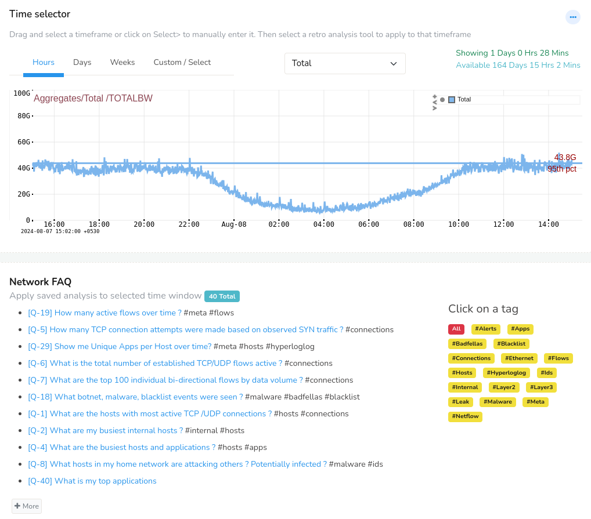
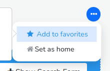
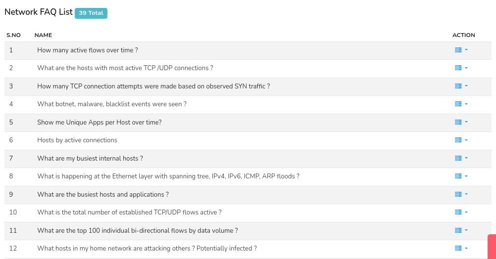
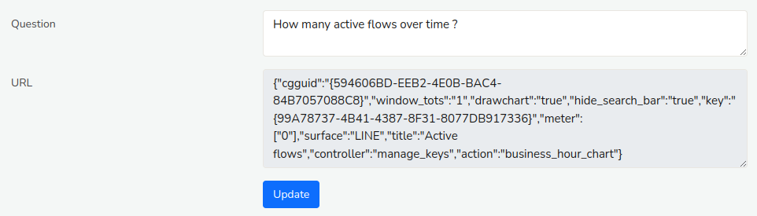

# Retro Q & A

Retro FAQs are complex network analysis like analysing network traffic, flows, and alerts rendered in plain English as a question for easy access.

> Powerful network analysis presented in a “Stack Overflow” style
> **tagged Q & A** format.

If you deal with networks on a daily basis you are bound to perform a
particular analysis repeatedly. You can certainly use one of the [Retro
Tools](retrotools) to accomplish your task but for certain cases that can get repetitive and tiring.

Retro FAQs are like handy answers (dashboards) for your repetitive questions (analysis) where you can just do the analysis in one click from the list of already saved questions.

For example, you may start by selecting a time interval and want to find
out the following as a matter of routine.

- Which internal hosts had the maximum traffic ?  

- What are my busiest hosts and ports ?  

- What IDS alerts were seen over this time period ?  

- Which hosts contacted a particular URL pattern ?  

- What were the most voluminous flows ?

Typically you would select an appropriate Retro Tool, type in the information you wish to seek and submit for each analysis. But with Retro Q & A this whole process becomes painless. With Retro FAQ you can ,

- Any time based analysis can be converted into a Question  

- You can tag related questions together by using #tag  

- Simply select a time interval and click on a question  

- Dynamically adjusting Q & A list will bubble up frequently accessed
  questions to the top

## How To Use

:::info navigation

:point_right: To access select Retro &rarr; Retro FAQ

:::

You will then be presented with a UI similar to this one shown below.

*Figure: Retro FAQ*

Here is how you use the UI.

***The time selector***  
Drag and select a time interval of interest to zoom or pan the detailed view. You can also custom select time range using [*Time Selector*](/docs/ug/ui/elements#time-selector).

***Network FAQ***  
Simply click on a question to run the corresponding analysis for the
interval selected.

Click on *more* if you want to load extra questions. Note that
frequently used questions bubble up to the top of this list.

***Using the tags*** 
The small buttons besides each question is the tag. Click on a tag to
load all questions with the same tag into the right hand side window
called *Tagged Questions*

## Creating Your Own Questions

Trisul ships with about 40 common questions. It is easy for you to
create your own questions customized to your network. This is how it
works.

- If Trisul determines that a particular query can be turned into a
  question, a star will appear on the toolbar area as shown here. Click on
  the Add to favorites star icon.

*Figure: Add to Favorites Option to Add Module to Retro FAQ*

Enter a question name and optionally a set of tags using the #
symbol

> An example : If you type in
> `What is the bandwidth utilized by my server 10.10.200.10 ? #server #bandwidth`  
> Your question will now appear with two tags named `server` and
> `bandwidth`

- New questions may initially show up at the bottom of the list so you
  may have to click on the “More” button to see them

## Managing Existing Questions

You can edit, retag, or delete existing questions if you wish.

:::info navigation

:point_right: To access, select Customize &rarr;Retro Favorites

:::

This will show a list of already available retro questions that can be managed easily.

*Figure: Network FAQ List*

Click on the option toolbar on the right side against each question. And click **Edit**. The following screen will be displayed with editable form. You can edit the question as  you want and URL. Then click **Update**.

*Figure: Edit FAQ Question*
