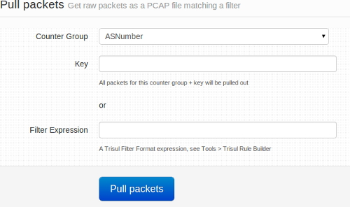
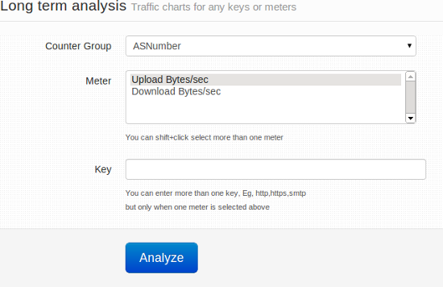

# Retro analysis tools

You have selected a time interval you want to focus on - whats next ?
Now you need to select an analysis tool to apply to the time interval.

To view retro analysis tools,
:::note navigation
Go to Retro-> Retro analysis tools
:::

You can find the list of retro tools below the time selector as shown in this example.

You have to pick one of the following tools shown.

| Name of tool                                                                            | Why you want to use this tool                                                                                                                                                       |
| --------------------------------------------------------------------------------------- | ----------------------------------------------------------------------------------------------------------------------------------------------------------------------------------- |
| Network FAQ                                                                             |                                                                                                                                                                                     |
| [Counter Group toppers](/docs/ug/cg/retrotools#counter-group-toppers)                   | Who were the toppers in a counter group for a statistic ? Also shows topper trends in time interval with ability to do a cross drill on any of them                                 |
| [Investigate IP activity](/docs/ug/cg/retrotools#investigate-activity-of-a-specific-ip) | Investigate complete activity of a host in selected interval. Details include conversations, flows, security alerts, malware activity, peer connections, upload / download data etc |
| [Investigate application](/docs/ug/cg/retrotools#investigate-users-of-an-application)   | Investigate complete activity of an application. Who the top users are of that application and other details split up by upload / download                                          |
| [Long term traffic charts](/docs/ug/cg/retrotools#long-term-traffic-charts)             | Used to see daily trends in traffic. Arranges traffic by day on top of each other so you can observe busy hours etc                                                                 |
| [Show traffic chart for an item](/docs/ug/cg/retrotools#show-traffic-chart-for-an-item) | Draw charts for any item such as a host, app, subnet                                                                                                                                |
| [IDS Alerts](/docs/ug/cg/retrotools#security-alerts-retro)                              | Various views of alert activity seen in selected interval                                                                                                                           |
| [Flow trackers](/docs/ug/cg/retrotools#flow-trackers)                                   | View top flows in the timeframe based on various criteria                                                                                                                           |
| Explore Flows                                                                           |                                                                                                                                                                                     |
| Traffic Charts                                                                          |                                                                                                                                                                                     |
| [Pull packets](/docs/ug/cg/retrotools#pull-packets)                                     | Get raw packets in tcpdump/libpcap format matching a certain key                                                                                                                    |
| View Edges                                                                              |                                                                                                                                                                                     |

## Counter Group toppers

View the toppers for a counter group and meter.

For example : You can select counter group *Hosts* and meter
*Connections* to view hosts with most connections in the selected
interval.

The information is presented in lists, charts, and a trend chart.

## Investigate IP activity

Enter an IP address or a host name to view detailed activity of that
host.

The analysis includes

1. Activity charts including total bandwidth, peers, upload, download, apps etc
2. Top 10 matching individual flows of total 10
3. Peers and applications and Conversations with other hosts
4. Security attacks targeted at host. Malware and alert activity detected.

Trisul will then run the [Investigate IP](/docs/ug/tools/investigate_ip_activity) analysis tool for the selected items and time interval.

## Investigate users of an application

Complete break up of behavior of an application.

The analysis includes

1. IP conversation matrix for this app
2. Tops IPs transmitting and receiving app
3. Peers
4. Top individual flows involving this app

The analysis will take you to the [Explore](/docs/ug/tools/explore_flows) tool with the selected
items and time interval.

## Show traffic chart for an item

View usage charts for a particular item for selected time interval.

For example : You can just type **smtp** in the box and view all
statistics for the requested application in charts and tables. You can
then save them as PDF if you wish.

## Security Alerts retro

Slice and dice IDS events from different angles in selected time
interval.

The available selections in the drop down list *View IDS Alerts By* are:

> From any of the alert analysis you have drilldown options to flows and
> raw packets

|                    |                                             |
| ------------------ | ------------------------------------------- |
| Alert types        | Show aggregated alerts grouped by signature |
| Top attackers      | Top source IPs which originated the alerts  |
| Top victims        | Top destinations IPs                        |
| By Priority        | Alerts grouped by priority                  |
| By Classificiation | Alerts grouped by classification            |
| All alerts         | Individual alerts received                  |

## Flow trackers

Flow trackers are used to monitor and store top flows matching specific
criteria.

Some of the built in trackers are :

> You can create your own [flow trackers](/docs/ug/flow/tracker) They will show up in this dropdown list

|                 |                                                                                                         |
| --------------- | ------------------------------------------------------------------------------------------------------- |
| Traffic         | Flows with maximum volume transferred (both directions together)                                        |
| Long lived      | Flows which stayed alive for longest time                                                               |
| Transferred Out | Flows which transferred maximum data **out** of your Home Network (Uploading)                           |
| Transferred In  | Flows which transferred maximum data **into** your Home Network (Downloading)                           |
| Local Traffic   | Top flows internal to your Home network                                                                 |
| Suspicious      | Flows that fired a blacklist based even, either by IP, requesting a domain name, or by requesting a URL |
| FilterFailed    | Flows that don’t use any of the well known ports                                                        |

## Pull Packets

Pull up a sample of raw packets for the selected time interval and
additional criteria.

:::note

There are some caps on this feature to prevent accidental misuse.

1. By default only 5MB of raw data is retrieved
2. By default only 1800s (30minutes) of interval can be analyzed

If you wish to change these settings, go to [App Settings](/docs/ug/webadmin/web_options) and change the *Deep
Packet Inspection Limit* and *Deep Packet Inspection Content Limit*.
Please be aware that in busy network analyzing packets can take time to
complete.

:::

**Using the tool**

You have two ways to use this tool to pull up raw packets.

1. **Packets for an item** -\> Select a counter group and key.  
   Counter group = `Country` and key = `JA` will get packets from
   Japan.  
   Counter group = `Apps` and key = `smtp` will get email packets.
2. **Packets matching expression** -\> [Trisul Filter
   Format](/docs/ref/trisul_filter_format) is a flexible way of constructing filters. You can enter an expression to run more sophisticated packet queries.  
   Enter the string `{C51B48D4-7876-479E-B0D9-BD9EFF03CE2E}=p-0050,p-0051,p-0052,p-0053` to retrieve packets for ports 80,81,82, and 83.

Upon running the tool, your browser will automatically download a PCAP
file containing the requested packets.

## Long term traffic charts

Draw long term charts designed to aid time of day based comparisons.

You have to select an item and a set of stats to chart for that item.
The result will be a chart showing most recent 7 days of data arranged
by day.

 tool will take you to the [Long term traffic trends](/docs/ug/tools/analyze_item) tool with the start time and other selections automatically filled in.
