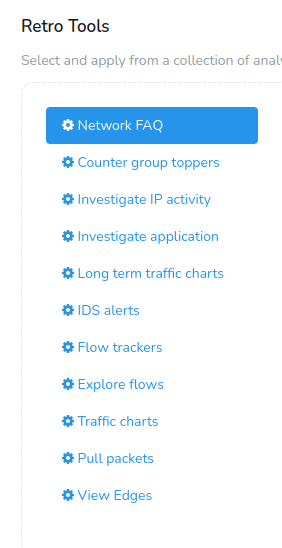
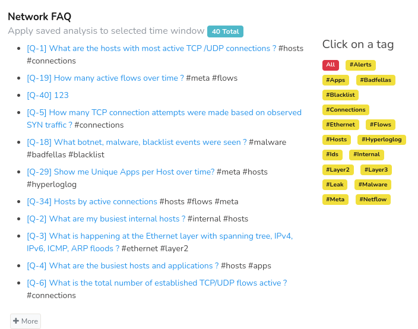
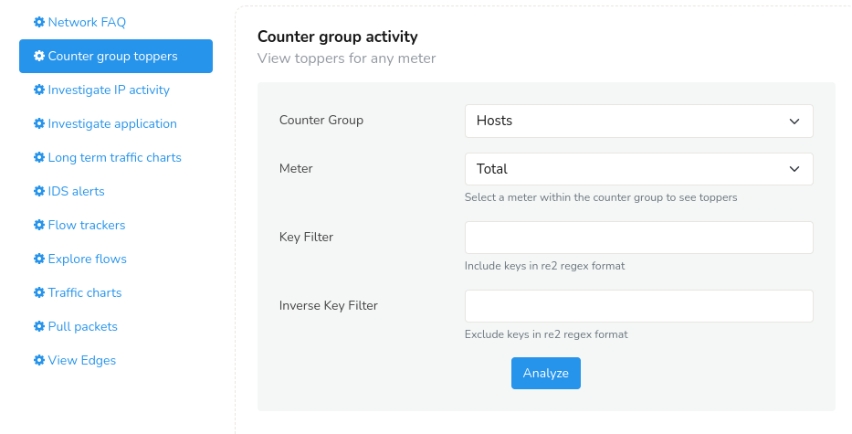
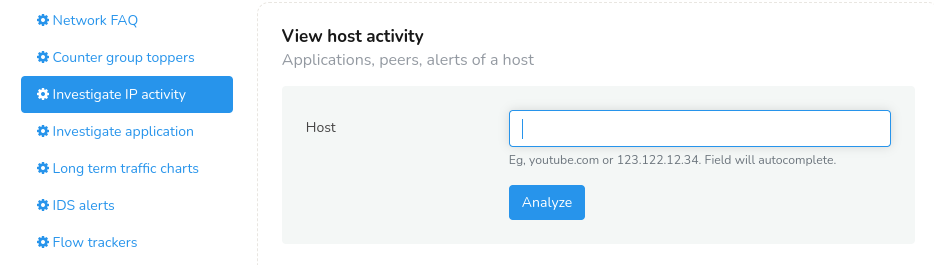
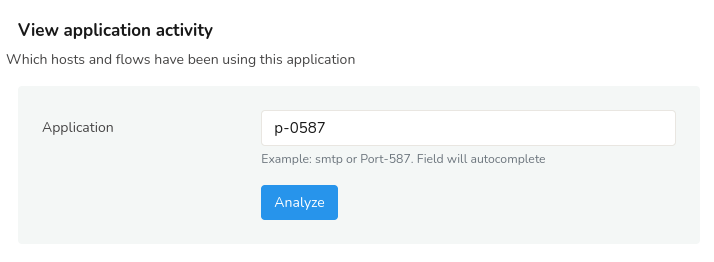
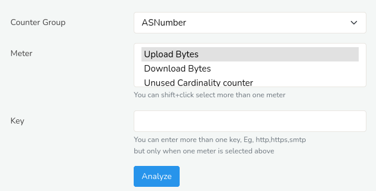
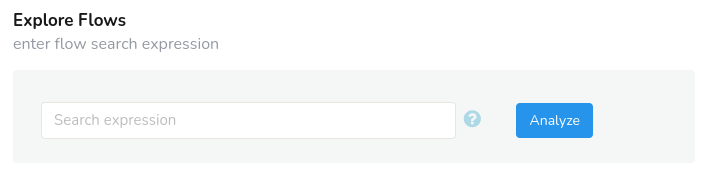
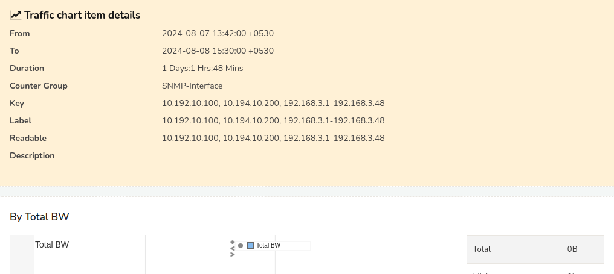
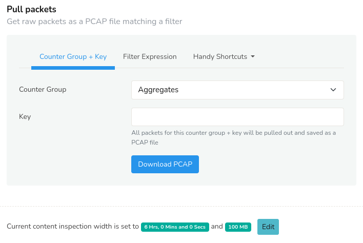
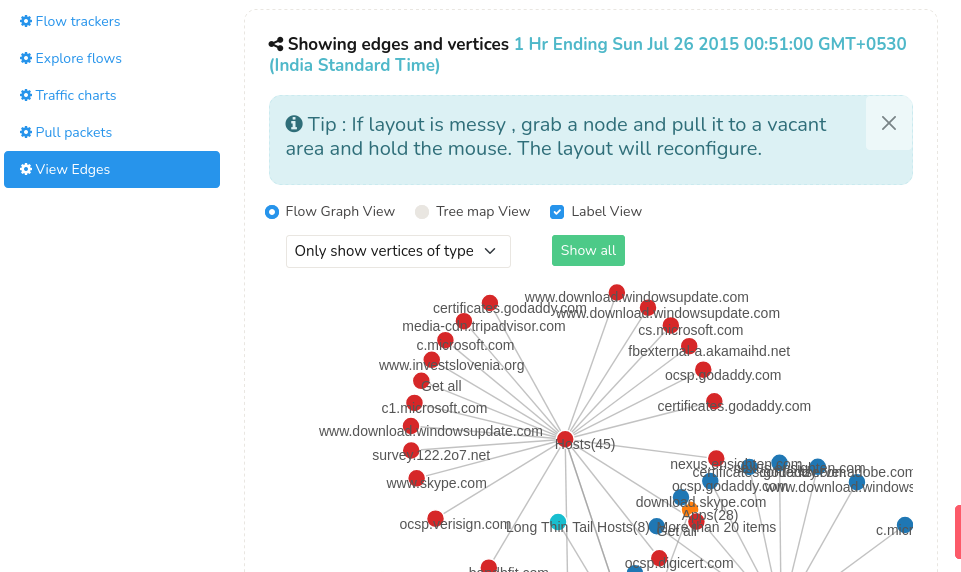

# Retro Analysis Tools

You have selected a time interval you want to focus on - whats next ?
Now you need to select an analysis tool to apply to the time interval.

To view retro analysis tools,
:::note navigation
Go to Retro-> Retro analysis tools
:::

You can find the list of retro tools below the time selector as shown in this example.

*Figure: Retro Tools*

You have to pick one of the following tools shown.

| Name of tool                                                                            | Why you want to use this tool                  |
| ------------- | -------------------------------------------------------------------------------------------------|
| [Network FAQ](/docs/ug/cg/retrotools#network-faq)                                       | Complex network analysis like analysing network traffic, flows, and alerts rendered in plain English as a question for easy access.|
| [Counter Group toppers](/docs/ug/cg/retrotools#counter-group-toppers)                   | Who were the toppers in a counter group for a statistic ? Also shows topper trends in time interval with ability to do a cross drill on any of them                                                                                                            |
| [Investigate IP activity](/docs/ug/cg/retrotools#investigate-ip-activity)               | Investigate complete activity of a host in selected interval. Details include conversations, flows, security alerts, malware activity, peer connections, upload / download data etc                                                                       |
| [Investigate IP activity](/docs/ug/cg/retrotools#investigate-ip-activity)               | Investigate complete activity of a host in selected interval. Details include conversations, flows, security alerts, malware activity, peer connections, upload / download data etc                                                                       |
| [Investigate application](/docs/ug/cg/retrotools#investigate-users-of-an-application)   | Investigate complete activity of an application. Who the top users are of that application and other details split up by upload / download                                                                                                           |
| [Long term traffic charts](/docs/ug/cg/retrotools#long-term-traffic-charts)             | Used to see daily trends in traffic. Arranges traffic by day on top of each other so you can observe busy hours etc                  |
| [Show traffic chart for an item](/docs/ug/cg/retrotools#show-traffic-chart-for-an-item) | Draw charts for any item such as a host, app, subnet                                                                                   |
| [IDSAlerts](/docs/ug/cg/retrotools#security-alerts-retro)                               | Various views of alert activity seen in selected interval                                                                                 |
| [Flow trackers](/docs/ug/cg/retrotools#flow-trackers)                                   | View top flows in the timeframe based on various criteria                                                                                |
| [Explore Flows](/docs/ug/cg/retrotools#explore-flows)                                   | Streaming flow visualization based on the popular parallel co-ordinates paradigm.                                             |
| [Traffic Charts](/docs/ug/cg/retrotools#show-traffic-chart-for-an-item)                 | View usage charts for a particular item for selected time interval.                                                                        |
| [Pull packets](/docs/ug/cg/retrotools#pull-packets)                                     | Get raw packets in tcpdump/libpcap format matching a certain key                                                                      |
| [View Edges](/docs/ug/cg/retrotools#view-edges)                                         | Edges are graph database showing how the metrics are related to each other beyond the flow connection.                             |

## Network FAQ

Network FAQ is a tool that allows you to save and easily access frequently performed network analyses. You can access the dashboards in a click to monitor, understand your network traffic, hosts, and alerts.

To view Network FAQ,

:::note navigation

Go to Retro-> Retro tools-> Network FAQ

:::

This is an example of the Network FAQ module.

*Figure: Network FAQ*

Refer [Retro Q&A](/docs/ug/cg/retrofaq) for more details.

## Counter Group Toppers

Counter Group Toppers views the top entities (e.g., hosts, ports, protocols) that exhibit the highest values for a specific network traffic metric or counter.

To view Counter Group Toppers,

:::note navigation

Go to Retro-> Retro tools-> Counter Group Toppers

:::

For example : You can select counter group *Hosts* and meter
*Connections* to view hosts with most connections in the selected
interval.

*Figure: Counter Group Toppers Retro Tool*

The information is presented as dashboards in lists, charts, and a trend chart.

## Investigate IP Activity

Enter an IP address or a host name to monitor and analyze network traffic to understand the behavior and patterns of that specific IP address.

To investigate an IP activity,

:::note navigation

Go to Retro-> Retro tools-> Investigate IP activity

:::

*Figure: Investigate IP Activity Retro Tool*

The analysis includes

1. Activity charts including total bandwidth, peers, upload, download, apps etc
2. Top 10 matching individual flows of total 10
3. Peers and applications and Conversations with other hosts
4. Security attacks targeted at host. Malware and alert activity detected.

Trisul will then run the Investigate IP analysis tool for the selected items and time interval.

## Investigate Users of an Application

Complete break up of behavior of an application.

To investigate any application,

:::note navigation

Go to Retro-> Retro tools-> Investigate Application

:::

Enter an port value say p-0587 and you will  get the detailed activity including the flows matching the time interval, activity details like top peers, top apps, flow taggers, interfaces, etc.

*Figure: Investigate Applications Retro Tool*

The analysis will take you to the [Explore](/docs/ug/tools/explore_flows) tool with the selected items and time interval.

## Long Term Traffic Charts

Draw long term charts designed to aid time of day based comparisons. View charts of network traffic patterns over an extended period, typically weeks, months, or even years.

To view Long term traffic charts,

:::note navigation

Go to Retro-> Retro tools-> Long Term Traffic Charts

:::

You have to select an item and a set of stats to chart for that item.
The result will be a chart showing most recent 7 days of data arranged
by day.

*Figure: Long Term Traffic Charts Retro Tool*

You can click on the **Show Search Form** on the top right for long term traffic charts and click on any date range in the **Time Frame**window to view the traffic for that selected time period. This tool will take you to the [Long term traffic trends](/docs/ug/tools/analyze_item) tool with the start time and other selections automatically filled in.

## Security Alerts Retro

Slice and dice IDS events from different angles in selected time
interval.

To view IDS Alerts,

:::note navigation

Go to Retro-> Retro tools-> IDS Alerts

:::

The available selections in the drop down list *View IDS Alerts By* are:

> From any of the alert analysis you have drilldown options to flows and
> raw packets

| View IDS ALerts by | Description                                 |
| ------------------ | ------------------------------------------- |
| Alert types        | Show aggregated alerts grouped by signature |
| Top attackers      | Top source IPs which originated the alerts  |
| Top victims        | Top destinations IPs                        |
| By Priority        | Alerts grouped by priority                  |
| By Classificiation | Alerts grouped by classification            |
| All alerts         | Individual alerts received                  |

## Flow Trackers

Flow trackers are used to monitor and store top flows matching specific
criteria.

To view Flow Trackers,

:::note navigation

Go to Retro-> Retro tools-> Flow Trackers

:::

Some of the built in trackers are :

> You can create your own [flow trackers](/docs/ug/flow/tracker) They will show up in this dropdown list

| Flow Trackers   |                                                                                        |
| --------------- | ---------------------------------------------------------------------------------------|
| Traffic         | Flows with maximum volume transferred (both directions together)                       |
| Long lived      | Flows which stayed alive for longest time                                              |
| Transferred Out | Flows which transferred maximum data **out** of your Home Network (Uploading)          |
| Transferred In  | Flows which transferred maximum data **into** your Home Network (Downloading)          |
| Local Traffic   | Top flows internal to your Home network                                                |
| Suspicious      | Flows that fired a blacklist based even, either by IP, requesting a domain name, or by requesting a URL                                                                                           |
| FilterFailed    | Flows that don’t use any of the well known ports                                       |

## Explore Flows

With Explore Flows tool you can view detailed network flow information including source and destination IP addresses, ports, and protocols. 

To view Explore Flows tool,

:::note navigation

Go to Retro-> Retro tools-> Explore Flows

:::

*Figure: Explore Flows Retro Tool*

> Click on the little question mark hint near the search expression toolbar to  Enter an expression like **ip=19.168.211.10** or ip=gmail.com or ip=fe80::fe08:7ad1 or port=smtp or port=p-0050 or port=80 and drill down into specific flows to investigate their traffic behavior.

## Show Traffic Chart for an Item

With Show traffic charts, you can view usage charts for a particular item for selected time interval.

To view Traffic charts,

:::note navigation

Go to Retro-> Retro tools-> Traffic Charts

:::

For example : You can just type **smtp** in the box and view all
statistics for the requested application in charts and tables. You can
then save them as PDF if you wish.

*Figure: Show Traffic Chart Retro Tool*

## Pull Packets

Pull up a sample of raw packets for the selected time interval and
additional criteria.

To view Pull Packets,

:::note navigation

Go to Retro-> Retro tools-> Pull Packets
:::

*Figure: Pull Packets Retro Tool*

There are some caps on this feature to prevent accidental misuse.

1. By default only 5MB of raw data is retrieved
2. By default only 1800s (30minutes) of interval can be analyzed

If you wish to change these settings, go to [App Settings](/docs/ag/webadmin/web_options) and change the *Deep
Packet Inspection Limit* and *Deep Packet Inspection Content Limit*.
Please be aware that in busy network analyzing packets can take time to
complete.

**Using the tool**

You have two ways to use this tool to pull up raw packets.

1. **Packets for an item** -> Select a counter group and key.  
   Counter group = `Country` and key = `JA` will get packets from
   Japan.  
   Counter group = `Apps` and key = `smtp` will get email packets.
2. **Packets matching expression** -> [Trisul Filter
   Format](/docs/ref/trisul_filter_format) is a flexible way of constructing filters. You can enter an expression to run more sophisticated packet queries.  
   Enter the string `{C51B48D4-7876-479E-B0D9-BD9EFF03CE2E}=p-0050,p-0051,p-0052,p-0053` to retrieve packets for ports 80,81,82, and 83.
3. **Handy Shortcuts**-> Clicking on Handy Shortcuts you get an option to "Get all packets" to download all the packets

Upon running the tool, your browser will automatically download a PCAP
file containing the requested packets.

## View Edges

With Trisul's streaming analytics, hundreds of metrics are captured and the Edges help discover how the metrics are related to each other beyond the flow connection. 

To view Edges,

:::note navigation

Go to Retro-> Retro tools-> View Edges

:::

*Figure: View Edges Retro Tool*

Learn more about Edges in [Trisul Edges](/docs/ug/edges/)- Streaming Graph Analytics.
