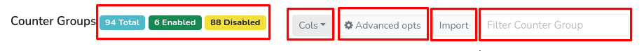

# Counter Group Settings

**You can :**  

1. Edit settings such as bucket size and other settings  

2. Edit topper policies: how many toppers to track for each meter  

3. Perform further configuration for user defined counter groups

You can also enable or disable any counter group.

> **Restart is required** since changes will be made effective only
> upon restarting Trisul

> **Disabling a built-in counter group** will cause all
> user-defined counter groups that depend on it to report zero usage.

## Editing Settings

:::info navigation
:point_right: Login as Admin &rarr;Context:default&rarr;profile0 &rarr; Counter Groups
:::

*Figure: Counter Group Settings- Header Part*

- The entire list of counter groups is shown as in the figure. On the left of the header shows the total number of counter groups available highlighted in blue color, the number of countergroups enabled highlighted in green color, and the disbaled counter groups count in yellow color. 
- To the right, access the [column selector](/docs/ug/ui/elements#column-selector). 
- Click on the **Advanced Options** button to navigate to bulk edit options.
- Click **Import** if you would like to browse and import a JSON file and click Upload.
- To filter a counter group, enter a counter group name in the **filter bar** on the right hand side corner of the header.

   
*Figure: List of Countergroups* 

Click on the name of a particular counter group or edit option from clicking on the action button ,which leads you to a page with the fields below.

| FieldName                           | Description                                                              |
| ----------------------------------- | ------------------------------------------------------------------------ |
| Counter Group                       | Displays the GUID                                                        |
| Name                                | A name for this counter group                                            |
| Description                         | Short description on the purpose of the counter group                    |
| Active                              | Shows if the counter group enabled or disabled                           |
| Bucket Size Counter Resolution (ms) | Specified as millisec.   Counters are accumulated into this bucket and written out when a bucket is full.   Smaller buckets results in more data being stored                |
| Topper Traffic Only                 | If enabled Trisul will store only the toppers                            |
| Enable Slice Keys                   | If enabled Trisul keeps track of all keys seen in this counter group     |
| Topper Snapshot Interval (Seconds)  | Specifies how frequently (in secs) are the Top-K and Bottom-K sketches (snapshots) taken                                                                                                 |
| High Water Mark                     | The maximum number of keys tracked in this counter group, before it is pruned down to the low water mark                                                                                |
| Low Water Mark                      | When the number of keys tracked gets over the high water mark, Trisul prunes them down to this level                                                                                   |
| Cardinality Estimate Bits           | Estimated cardinality of keys in this group. 2^x; Enter 8 if estimate is about 256                                                                                                        |
| Resolver Group                      | Select one of the countergroups from the dropdown list to resolve keys   |

> Note that all the columns are [column sortable](/docs/ug/ui/elements#column-sorter). 

Click Update to configure the counter group.

## Bulk Edits

The following bulk edit options are available.

To access these options:

:::info navigation

:point_right: Login as Admin &rarr;Select Context: default&rarr;profile0 &rarr; Counter Groups &rarr;Advanced Options

:::

*Figure: Bulk Edit All Counter Groups*

1. Set a bucket size for all counter groups 

2. Common countergroup configurations for various scenarios 

3. Disable all counter groups that do not apply in Netflow mode

## Editing Counter Group Topper Policies

Directions to edit counter group settings

:::info navigation

:point_right: Login as Admin &rarr;Select Context:default&rarr;profile0 &rarr;Counter Groups  
:::

The entire list of counter groups is shown  

Click on the action button against any counter group and select edit, enable and toppers to modify counter group settings, enable and modify topper policies respectively.

Clicking on Topper option directs you to a page with the below fields to modify them.
   
  
*Figure: Editing Counter Group Topper Policies*

| Counter Groups             |
| -------------------------- |
| Total                      |
| Received                   |
| Transmit                   |
| Total Packets              |
| Active Conns               |
| Attacker alerts            |
| Homenet                    |
| External                   |
| TCP SYN sent               |
| TCP SYN recv               |
| TCP SYNACK sent            |
| Blacklist Alerts           |
| Victim alerts              |
| New Conns                  |
| Into Interface             |
| Outof Interface            |
| Flow records               |
| Unused Cardinality counter |
| Unused Cardinality counter |

The topper policy depends on the meters present for each counter group .
The above example shows for `Internal Hosts` consisting of 18 meters
